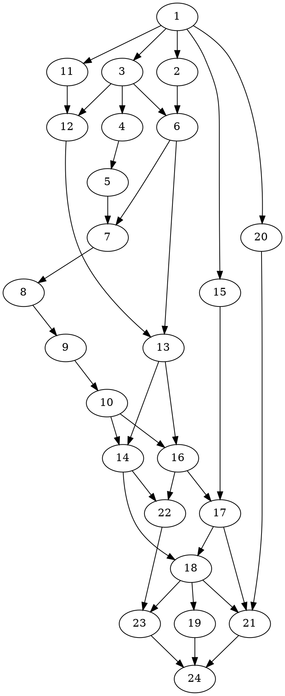

# Graph-Buddy Obsidian Plugin Implementation Plan

> **For agentic workers:** REQUIRED: Use superpowers:subagent-driven-development or superpowers:executing-plans to implement this plan. Steps use checkbox (`- [ ]`) syntax for tracking.

**Goal:** An Obsidian desktop plugin embedding the knowledge-graph interviewer (Claude Agent SDK on the user's Claude Code subscription) with chat tabs, a deterministic TypeScript GraphModel ported from the two Python oracle scripts, and a live mindmap view.

**Architecture:** Four components, one direction of truth — files are the state. A pure-TS GraphModel (no Obsidian imports, no AI) computes discovery/index/validation/obligations over an in-memory file map; the Obsidian layer feeds it vault events. AgentService wraps `@anthropic-ai/claude-agent-sdk` with a permission layer enforcing the skill's approval table. ChatView and MindmapView are Obsidian `ItemView`s hosting React; their logic lives in TDD'd pure view-model modules, their Obsidian shells are thin and manually tested (per the design spec: "UI: manual, in a dev vault").

**Tech Stack (versions verified against npm on 2026-08-11):**

| Package | Version | Purpose |
|---|---|---|
| obsidian | ^1.13.1 | plugin API + typings |
| typescript | 7.0.2 | typecheck (`tsc --noEmit`); fallback 5.9.x if 7.x breaks — see Task 1 |
| esbuild | ^0.28.2 | bundling to `main.js` |
| vitest | ^4.1.10 | test runner |
| js-yaml | ^5.2.3 | frontmatter YAML (fallback 4.1.x if 5.x types missing — see Task 1) |
| react / react-dom | ^19.2.8 | view internals |
| @types/react / @types/react-dom | ^19.2.18 / ^19.2.4 | |
| @types/node | ^26.2.0 | |
| d3-hierarchy | ^3.1.2 | tree structures |
| d3-flextree | ^2.1.2 | variable-node-size layout (no official types — local `.d.ts`) |
| d3-zoom / d3-selection | ^3.0.0 | pan/zoom |
| @anthropic-ai/claude-agent-sdk | 0.3.227 (pinned exact) | sessions |

Model IDs (verified current): `claude-opus-5`, `claude-sonnet-5`, `claude-haiku-4-5`.

**Source references (read-only inputs to this plan):**
- Design spec: `docs/superpowers/specs/2026-08-11-knowledge-graph-obsidian-plugin-design.md`
- Oracle: `oracle/graph_check.py`, `oracle/obligations.py` (vendored; behavior is the spec for GraphModel)
- Prompt sources: `assets/prompts/skill-source.md`, `assets/prompts/grill.md`, `assets/prompts/consult.md`, `assets/agents/kg-scout.md`
- Agent SDK reference: `docs/superpowers/research/2026-08-11-agent-sdk-reference.md`

---

## File Structure

```
graph-buddy/  (repo root = plugin root)
├── manifest.json                     # Obsidian plugin manifest (isDesktopOnly: true)
├── package.json / package-lock.json
├── tsconfig.json
├── esbuild.config.mjs                # bundles src/main.ts → main.js; .md assets as text
├── vitest.config.ts                  # node env; .md-as-text vite plugin
├── .gitattributes                    # tests/fixtures/** -text  (exact bytes: LF + BOM preserved)
├── oracle/
│   ├── graph_check.py                # vendored oracle (do not edit)
│   ├── obligations.py                # vendored oracle (do not edit)
│   └── gen_expected.py               # regenerates tests/expected/*.json
├── assets/
│   ├── prompts/skill-source.md       # original SKILL.md (reference only, not shipped)
│   ├── prompts/system.md             # adapted embedded system prompt (Task 13)
│   ├── prompts/grill.md              # shipped verbatim
│   ├── prompts/consult.md            # shipped verbatim
│   └── agents/kg-scout.md            # source for SDK subagent definition
├── src/
│   ├── main.ts                       # plugin entry: views, settings, vault→GraphModel wiring
│   ├── settings.ts                   # settings tab + health check
│   ├── graph/                        # M1 — pure TS, zero Obsidian imports
│   │   ├── types.ts                  # Vault, Note, Problem, reports
│   │   ├── py-compat.ts              # pyRepr, sortKeyWindows, casefold, date helpers
│   │   ├── reader.ts                 # normalizeContent, stripBom
│   │   ├── frontmatter.ts            # parseFrontmatter, innermostScalar, parentName
│   │   ├── notes.ts                  # note extraction: parent, aliases, kind, status, links
│   │   ├── discovery.ts              # findGraphs, collectNotes, markdownFiles
│   │   ├── validation.ts             # 5 checks + checkGraph + buildValidationReport + stats
│   │   ├── obligations.ts            # openTasks, grade, buildObligationsReport
│   │   └── graph-model.ts            # stateful engine: file map, mutations, events, cached reports
│   ├── agent/                        # M2
│   │   ├── permissions.ts            # pure: filename sanity, graph boundary, decision table
│   │   ├── prompts.ts                # embedded prompt assembly (imports assets/*.md as text)
│   │   ├── agent-service.ts          # SDK session wrapper (injectable query fn)
│   │   └── sdk-types.ts              # narrow local types for the SDK boundary
│   ├── chat/                         # M3
│   │   ├── transcript.ts             # pure reducer: stream events → transcript items
│   │   ├── ChatView.tsx              # ItemView shell + React mount (manual test)
│   │   └── components.tsx            # message list, composer, model picker, approval card
│   └── mindmap/                      # M4
│       ├── layout.ts                 # pure: index → flextree input, unreachable set, badges
│       ├── collapse-store.ts         # pure collapse-state store
│       ├── MindmapView.tsx           # ItemView shell + SVG render (manual test)
│       └── obligations-panel.tsx
├── tests/
│   ├── fixtures/                     # fixture vaults (exact bytes; see Task 2)
│   │   ├── simple/ | problems/ | edge-cases/ | rooty/ | multi/
│   ├── expected/                     # oracle-generated JSON (committed)
│   ├── helpers/load-fixture.ts
│   └── *.test.ts
└── docs/                             # spec, plans, research (already present)
```

## Locked porting decisions (read before implementing any M1 task)

These reconcile ambiguities between the two oracle scripts. Deviating from them is a plan violation.

0. **The vendored oracle carries one deliberate bug fix** (commit `fix: terminate misfiled() ancestor walk on parent rings`): the original `misfiled()` guard `len(ancestors) < len(notes)` infinite-loops whenever a parent ring exists (empirically confirmed — the unpatched script hangs on a 2-note ring). The vendored copy tracks visited notes (`walked` set) and breaks on revisit; non-ring behavior is unchanged. The TS port mirrors the **patched** semantics. Do not "restore" the original guard.

1. **BOM handling differs by consumer, exactly as in Python.** `obligations.py` reads with `utf-8-sig` (BOM stripped); `graph_check.py` reads plain `utf-8` (BOM kept). Port: the obligations path and graph discovery call `stripBom()`; the validation path (frontmatter → parent) does **not**, so a BOM-prefixed note's frontmatter reads as absent → `orphan-root`, matching `graph_check.py`. Discovery uses the BOM-stripping (forgiving) variant; fixtures never place `## Charter` on a hub's first line, so both scripts agree on every fixture.
2. **Line endings.** Python `Path.read_text` universal-newlines CRLF→LF. TS `normalizeContent` replaces `\r\n`→`\n` and lone `\r`→`\n` on every read. `.gitattributes` marks `tests/fixtures/** -text` so git never rewrites fixture bytes.
3. **Sort order is Windows truth.** The oracle runs on Windows where `str(Path)` uses `\` and `os.path.normcase` lowercases. TS sorts note lists with `sortKeyWindows(path) = path.replaceAll("/", "\\")` byte compare, and all case-insensitive comparisons use `casefold(s) = s.toLowerCase()`. Fixture names avoid `ß` and other locale-sensitive casing.
4. **`collect_notes` (validation) skips only `Log/` dirs (case-insensitive) — NOT the SKIP_DIRS set; `markdown_files` (obligations) skips both.** Port each walk exactly.
5. **Graph list ordering:** Python `sorted(list[Path])` compares path-segment tuples. TS compares `path.split("/")` arrays element-wise.
6. **Detail strings are ported verbatim** including Python `!r` quoting via `pyRepr()` (prefer `'…'`; use `"…"` when the string contains `'` and no `"`; escape backslashes and the quote char).
7. **In-memory path lookups are case-insensitive** (the oracle hits a case-insensitive NTFS): the `Vault` structure keeps a normalized-lowercase index alongside exact paths.
8. **Report `path`/`root` fields:** TS emits vault-relative posix (`"."` for the root graph); `gen_expected.py` relativizes the Python absolute paths the same way before writing expected JSON.
9. **Dates are plain y/m/d** (no timezones, no `Date.now()`): parse `%Y-%m-%d` with real-date validation (2026-13-45 → malformed), compare via epoch-day integers computed with `Date.UTC`.
10. **`aliases`/`kind`/`status`/`links` extraction** (spec's node index) has no Python oracle; it is unit-tested directly. `kind`/`status` are `str()`-like scalars or null; `aliases` accepts a string or list of scalars; `links` are `[[target]]` matches over the whole normalized text with `|alias`/`#heading` tails dropped and blanks discarded.

## Common actions (referenced from tasks as “per knowledge/<file>”)

Stored in `docs/superpowers/plans/knowledge/`:
- `run-tests.md` — `npx vitest run` (all) / `npx vitest run tests/<file>.test.ts` (one file). Run from the worktree root.
- `regen-oracle.md` — `python oracle/gen_expected.py` (regenerates `tests/expected/*.json`; run after any fixture change; commit the JSON).
- `typecheck-build.md` — `npx tsc --noEmit` then `npm run build` (esbuild production).
- `commit.md` — commit format: `type: subject` (feat/test/chore/fix/docs), body optional, always append the `Co-Authored-By: Claude Fable 5 <noreply@anthropic.com>` trailer. One task = one or more commits; never commit a red test.

---

# Milestone M1 — GraphModel + oracle fixtures + tests

### Task 1: Project scaffold

**Files:**
- Create: `manifest.json`, `package.json`, `tsconfig.json`, `esbuild.config.mjs`, `vitest.config.ts`, `versions.json`, `src/main.ts`, `src/md-modules.d.ts`, `.gitattributes`, `.editorconfig`
- Create: `docs/superpowers/plans/knowledge/run-tests.md`, `regen-oracle.md`, `typecheck-build.md`, `commit.md`
- Test: `tests/scaffold.test.ts`

- [ ] **Step 1: Write the knowledge files** with exactly the contents listed under "Common actions" above (one short md file each, heading + command + one-line note).

- [ ] **Step 2: Write `package.json`**

```json
{
  "name": "graph-buddy",
  "version": "0.1.0",
  "description": "Knowledge-graph interviewer and mindmap for Obsidian, on the Claude Agent SDK",
  "main": "main.js",
  "type": "module",
  "scripts": {
    "dev": "node esbuild.config.mjs",
    "build": "tsc --noEmit && node esbuild.config.mjs production",
    "test": "vitest run",
    "oracle": "python oracle/gen_expected.py"
  },
  "license": "MIT"
}
```

- [ ] **Step 3: Install dependencies (exact commands)**

```bash
npm install --save-exact @anthropic-ai/claude-agent-sdk@0.3.227
npm install js-yaml react react-dom d3-hierarchy d3-flextree d3-zoom d3-selection
npm install -D obsidian typescript esbuild vitest @types/node @types/react @types/react-dom @types/d3-hierarchy @types/d3-zoom @types/d3-selection
```

Then `npm ls js-yaml typescript` to record resolved versions. **Verification gates:** (a) if `js-yaml@5` ships without bundled types and `@types/js-yaml` doesn't cover v5, downgrade to `js-yaml@^4.1.0 @types/js-yaml@^4.0.9` and note it in the commit body; (b) if `tsc --noEmit` (TS 7.x) fails on this project for tool-chain reasons (not code errors), pin `typescript@~5.9.0` and note it.

- [ ] **Step 4: Write `manifest.json` and `versions.json`**

```json
{
  "id": "graph-buddy",
  "name": "Graph Buddy",
  "version": "0.1.0",
  "minAppVersion": "1.13.0",
  "description": "Conversational knowledge-graph interviewer with a live mindmap, running on your Claude Code subscription.",
  "author": "Victor Suponev",
  "isDesktopOnly": true
}
```

`versions.json`: `{ "0.1.0": "1.13.0" }`

- [ ] **Step 5: Write `tsconfig.json`**

```json
{
  "compilerOptions": {
    "target": "ES2022",
    "module": "ESNext",
    "moduleResolution": "bundler",
    "jsx": "react-jsx",
    "strict": true,
    "noUncheckedIndexedAccess": true,
    "isolatedModules": true,
    "esModuleInterop": true,
    "skipLibCheck": true,
    "noEmit": true,
    "lib": ["ES2022", "DOM"],
    "types": ["node"]
  },
  "include": ["src/**/*.ts", "src/**/*.tsx", "src/**/*.d.ts", "tests/**/*.ts", "vitest.config.ts"]
}
```

- [ ] **Step 6: Write `esbuild.config.mjs`**

```js
import esbuild from "esbuild";
import process from "node:process";

const prod = process.argv[2] === "production";

const ctx = await esbuild.context({
  entryPoints: ["src/main.ts"],
  bundle: true,
  external: ["obsidian", "electron", "@codemirror/*", "@lezer/*"],
  format: "cjs",
  target: "es2022",
  platform: "node",
  logLevel: "info",
  sourcemap: prod ? false : "inline",
  treeShaking: true,
  outfile: "main.js",
  loader: { ".md": "text" },
});

if (prod) {
  await ctx.rebuild();
  process.exit(0);
} else {
  await ctx.watch();
}
```

- [ ] **Step 7: Write `src/md-modules.d.ts`**

```ts
declare module "*.md" {
  const content: string;
  export default content;
}
```

- [ ] **Step 8: Write `vitest.config.ts`** (md-as-text so the same imports work under tests)

```ts
import { defineConfig } from "vitest/config";
import fs from "node:fs";

export default defineConfig({
  plugins: [
    {
      name: "md-as-text",
      enforce: "pre",
      load(id) {
        if (id.endsWith(".md")) {
          return `export default ${JSON.stringify(fs.readFileSync(id, "utf8"))};`;
        }
      },
    },
  ],
  test: {
    environment: "node",
    include: ["tests/**/*.test.ts"],
  },
});
```

- [ ] **Step 9: Write `.gitattributes` and `.editorconfig`**

`.gitattributes`:
```
* text=auto eol=lf
tests/fixtures/** -text
*.png binary
```
`.editorconfig`: root, `[*]` charset utf-8, lf, insert_final_newline, indent 2 spaces.

- [ ] **Step 10: Write minimal `src/main.ts`** (compiles against obsidian typings; real wiring comes in M2)

```ts
import { Plugin } from "obsidian";

export default class GraphBuddyPlugin extends Plugin {
  async onload(): Promise<void> {
    console.log("graph-buddy: loaded");
  }

  onunload(): void {
    console.log("graph-buddy: unloaded");
  }
}
```

- [ ] **Step 11: Write the failing scaffold test** `tests/scaffold.test.ts`

```ts
import { describe, it, expect } from "vitest";
import fs from "node:fs";
import path from "node:path";

describe("scaffold", () => {
  it("manifest is desktop-only and ids match", () => {
    const manifest = JSON.parse(fs.readFileSync(path.join(__dirname, "..", "manifest.json"), "utf8"));
    expect(manifest.id).toBe("graph-buddy");
    expect(manifest.isDesktopOnly).toBe(true);
  });

  it("md-as-text loading works", async () => {
    const mod = await import("../assets/prompts/grill.md");
    expect(mod.default).toContain("Pull-write");
  });
});
```

- [ ] **Step 12: Run it before implementation exists to see it fail correctly** — per knowledge/run-tests.md, expect failure ONLY if any file above is missing/wrong; after Steps 2–10 it should pass. (This task is scaffold: the meaningful red→green is the md-as-text test failing until Step 8's plugin exists — verify by temporarily running with the plugin removed if the order got inverted.)

- [ ] **Step 13: Verify all green + build** — per knowledge/run-tests.md and knowledge/typecheck-build.md. `npm run build` must produce `main.js`.

- [ ] **Step 14: Commit** — `chore: scaffold Obsidian plugin project (esbuild, vitest, TS, manifest)` per knowledge/commit.md.

### Task 2: Fixture vaults + oracle expected outputs

**Files:**
- Create: `tests/fixtures/**` (five vaults, exact contents below)
- Create: `oracle/gen_expected.py`
- Create: `tests/expected/*.json` (generated, committed)
- Create: `tests/helpers/load-fixture.ts`
- Test: `tests/fixtures-sanity.test.ts`

**Rules:** every fixture file is committed with LF endings and exactly the bytes shown. The one BOM file is created by script (Step 3). Fixture prose is deliberately boring; what matters is structure. `TODAY` for all dated grading is **2026-08-11**.

- [ ] **Step 1: Create fixture vault `simple/`** — a clean graph; exercises shallow mirror, Log/ exclusion, every obligation grade, Cyrillic names, fenced examples, closed statuses.

`tests/fixtures/simple/Stray.md`:
```markdown
A note outside any graph. It is invisible to every report.

- [ ] 2026-08-01: this task must never surface
```

`tests/fixtures/simple/Noir game/Noir game.md`:
```markdown
# Noir game

## Charter

Statements come only from the user. Kinds: character, scene, reference.

## Shape

- [[References]] — the shelf of prior art.
- [[Heavy Rain]] — the tone anchor.

- [ ] 2026-12-01: revisit the charter with fresh eyes

```markdown
- [ ] 2026-01-01: a fenced example task that never counts
```
```

(The inner fence above is literal content of the hub — the hub contains a ```` ```markdown ```` block holding a task line, closed by ```` ``` ````.)

`tests/fixtures/simple/Noir game/Heavy Rain.md`:
```markdown
---
parent: "[[References]]"
kind: reference
---

Heavy Rain proves slow rain pacing can carry a whole act.

- [ ] owed: send Farah the pacing doc
* [ ] GAP: no scene stages Bo learning about the fire
- [ ] What is the tragic backstory?
- [x] 2026-01-01: already handled, must not surface
  - [ ] owed: an indented errand still counts
```

`tests/fixtures/simple/Noir game/References/References.md`:
```markdown
---
parent: Noir game
aliases:
  - the shelf
---

What the user said gathers these: prior art that sets tone.
```

`tests/fixtures/simple/Noir game/References/Observer.md`:
```markdown
---
parent: "[[References|refs]]"
kind: reference
status: rot
---

Observer's apartment scenes are the density benchmark.

+ [ ] 2026-08-11: re-watch the apartment chapter
- [ ] 2026-08-05: pull three screenshots for the board
- [ ] 2026-08-20: write the density note
```

`tests/fixtures/simple/Noir game/Log/2026-08-01-a.md`:
```markdown
Session log. Established pacing rules.

- [ ] 2026-08-02: log tasks are not obligations
```

`tests/fixtures/simple/Noir game/Мысли.md`:
```markdown
---
parent: "[[Noir game]]"
---

Заметки на полях — the margins hold the doubts.

- [ ] look up: when did the brine works close
- [ ] lookup: the closed-up variant also counts
- [ ] parked: the tatami night
- [ ] parked 2026-07-01: parked with a date stays parked
- [-] a cancelled line never surfaces
1. [ ] a numbered line is not a task
```

- [ ] **Step 2: Create fixture vault `problems/`** — every validation kind + malformed date + flat hub.

`tests/fixtures/problems/Tangle/Tangle.md`:
```markdown
# Tangle

## Charter

A graph that is wrong in every catalogued way.
```

`tests/fixtures/problems/Tangle/Orphan.md`:
```markdown
No frontmatter at all, and not the hub.
```

`tests/fixtures/problems/Tangle/Ghost.md`:
```markdown
---
parent: "[[Nobody]]"
---

Points at a note that does not exist.
```

`tests/fixtures/problems/Tangle/Loop A.md`:
```markdown
---
parent: "[[Loop B]]"
---

First link of the ring.
```

`tests/fixtures/problems/Tangle/Loop B.md`:
```markdown
---
parent: "[[Loop C]]"
---

Second link of the ring.
```

`tests/fixtures/problems/Tangle/Loop C.md`:
```markdown
---
parent: "[[Loop A]]"
---

Third link of the ring.
```

`tests/fixtures/problems/Tangle/Twin.md`:
```markdown
---
parent: "[[Tangle]]"
---

The top-level twin.
```

`tests/fixtures/problems/Tangle/Deep/Deep.md`:
```markdown
---
parent: "[[Tangle]]"
---

A node with children, living in its own folder.
```

`tests/fixtures/problems/Tangle/Deep/Twin.md`:
```markdown
---
parent: "[[Deep]]"
---

The nested twin — same stem, different folder.
```

`tests/fixtures/problems/Tangle/Misplaced/Lost.md`:
```markdown
---
parent: "[[Tangle]]"
---

Sits in a folder that is not one of its ancestors.
```

`tests/fixtures/problems/Tangle/Bad Date.md`:
```markdown
---
parent: "[[Tangle]]"
---

- [ ] 2026-13-45: an impossible deadline lands in malformed
- [ ] 2026-02-30: february refuses this date too
```

- [ ] **Step 3: Create fixture vault `edge-cases/`** — BOM, broken YAML, nested-list parents, tails, case-insensitive resolution, empty parent, nested graph, lowercase `log/`, non-graph folder, unclosed fence, `~~~` fence.

Plain files first:

`tests/fixtures/edge-cases/Edge/Edge.md`:
```markdown
# Edge

## Charter

Every parser edge in one folder.
```

`tests/fixtures/edge-cases/Edge/Broken.md`:
```markdown
---
parent: [unclosed
---

Frontmatter that will not parse reads as no frontmatter.
```

`tests/fixtures/edge-cases/Edge/Nested.md`:
```markdown
---
parent: [[Edge]]
---

The unquoted wikilink form — YAML sees a nested list.
```

`tests/fixtures/edge-cases/Edge/Tail.md`:
```markdown
---
parent: "[[Edge#Charter]]"
---

A heading tail is dropped during normalisation.
```

`tests/fixtures/edge-cases/Edge/Case.md`:
```markdown
---
parent: edge
---

Parent matching is case-insensitive by stem.
```

`tests/fixtures/edge-cases/Edge/Empty.md`:
```markdown
---
parent:
---

An empty value means the same as a missing key.
```

`tests/fixtures/edge-cases/Edge/Inner/Inner.md`:
```markdown
---
parent: "[[Edge]]"
---

## Charter

A charter inside an outer graph does not make a second graph.

- [ ] owed: inner notes still belong to Edge
```

`tests/fixtures/edge-cases/Edge/Inner/Leaf.md`:
```markdown
---
parent: "[[Inner]]"
---

Hangs under the inner node; the folder is an ancestor.
```

`tests/fixtures/edge-cases/Edge/Fences.md`:
```markdown
---
parent: "[[Edge]]"
---

~~~
- [ ] 2026-08-01: tilde-fenced, never counts
~~~

- [ ] GAP: a real gap between the fences

```text
- [ ] owed: an unclosed fence swallows everything after it
- [ ] 2026-08-01: still inside the unclosed fence
```

(The final ```` ```text ```` fence above is **not** closed — the file ends inside it; the two tasks in it must not surface. The `GAP:` line sits between the two fences and must surface.)

`tests/fixtures/edge-cases/Edge/log/2026-08-02-a.md`:
```markdown
Lowercase log folder is excluded too.

- [ ] owed: must never surface
```

`tests/fixtures/edge-cases/Plain/Notes.md`:
```markdown
A folder without a charter is simply not a graph.

- [ ] 2026-08-01: invisible to every report
```

Then the BOM file — create by script so the bytes are exact (UTF-8 BOM + LF):

```bash
node -e "const fs=require('fs');fs.writeFileSync('tests/fixtures/edge-cases/Edge/Bom.md','---\nparent: \"[[Edge]]\"\n---\n\nA BOM hides this frontmatter from validation but not from tasks.\n\n- [ ] owed: BOM tasks still count\n')"
```

(Per locked decision 1: `graph_check.py` reports `Bom.md` as `orphan-root`; `obligations.py` still surfaces its `owed` task. Both are asserted.)

- [ ] **Step 4: Create fixture vault `rooty/`** — the vault root itself is the graph.

`tests/fixtures/rooty/rooty.md`:
```markdown
# rooty

## Charter

The root of the vault is itself a graph.
```

`tests/fixtures/rooty/Solo.md`:
```markdown
---
parent: "[[rooty]]"
---

- [ ] 2026-08-12: one dated task at the root
```

- [ ] **Step 5: Create fixture vault `multi/`** — two graphs plus report ordering.

`tests/fixtures/multi/Alpha/Alpha.md`:
```markdown
# Alpha

## Charter

First of two.
```

`tests/fixtures/multi/Alpha/A1.md`:
```markdown
---
parent: "[[Alpha]]"
---

- [ ] owed: alpha errand
```

`tests/fixtures/multi/Beta/Beta.md`:
```markdown
# Beta

## Charter

Second of two.
```

`tests/fixtures/multi/Beta/B1.md`:
```markdown
---
parent: "[[Beta]]"
---

- [ ] GAP: beta gap
```

- [ ] **Step 6: Write `oracle/gen_expected.py`**

```python
#!/usr/bin/env python3
"""Regenerate tests/expected/*.json by running the vendored oracle scripts
over every fixture vault. Run from anywhere; paths are script-relative.

Usage:  python oracle/gen_expected.py
"""
from __future__ import annotations

import json
import sys
from datetime import date
from pathlib import Path

ROOT = Path(__file__).resolve().parent.parent
sys.path.insert(0, str(ROOT / "oracle"))

import graph_check  # noqa: E402
import obligations  # noqa: E402

TODAY = date(2026, 8, 11)
FIXTURES = ROOT / "tests" / "fixtures"
EXPECTED = ROOT / "tests" / "expected"


def relativize(report: dict, root: Path) -> dict:
    report["root"] = "."
    for graph in report["graphs"]:
        rel = Path(graph["path"]).relative_to(root)
        graph["path"] = "." if str(rel) == "." else rel.as_posix()
    return report


def main() -> int:
    EXPECTED.mkdir(parents=True, exist_ok=True)
    for fixture in sorted(FIXTURES.iterdir()):
        if not fixture.is_dir():
            continue
        root = fixture.resolve()
        gc = relativize(graph_check.build_report(root), root)
        ob = obligations.build_report(root, TODAY)
        (EXPECTED / f"{fixture.name}.graph-check.json").write_text(
            json.dumps(gc, ensure_ascii=False, indent=2) + "\n", encoding="utf-8")
        (EXPECTED / f"{fixture.name}.obligations.json").write_text(
            json.dumps(ob, ensure_ascii=False, indent=2) + "\n", encoding="utf-8")
        print(f"{fixture.name}: {gc['graphs'] and len(gc['graphs'])} graph(s)")
    return 0


if __name__ == "__main__":
    sys.exit(main())
```

- [ ] **Step 7: Generate expected outputs** — per knowledge/regen-oracle.md. Inspect the five `*.graph-check.json` / `*.obligations.json` pairs by eye against the fixture intent (e.g. `problems` must contain exactly one problem of each of the five kinds plus two `malformed` entries; `simple` must have zero problems; `edge-cases` must list `Bom.md`, `Broken.md`, `Empty.md` as `orphan-root`). If anything surprises, fix the FIXTURE (never the oracle), regenerate, re-inspect.

- [ ] **Step 8: Write `tests/helpers/load-fixture.ts`**

```ts
import fs from "node:fs";
import path from "node:path";

export interface Vault {
  rootName: string;
  files: Map<string, string>; // vault-relative posix path → raw content (exact bytes as UTF-8 string)
}

export function loadFixtureVault(name: string): Vault {
  const root = path.join(__dirname, "..", "fixtures", name);
  const files = new Map<string, string>();
  const walk = (dir: string): void => {
    for (const entry of fs.readdirSync(dir, { withFileTypes: true })) {
      const full = path.join(dir, entry.name);
      if (entry.isDirectory()) walk(full);
      else files.set(path.relative(root, full).split(path.sep).join("/"), fs.readFileSync(full, "utf8"));
    }
  };
  walk(root);
  return { rootName: name, files };
}

export function loadExpected(name: string, kind: "graph-check" | "obligations"): unknown {
  const p = path.join(__dirname, "..", "expected", `${name}.${kind}.json`);
  return JSON.parse(fs.readFileSync(p, "utf8"));
}
```

- [ ] **Step 9: Write the failing sanity test** `tests/fixtures-sanity.test.ts`

```ts
import { describe, it, expect } from "vitest";
import { loadFixtureVault, loadExpected } from "./helpers/load-fixture";

const FIXTURES = ["simple", "problems", "edge-cases", "rooty", "multi"] as const;

describe("fixture integrity", () => {
  it.each(FIXTURES)("%s loads and has expected JSON", (name) => {
    const vault = loadFixtureVault(name);
    expect(vault.files.size).toBeGreaterThan(0);
    expect(loadExpected(name, "graph-check")).toHaveProperty("graphs");
    expect(loadExpected(name, "obligations")).toHaveProperty("counts");
  });

  it("the BOM fixture really starts with a BOM", () => {
    const vault = loadFixtureVault("edge-cases");
    const bom = vault.files.get("Edge/Bom.md");
    expect(bom).toBeDefined();
    expect(bom!.charCodeAt(0)).toBe(0xfeff);
  });

  it("fixtures use LF endings", () => {
    const vault = loadFixtureVault("simple");
    for (const [, content] of vault.files) expect(content).not.toContain("\r");
  });
});
```

- [ ] **Step 10: Run to verify it fails, then passes** — it fails while fixtures/expected are missing; after Steps 1–8 it must pass. If the LF test fails, git rewrote the fixture bytes: confirm `.gitattributes` from Task 1 was committed BEFORE adding fixtures, fix, re-add.

- [ ] **Step 11: Commit** — `test: add oracle fixture vaults and generated expected outputs` per knowledge/commit.md.

### Task 3: Python-compat helpers, reader, core types

**Files:**
- Create: `src/graph/py-compat.ts`, `src/graph/reader.ts`, `src/graph/types.ts`
- Test: `tests/py-compat.test.ts`

- [ ] **Step 1: Write the failing test** `tests/py-compat.test.ts`

```ts
import { describe, it, expect } from "vitest";
import { casefold, pyRepr, pyStr, sortKeyWindows, comparePathSegments, parseIsoDate, epochDays, isoDate } from "../src/graph/py-compat";
import { normalizeContent, stripBom } from "../src/graph/reader";
import { baseName, dirName, stemOf } from "../src/graph/types";

describe("pyRepr", () => {
  it("prefers single quotes", () => expect(pyRepr("Nobody")).toBe("'Nobody'"));
  it("uses double quotes when the string holds a single quote", () => expect(pyRepr("O'Hara")).toBe('"O\'Hara"'));
  it("escapes the quote char when both quote kinds appear", () => expect(pyRepr(`a"b'c`)).toBe(`'a"b\\'c'`));
  it("escapes backslashes", () => expect(pyRepr("a\\b")).toBe("'a\\\\b'"));
});

describe("sort compat", () => {
  it("sortKeyWindows orders prefix-siblings the Windows way", () => {
    const paths = ["Act2/y.md", "Act/x.md"];
    paths.sort((a, b) => (sortKeyWindows(a) < sortKeyWindows(b) ? -1 : 1));
    expect(paths).toEqual(["Act2/y.md", "Act/x.md"]); // "2" (50) < "\\" (92)
  });
  it("comparePathSegments matches Python Path ordering", () => {
    // ("a b",) > ("a","b"): tuple compare stops at "a b" vs "a", and the
    // shorter prefix "a" sorts first — verified against live Python 3.14.
    expect(comparePathSegments("a b", "a/b")).toBeGreaterThan(0);
    expect(comparePathSegments("a/b", "a")).toBeGreaterThan(0);
    expect(comparePathSegments("Alpha", "Beta")).toBeLessThan(0);
  });
});

describe("dates", () => {
  it("parses real dates incl. single-digit month/day", () => {
    expect(parseIsoDate("2026-8-9")).toEqual({ y: 2026, m: 8, d: 9 });
    expect(isoDate({ y: 2026, m: 8, d: 9 })).toBe("2026-08-09");
  });
  it("rejects impossible dates", () => {
    expect(parseIsoDate("2026-13-45")).toBeNull();
    expect(parseIsoDate("2026-02-30")).toBeNull();
  });
  it("epochDays orders correctly across months", () => {
    expect(epochDays({ y: 2026, m: 9, d: 1 }) - epochDays({ y: 2026, m: 8, d: 31 })).toBe(1);
  });
});

describe("reader", () => {
  it("normalizes CRLF and lone CR", () => expect(normalizeContent("a\r\nb\rc")).toBe("a\nb\nc"));
  it("strips exactly one BOM", () => expect(stripBom("x")).toBe("x"));
  it("leaves BOM-free text alone", () => expect(stripBom("x")).toBe("x"));
});

describe("path pieces", () => {
  it("baseName / dirName / stemOf", () => {
    expect(baseName("a/b/c.md")).toBe("c.md");
    expect(dirName("a/b/c.md")).toBe("a/b");
    expect(dirName("c.md")).toBe("");
    expect(stemOf("a/b/Heavy Rain.md")).toBe("Heavy Rain");
    expect(stemOf("a/x.tar.md")).toBe("x.tar");
    expect(stemOf("a/.md")).toBe(".md"); // Python Path(".md").stem
  });
  it("casefold lowercases (incl. Cyrillic)", () => expect(casefold("Мысли")).toBe("мысли"));
  it("pyStr renders yaml dates like Python str()", () => {
    expect(pyStr(new Date(Date.UTC(2024, 0, 1)))).toBe("2024-01-01");
    expect(pyStr(42)).toBe("42");
  });
});
```

- [ ] **Step 2: Run to verify it fails** — per knowledge/run-tests.md, expect module-not-found failures.

- [ ] **Step 3: Implement `src/graph/py-compat.ts`**

```ts
/** Helpers that replicate Python-side semantics the oracle depends on. */

export function casefold(s: string): string {
  return s.toLowerCase();
}

/** Python repr() for the plain strings that appear in problem details. */
export function pyRepr(s: string): string {
  const quote = s.includes("'") && !s.includes('"') ? '"' : "'";
  let body = "";
  for (const ch of s) {
    body += ch === "\\" || ch === quote ? "\\" + ch : ch;
  }
  return quote + body + quote;
}

/** Python str() for YAML scalars (dates render as YYYY-MM-DD like PyYAML's date). */
export function pyStr(value: unknown): string {
  if (value instanceof Date) return value.toISOString().slice(0, 10);
  return String(value);
}

/** The oracle sorts str(Path) on Windows, where the separator is a backslash. */
export function sortKeyWindows(p: string): string {
  return p.replaceAll("/", "\\");
}

/** Python sorted(list[Path]) compares the parts tuples element-wise. */
export function comparePathSegments(a: string, b: string): number {
  const as = a === "" ? [] : a.split("/");
  const bs = b === "" ? [] : b.split("/");
  const n = Math.min(as.length, bs.length);
  for (let i = 0; i < n; i++) {
    const x = as[i]!;
    const y = bs[i]!;
    if (x !== y) return x < y ? -1 : 1;
  }
  return as.length - bs.length;
}

export interface DateOnly {
  y: number;
  m: number;
  d: number;
}

/** strptime("%Y-%m-%d") — real calendar dates only; 1–2 digit month/day accepted. */
export function parseIsoDate(stamp: string): DateOnly | null {
  const parts = stamp.split("-");
  if (parts.length !== 3) return null;
  const y = Number(parts[0]);
  const m = Number(parts[1]);
  const d = Number(parts[2]);
  if (!Number.isInteger(y) || !Number.isInteger(m) || !Number.isInteger(d)) return null;
  const probe = new Date(Date.UTC(y, m - 1, d));
  if (probe.getUTCFullYear() !== y || probe.getUTCMonth() !== m - 1 || probe.getUTCDate() !== d) return null;
  return { y, m, d };
}

export function epochDays(date: DateOnly): number {
  return Date.UTC(date.y, date.m - 1, date.d) / 86_400_000;
}

export function isoDate(date: DateOnly): string {
  return `${date.y}-${String(date.m).padStart(2, "0")}-${String(date.d).padStart(2, "0")}`;
}
```

- [ ] **Step 4: Implement `src/graph/reader.ts`**

```ts
/** Python reads text with universal newlines; Node does not. Normalize on every read. */
export function normalizeContent(raw: string): string {
  return raw.replace(/\r\n/g, "\n").replace(/\r/g, "\n");
}

/** utf-8-sig semantics: drop exactly one leading BOM. */
export function stripBom(text: string): string {
  return text.charCodeAt(0) === 0xfeff ? text.slice(1) : text;
}
```

- [ ] **Step 5: Implement `src/graph/types.ts`**

```ts
import { casefold } from "./py-compat";

/** A vault snapshot: rootName is the vault folder's basename; keys are vault-relative posix paths. */
export interface Vault {
  rootName: string;
  files: Map<string, string>;
}

export interface Problem {
  kind: string;
  note: string;
  detail: string;
}

export function baseName(p: string): string {
  const i = p.lastIndexOf("/");
  return i === -1 ? p : p.slice(i + 1);
}

export function dirName(p: string): string {
  const i = p.lastIndexOf("/");
  return i === -1 ? "" : p.slice(0, i);
}

/** Python Path.stem: strip the last suffix; a leading dot alone is not a suffix. */
export function stemOf(p: string): string {
  const b = baseName(p);
  const i = b.lastIndexOf(".");
  return i <= 0 ? b : b.slice(0, i);
}

/** Read-facade over a Vault with the case-insensitive lookups NTFS gives Python. */
export class VaultView {
  readonly rootName: string;
  private readonly byPath: Map<string, string>;
  private readonly byNorm: Map<string, string>;

  constructor(vault: Vault) {
    this.rootName = vault.rootName;
    this.byPath = vault.files;
    this.byNorm = new Map();
    for (const p of vault.files.keys()) this.byNorm.set(casefold(p), p);
  }

  get(path: string): string | undefined {
    const exact = this.byPath.get(path);
    if (exact !== undefined) return exact;
    const real = this.byNorm.get(casefold(path));
    return real === undefined ? undefined : this.byPath.get(real);
  }

  paths(): IterableIterator<string> {
    return this.byPath.keys();
  }
}
```

- [ ] **Step 6: Run to verify green** — per knowledge/run-tests.md; full suite must pass.

- [ ] **Step 7: Commit** — `feat: python-compat helpers, content reader, vault types` per knowledge/commit.md.

### Task 4: Frontmatter parsing

**Files:**
- Create: `src/graph/frontmatter.ts`
- Test: `tests/frontmatter.test.ts`

- [ ] **Step 1: Write the failing test** `tests/frontmatter.test.ts`

```ts
import { describe, it, expect } from "vitest";
import { parseFrontmatter, innermostScalar, parentName } from "../src/graph/frontmatter";

describe("parseFrontmatter", () => {
  it("reads a simple mapping", () => {
    expect(parseFrontmatter('---\nparent: "[[X]]"\nkind: scene\n---\nbody')).toEqual({ parent: "[[X]]", kind: "scene" });
  });
  it("returns {} when there is no frontmatter", () => {
    expect(parseFrontmatter("just prose")).toEqual({});
    expect(parseFrontmatter("")).toEqual({});
  });
  it("returns {} when the block never closes", () => {
    expect(parseFrontmatter("---\nparent: X\nno closer")).toEqual({});
  });
  it("accepts ... as a closer", () => {
    expect(parseFrontmatter("---\nparent: X\n...\nbody")).toEqual({ parent: "X" });
  });
  it("returns {} on YAML that will not parse", () => {
    expect(parseFrontmatter("---\nparent: [unclosed\n---\n")).toEqual({});
  });
  it("returns {} when the document is not a mapping", () => {
    expect(parseFrontmatter("---\n- a\n- b\n---\n")).toEqual({});
    expect(parseFrontmatter("---\njust a scalar\n---\n")).toEqual({});
  });
  it("does not see frontmatter behind a BOM (validation semantics)", () => {
    expect(parseFrontmatter("---\nparent: X\n---\n")).toEqual({});
  });
});

describe("innermostScalar", () => {
  it("digs through nested lists", () => expect(innermostScalar([["Sample"]])).toBe("Sample"));
  it("empty list is null", () => expect(innermostScalar([])).toBeNull());
  it("scalar passes through", () => expect(innermostScalar("x")).toBe("x"));
});

describe("parentName", () => {
  it("normalises the unquoted wikilink (nested list) form", () => expect(parentName([["Sample"]])).toBe("Sample"));
  it("strips [[ ]] and quotes", () => expect(parentName('"[[Sample]]"')).toBe("Sample"));
  it("drops |alias and #heading tails", () => {
    expect(parentName("[[Sample|the s]]")).toBe("Sample");
    expect(parentName("[[Sample#Part]]")).toBe("Sample");
  });
  it("empty and missing mean no parent", () => {
    expect(parentName(undefined)).toBeNull();
    expect(parentName(null)).toBeNull();
    expect(parentName("")).toBeNull();
    expect(parentName("   ")).toBeNull();
  });
  it("plain names pass through trimmed", () => expect(parentName("  Noir game  ")).toBe("Noir game"));
});
```

- [ ] **Step 2: Run to verify it fails** (module not found).

- [ ] **Step 3: Implement `src/graph/frontmatter.ts`**

```ts
import { load } from "js-yaml";
import { pyStr } from "./py-compat";

/** The note's YAML frontmatter as a mapping — {} on anything unreadable (hand edits are legal). */
export function parseFrontmatter(text: string): Record<string, unknown> {
  const lines = text.split("\n");
  if (lines.length === 0 || lines[0]!.trim() !== "---") return {};
  let end = -1;
  for (let i = 1; i < lines.length; i++) {
    const t = lines[i]!.trim();
    if (t === "---" || t === "...") {
      end = i;
      break;
    }
  }
  if (end === -1) return {};
  let loaded: unknown;
  try {
    loaded = load(lines.slice(1, end).join("\n"));
  } catch {
    return {};
  }
  if (typeof loaded !== "object" || loaded === null || Array.isArray(loaded) || loaded instanceof Date) return {};
  return loaded as Record<string, unknown>;
}

/** `parent: [[Sample]]` is a list holding a list holding "Sample" to YAML. */
export function innermostScalar(value: unknown): unknown {
  while (Array.isArray(value)) {
    if (value.length === 0) return null;
    value = value[0];
  }
  return value;
}

/** Normalise a `parent:` value to a bare note name, or null if there isn't one. */
export function parentName(raw: unknown): string | null {
  const value = innermostScalar(raw);
  if (value === null || value === undefined) return null;
  let text = pyStr(value).trim();
  for (const quote of ['"', "'"]) {
    if (text.length >= 2 && text.startsWith(quote) && text.endsWith(quote)) {
      text = text.slice(1, -1).trim();
    }
  }
  if (text.startsWith("[[") && text.endsWith("]]")) text = text.slice(2, -2);
  text = text.split("|", 1)[0]!.split("#", 1)[0]!.trim();
  return text === "" ? null : text;
}
```

- [ ] **Step 4: Run to verify green.** If the "not a mapping" scalar case fails because js-yaml wraps differently, fix the implementation (never the test) — the Python behavior is: only a dict survives.

- [ ] **Step 5: Commit** — `feat: frontmatter parsing with oracle-parity normalisation` per knowledge/commit.md.

### Task 5: Note extraction (index metadata)

**Files:**
- Create: `src/graph/notes.ts`
- Test: `tests/notes.test.ts`

- [ ] **Step 1: Write the failing test** `tests/notes.test.ts`

```ts
import { describe, it, expect } from "vitest";
import { noteFromFile, extractLinks } from "../src/graph/notes";

describe("noteFromFile", () => {
  it("extracts the full index row", () => {
    const raw = [
      "---",
      'parent: "[[References]]"',
      "kind: reference",
      "status: rot",
      "aliases:",
      "  - the shelf",
      "---",
      "",
      "Links out to [[Heavy Rain]] and [[Observer|the dense one]] and [[Noir game#Charter]].",
    ].join("\n");
    const note = noteFromFile("Noir game/References/References.md", raw);
    expect(note).toEqual({
      path: "Noir game/References/References.md",
      stem: "References",
      parent: "References",
      kind: "reference",
      status: "rot",
      aliases: ["the shelf"],
      links: ["Heavy Rain", "Observer", "Noir game"],
    });
  });

  it("absent metadata reads as null/empty, never defaults", () => {
    const note = noteFromFile("G/Plain.md", "no frontmatter at all");
    expect(note.parent).toBeNull();
    expect(note.kind).toBeNull();
    expect(note.status).toBeNull();
    expect(note.aliases).toEqual([]);
    expect(note.links).toEqual([]);
  });

  it("a single string alias becomes a one-item list", () => {
    const note = noteFromFile("G/A.md", "---\naliases: solo\n---\n");
    expect(note.aliases).toEqual(["solo"]);
  });

  it("BOM hides frontmatter from parent (validation semantics)", () => {
    const note = noteFromFile("G/B.md", '---\nparent: "[[G]]"\n---\n');
    expect(note.parent).toBeNull();
  });

  it("normalises CRLF before parsing", () => {
    const note = noteFromFile("G/C.md", "---\r\nparent: X\r\n---\r\n");
    expect(note.parent).toBe("X");
  });
});

describe("extractLinks", () => {
  it("keeps duplicates and order, drops blanks", () => {
    expect(extractLinks("[[A]] then [[B|b]] then [[A]] and [[ ]]")).toEqual(["A", "B", "A"]);
  });
});
```

- [ ] **Step 2: Run to verify it fails.**

- [ ] **Step 3: Implement `src/graph/notes.ts`**

```ts
import { parseFrontmatter, parentName, innermostScalar } from "./frontmatter";
import { normalizeContent, stripBom } from "./reader";
import { casefold, pyStr } from "./py-compat";
import { stemOf } from "./types";

export interface Note {
  path: string;
  stem: string;
  parent: string | null;
  aliases: string[];
  kind: string | null;
  status: string | null;
  links: string[];
}

const WIKILINK = /\[\[([^\[\]]+)\]\]/g;

export function extractLinks(text: string): string[] {
  const out: string[] = [];
  for (const match of text.matchAll(WIKILINK)) {
    const target = match[1]!.split("|", 1)[0]!.split("#", 1)[0]!.trim();
    if (target !== "") out.push(target);
  }
  return out;
}

function scalarOrNull(raw: unknown): string | null {
  const value = innermostScalar(raw);
  if (value === null || value === undefined) return null;
  const text = pyStr(value).trim();
  return text === "" ? null : text;
}

function aliasesOf(raw: unknown): string[] {
  if (raw === null || raw === undefined) return [];
  const list = Array.isArray(raw) ? raw : [raw];
  const out: string[] = [];
  for (const item of list) {
    if (item === null || item === undefined) continue;
    const text = pyStr(item).trim();
    if (text !== "") out.push(text);
  }
  return out;
}

/**
 * One index row. `parent` follows graph_check.py semantics (no BOM strip, so a
 * BOM'd note reads as parentless); the body-level fields use the forgiving
 * BOM-stripped text.
 */
export function noteFromFile(path: string, rawContent: string): Note {
  const text = normalizeContent(rawContent);
  const fm = parseFrontmatter(text);
  const body = stripBom(text);
  return {
    path,
    stem: stemOf(path),
    parent: parentName(fm["parent"]),
    aliases: aliasesOf(fm["aliases"]),
    kind: scalarOrNull(fm["kind"]),
    status: scalarOrNull(fm["status"]),
    links: extractLinks(body),
  };
}

/** Resolution map for links/aliases (used by the mindmap): casefolded stem and aliases → note. */
export function nameResolutionMap(notes: Note[]): Map<string, Note> {
  const map = new Map<string, Note>();
  for (const note of notes) map.set(casefold(note.stem), note);
  for (const note of notes) {
    for (const alias of note.aliases) {
      const key = casefold(alias);
      if (!map.has(key)) map.set(key, note);
    }
  }
  return map;
}
```

- [ ] **Step 4: Run to verify green.**

- [ ] **Step 5: Commit** — `feat: note index extraction (parent, aliases, kind, status, links)` per knowledge/commit.md.

### Task 6: Graph discovery and note collection

**Files:**
- Create: `src/graph/discovery.ts`
- Test: `tests/discovery.test.ts`

- [ ] **Step 1: Write the failing test** `tests/discovery.test.ts`

```ts
import { describe, it, expect } from "vitest";
import { loadFixtureVault } from "./helpers/load-fixture";
import { VaultView } from "../src/graph/types";
import { findGraphs, collectNoteFiles, markdownFiles } from "../src/graph/discovery";

const view = (name: string) => new VaultView(loadFixtureVault(name));

describe("findGraphs", () => {
  it("finds the single graph in simple/", () => {
    expect(findGraphs(view("simple"))).toEqual(["Noir game"]);
  });
  it("does not descend into a found graph (nested charter belongs to the outer graph)", () => {
    expect(findGraphs(view("edge-cases"))).toEqual(["Edge"]);
  });
  it("the root itself may be a graph", () => {
    expect(findGraphs(view("rooty"))).toEqual([""]);
  });
  it("orders multiple graphs like sorted(Path)", () => {
    expect(findGraphs(view("multi"))).toEqual(["Alpha", "Beta"]);
  });
});

describe("collectNoteFiles (validation walk)", () => {
  it("includes subfolders, excludes Log/ case-insensitively, sorts Windows-style", () => {
    const files = collectNoteFiles(view("simple"), "Noir game");
    expect(files).toEqual([
      "Noir game/Heavy Rain.md",
      "Noir game/Noir game.md",
      "Noir game/References/Observer.md",
      "Noir game/References/References.md",
      "Noir game/Мысли.md",
    ]);
  });
});

describe("markdownFiles (obligations walk)", () => {
  it("excludes lowercase log/ and skip-dirs", () => {
    const files = markdownFiles(view("edge-cases"), "Edge");
    expect(files).not.toContain("Edge/log/2026-08-02-a.md");
    expect(files).toContain("Edge/Inner/Leaf.md");
  });
});
```

- [ ] **Step 2: Run to verify it fails.**

- [ ] **Step 3: Implement `src/graph/discovery.ts`**

```ts
import { VaultView, baseName } from "./types";
import { normalizeContent, stripBom } from "./reader";
import { casefold, comparePathSegments, sortKeyWindows } from "./py-compat";

export const SKIP_DIRS: ReadonlySet<string> = new Set([".obsidian", ".claude", ".git", ".trash", "node_modules"]);
const LOG_DIR = "log";
const CHARTER = "## Charter";

export function hubPath(view: VaultView, dir: string): string {
  const name = dir === "" ? view.rootName : baseName(dir);
  return dir === "" ? `${name}.md` : `${dir}/${name}.md`;
}

/** Immediate subdirectories of dir, derived from the path set. `skip` filters by exact name. */
export function childDirectories(view: VaultView, dir: string, skip: ReadonlySet<string> | null): string[] {
  const prefix = dir === "" ? "" : dir + "/";
  const seen = new Set<string>();
  const out: string[] = [];
  for (const p of view.paths()) {
    if (!p.startsWith(prefix)) continue;
    const rest = p.slice(prefix.length);
    const slash = rest.indexOf("/");
    if (slash === -1) continue;
    const name = rest.slice(0, slash);
    if (seen.has(name)) continue;
    seen.add(name);
    if (skip !== null && skip.has(name)) continue;
    out.push(prefix + name);
  }
  return out;
}

export function filesDirectlyIn(view: VaultView, dir: string): string[] {
  const prefix = dir === "" ? "" : dir + "/";
  const out: string[] = [];
  for (const p of view.paths()) {
    if (!p.startsWith(prefix)) continue;
    if (p.slice(prefix.length).indexOf("/") === -1) out.push(p);
  }
  return out;
}

/** True when the directory holds `<DirName>.md` carrying a `## Charter` line. */
export function isGraphDir(view: VaultView, dir: string): boolean {
  const content = view.get(hubPath(view, dir));
  if (content === undefined) return false;
  return stripBom(normalizeContent(content))
    .split("\n")
    .some((line) => line.trim() === CHARTER);
}

/** Every graph at or under the root; a found graph is not descended into. */
export function findGraphs(view: VaultView): string[] {
  const found: string[] = [];
  const pending: string[] = [""];
  while (pending.length > 0) {
    const dir = pending.pop()!;
    if (isGraphDir(view, dir)) {
      found.push(dir);
      continue;
    }
    for (const child of childDirectories(view, dir, SKIP_DIRS)) pending.push(child);
  }
  return found.sort(comparePathSegments);
}

function isMarkdown(path: string): boolean {
  return casefold(path).endsWith(".md");
}

/** graph_check.py collect_notes: everything under the graph, only Log/ excluded. */
export function collectNoteFiles(view: VaultView, graphDir: string): string[] {
  const out: string[] = [];
  const pending: string[] = [graphDir];
  while (pending.length > 0) {
    const dir = pending.pop()!;
    for (const child of childDirectories(view, dir, null)) {
      if (casefold(baseName(child)) !== LOG_DIR) pending.push(child);
    }
    for (const file of filesDirectlyIn(view, dir)) {
      if (isMarkdown(file)) out.push(file);
    }
  }
  return out.sort((a, b) => (sortKeyWindows(a) < sortKeyWindows(b) ? -1 : sortKeyWindows(a) > sortKeyWindows(b) ? 1 : 0));
}

/** obligations.py markdown_files: SKIP_DIRS and log/ both excluded. */
export function markdownFiles(view: VaultView, graphDir: string): string[] {
  const out: string[] = [];
  const pending: string[] = [graphDir];
  while (pending.length > 0) {
    const dir = pending.pop()!;
    for (const child of childDirectories(view, dir, null)) {
      const name = baseName(child);
      if (!SKIP_DIRS.has(name) && casefold(name) !== LOG_DIR) pending.push(child);
    }
    for (const file of filesDirectlyIn(view, dir)) {
      if (isMarkdown(file)) out.push(file);
    }
  }
  return out.sort();
}
```

- [ ] **Step 4: Run to verify green.** If the `collectNoteFiles` ordering assertion fails, compare against `tests/expected/simple.graph-check.json` — the expected file's problem ordering is downstream of this sort; fix the implementation to match the oracle, then re-check the test's literal list (the literal in the test was derived by hand; the oracle is authoritative).

- [ ] **Step 5: Commit** — `feat: graph discovery and the two note-collection walks` per knowledge/commit.md.

### Task 7: Validation — parent resolution, orphan-root, unresolved-parent

**Files:**
- Create: `src/graph/validation.ts`
- Test: `tests/validation-parents.test.ts`

- [ ] **Step 1: Write the failing test** `tests/validation-parents.test.ts`

```ts
import { describe, it, expect } from "vitest";
import { loadFixtureVault } from "./helpers/load-fixture";
import { VaultView } from "../src/graph/types";
import { collectNoteFiles, hubPath } from "../src/graph/discovery";
import { noteFromFile } from "../src/graph/notes";
import { resolveParents } from "../src/graph/validation";

function notesOf(fixture: string, graphDir: string) {
  const view = new VaultView(loadFixtureVault(fixture));
  const notes = collectNoteFiles(view, graphDir).map((p) => noteFromFile(p, view.get(p)!));
  return { view, notes, hub: hubPath(view, graphDir) };
}

describe("resolveParents", () => {
  it("clean graph resolves everything, hub exempt", () => {
    const { notes, hub } = notesOf("simple", "Noir game");
    const { edges, problems } = resolveParents(notes, hub);
    expect(problems).toEqual([]);
    expect(edges.size).toBe(4); // every non-hub note has a resolved parent
  });

  it("reports unresolved-parent with Python repr detail", () => {
    const { notes, hub } = notesOf("problems", "Tangle");
    const { problems } = resolveParents(notes, hub);
    expect(problems).toContainEqual({
      kind: "unresolved-parent",
      note: "Ghost.md",
      detail: "parent 'Nobody' names no note in this graph",
    });
  });

  it("reports orphan-root for parentless non-hub notes", () => {
    const { notes, hub } = notesOf("problems", "Tangle");
    const { problems } = resolveParents(notes, hub);
    expect(problems).toContainEqual({
      kind: "orphan-root",
      note: "Orphan.md",
      detail: "no parent: value, and this note is not the hub",
    });
  });

  it("matches case-insensitively and last-wins on duplicate stems", () => {
    const { notes, hub } = notesOf("edge-cases", "Edge");
    const { edges, problems } = resolveParents(notes, hub);
    const caseNote = notes.find((n) => n.stem === "Case")!;
    expect(edges.get(caseNote)?.stem).toBe("Edge");
    expect(problems.filter((p) => p.note === "Case.md")).toEqual([]);
  });
});
```

- [ ] **Step 2: Run to verify it fails.**

- [ ] **Step 3: Implement the first slice of `src/graph/validation.ts`**

```ts
import { Note } from "./notes";
import { Problem, baseName, dirName } from "./types";
import { casefold, pyRepr } from "./py-compat";

/** Path equality with the filesystem's own case rules (the oracle runs on NTFS). */
export function samePath(a: string, b: string): boolean {
  return casefold(a) === casefold(b);
}

export interface ResolveResult {
  edges: Map<Note, Note>;
  problems: Problem[];
}

/** Match each note's parent: to a note in the same graph, by stem, case-insensitively. */
export function resolveParents(notes: Note[], hub: string): ResolveResult {
  const byName = new Map<string, Note>();
  for (const note of notes) byName.set(casefold(note.stem), note); // last wins, like the dict comprehension

  const edges = new Map<Note, Note>();
  const problems: Problem[] = [];

  for (const note of notes) {
    if (note.parent === null) {
      if (!samePath(note.path, hub)) {
        problems.push({
          kind: "orphan-root",
          note: baseName(note.path),
          detail: "no parent: value, and this note is not the hub",
        });
      }
      continue;
    }
    const target = byName.get(casefold(note.parent));
    if (target === undefined) {
      problems.push({
        kind: "unresolved-parent",
        note: baseName(note.path),
        detail: `parent ${pyRepr(note.parent)} names no note in this graph`,
      });
    } else {
      edges.set(note, target);
    }
  }

  return { edges, problems };
}

export function byNameMap(notes: Note[]): Map<string, Note> {
  const map = new Map<string, Note>();
  for (const note of notes) map.set(casefold(note.stem), note);
  return map;
}
```

- [ ] **Step 4: Run to verify green.**

- [ ] **Step 5: Commit** — `feat: parent resolution with orphan-root and unresolved-parent checks` per knowledge/commit.md.

### Task 8: Validation — cycles

**Files:**
- Modify: `src/graph/validation.ts` (append)
- Test: `tests/validation-cycles.test.ts`

- [ ] **Step 1: Write the failing test** `tests/validation-cycles.test.ts`

```ts
import { describe, it, expect } from "vitest";
import { loadFixtureVault } from "./helpers/load-fixture";
import { VaultView } from "../src/graph/types";
import { collectNoteFiles, hubPath } from "../src/graph/discovery";
import { noteFromFile } from "../src/graph/notes";
import { resolveParents, findCycles, cycleProblem } from "../src/graph/validation";

function ringSetup() {
  const view = new VaultView(loadFixtureVault("problems"));
  const notes = collectNoteFiles(view, "Tangle").map((p) => noteFromFile(p, view.get(p)!));
  const { edges } = resolveParents(notes, hubPath(view, "Tangle"));
  return { notes, edges };
}

describe("findCycles", () => {
  it("finds each ring exactly once", () => {
    const { notes, edges } = ringSetup();
    const cycles = findCycles(notes, edges);
    expect(cycles).toHaveLength(1);
    expect(cycles[0]!.map((n) => n.stem).sort()).toEqual(["Loop A", "Loop B", "Loop C"]);
  });

  it("names the ring by its alphabetically first note and closes the chain", () => {
    const { notes, edges } = ringSetup();
    const problem = cycleProblem(findCycles(notes, edges)[0]!);
    expect(problem).toEqual({
      kind: "cycle",
      note: "Loop A.md",
      detail: "parent chain forms a cycle: Loop A -> Loop B -> Loop C -> Loop A",
    });
  });

  it("a clean graph has no cycles", () => {
    const view = new VaultView(loadFixtureVault("simple"));
    const notes = collectNoteFiles(view, "Noir game").map((p) => noteFromFile(p, view.get(p)!));
    const { edges } = resolveParents(notes, hubPath(view, "Noir game"));
    expect(findCycles(notes, edges)).toEqual([]);
  });
});
```

- [ ] **Step 2: Run to verify it fails.**

- [ ] **Step 3: Append to `src/graph/validation.ts`**

```ts
/** Every parent ring, found exactly once (one parent per note → one walk finds it). */
export function findCycles(notes: Note[], edges: Map<Note, Note>): Note[][] {
  const UNSEEN = 0;
  const WALKING = 1;
  const SETTLED = 2;
  const state = new Map<Note, number>();
  for (const note of notes) state.set(note, UNSEEN);
  const cycles: Note[][] = [];

  for (const note of notes) {
    if (state.get(note) !== UNSEEN) continue;
    const trail: Note[] = [];
    const position = new Map<Note, number>();
    let current: Note | undefined = note;
    while (current !== undefined && state.get(current) === UNSEEN) {
      state.set(current, WALKING);
      position.set(current, trail.length);
      trail.push(current);
      current = edges.get(current);
    }
    if (current !== undefined && state.get(current) === WALKING) {
      cycles.push(trail.slice(position.get(current)!));
    }
    for (const walked of trail) state.set(walked, SETTLED);
  }

  return cycles;
}

/** One ring, named after its alphabetically first note so runs are stable. */
export function cycleProblem(ring: Note[]): Problem {
  let head = ring[0]!;
  for (const note of ring) {
    if (casefold(baseName(note.path)) < casefold(baseName(head.path))) head = note;
  }
  const start = ring.indexOf(head);
  const ordered = [...ring.slice(start), ...ring.slice(0, start)];
  const chain = [...ordered, head].map((n) => n.stem).join(" -> ");
  return {
    kind: "cycle",
    note: baseName(head.path),
    detail: `parent chain forms a cycle: ${chain}`,
  };
}
```

- [ ] **Step 4: Run to verify green.**

- [ ] **Step 5: Commit** — `feat: cycle detection with stable ring naming` per knowledge/commit.md.

### Task 9: Validation — duplicate-name and misfiled

**Files:**
- Modify: `src/graph/validation.ts` (append)
- Test: `tests/validation-placement.test.ts`

- [ ] **Step 1: Write the failing test** `tests/validation-placement.test.ts`

```ts
import { describe, it, expect } from "vitest";
import { loadFixtureVault } from "./helpers/load-fixture";
import { VaultView } from "../src/graph/types";
import { collectNoteFiles, hubPath } from "../src/graph/discovery";
import { noteFromFile } from "../src/graph/notes";
import { duplicateNames, misfiled } from "../src/graph/validation";

function setup(fixture: string, graphDir: string) {
  const view = new VaultView(loadFixtureVault(fixture));
  const notes = collectNoteFiles(view, graphDir).map((p) => noteFromFile(p, view.get(p)!));
  return { view, notes, hub: hubPath(view, graphDir) };
}

describe("duplicateNames", () => {
  it("reports one problem per shared stem, first occurrence named", () => {
    const { view, notes } = setup("problems", "Tangle");
    expect(duplicateNames(notes, view.rootName)).toEqual([
      {
        kind: "duplicate-name",
        note: "Twin.md",
        detail: "name is shared by Tangle/Twin.md",
      },
    ]);
  });
  it("clean graph has none", () => {
    const { view, notes } = setup("simple", "Noir game");
    expect(duplicateNames(notes, view.rootName)).toEqual([]);
  });
});

describe("misfiled", () => {
  it("catches a note filed under a stranger folder", () => {
    const { view, notes, hub } = setup("problems", "Tangle");
    expect(misfiled(notes, "Tangle", hub, view.rootName)).toEqual([
      {
        kind: "misfiled",
        note: "Lost.md",
        detail: "sits in 'Misplaced', which is not one of its ancestors",
      },
    ]);
  });

  it("passes the shallow mirror and own-folder cases", () => {
    const { view, notes, hub } = setup("simple", "Noir game");
    expect(misfiled(notes, "Noir game", hub, view.rootName)).toEqual([]);
  });

  it("terminates on parent rings (patched-oracle semantics)", () => {
    const { view, notes, hub } = setup("problems", "Tangle");
    // The ring notes live at graph top level → folder == graph dir → skipped, no problems, no hang.
    const result = misfiled(notes, "Tangle", hub, view.rootName);
    expect(result.filter((p) => p.note.startsWith("Loop"))).toEqual([]);
  });
});
```

- [ ] **Step 2: Run to verify it fails.**

- [ ] **Step 3: Append to `src/graph/validation.ts`**

```ts
function parentDirDisplay(path: string, rootName: string): string {
  const dir = dirName(path);
  return dir === "" ? rootName : baseName(dir);
}

/** Notes sharing a stem — one address with two answers. */
export function duplicateNames(notes: Note[], rootName: string): Problem[] {
  const seen = new Map<string, Note[]>();
  for (const note of notes) {
    const key = casefold(note.stem);
    const group = seen.get(key);
    if (group !== undefined) group.push(note);
    else seen.set(key, [note]);
  }
  const problems: Problem[] = [];
  for (const group of seen.values()) {
    if (group.length < 2) continue;
    const rest = group
      .slice(1)
      .map((other) => `${parentDirDisplay(other.path, rootName)}/${baseName(other.path)}`)
      .join(", ");
    problems.push({
      kind: "duplicate-name",
      note: baseName(group[0]!.path),
      detail: `name is shared by ${rest}`,
    });
  }
  return problems;
}

/**
 * Notes sitting in a folder that is not one of their ancestors. Mirrors the
 * PATCHED oracle: the ancestor walk tracks visited notes so parent rings
 * terminate (see locked decision 0).
 */
export function misfiled(notes: Note[], graphDir: string, hub: string, rootName: string): Problem[] {
  const byName = byNameMap(notes);
  const problems: Problem[] = [];

  for (const note of notes) {
    if (samePath(note.path, hub)) continue;

    const ancestors = new Set<string>();
    const walked = new Set<string>();
    let current: Note = note;
    while (current.parent !== null && ancestors.size < notes.length) {
      const key = casefold(current.path);
      if (walked.has(key)) break;
      walked.add(key);
      const parent = byName.get(casefold(current.parent));
      if (parent === undefined) break;
      ancestors.add(casefold(parent.stem));
      if (samePath(parent.path, hub)) break;
      current = parent;
    }

    let folder = dirName(note.path);
    const folderNameOf = (dir: string): string => (dir === "" ? rootName : baseName(dir));
    if (casefold(folderNameOf(folder)) === casefold(note.stem)) folder = dirName(folder);
    if (samePath(folder, graphDir)) continue;

    const folderName = folderNameOf(folder);
    if (!ancestors.has(casefold(folderName))) {
      problems.push({
        kind: "misfiled",
        note: baseName(note.path),
        detail: `sits in ${pyRepr(folderName)}, which is not one of its ancestors`,
      });
    }
  }

  return problems;
}
```

- [ ] **Step 4: Run to verify green.**

- [ ] **Step 5: Commit** — `feat: duplicate-name and misfiled checks (ring-safe ancestor walk)` per knowledge/commit.md.

### Task 10: Validation — full report, oracle equality, stats

**Files:**
- Modify: `src/graph/validation.ts` (append)
- Test: `tests/validation-oracle.test.ts`

- [ ] **Step 1: Write the failing test** `tests/validation-oracle.test.ts`

```ts
import { describe, it, expect } from "vitest";
import { loadFixtureVault, loadExpected } from "./helpers/load-fixture";
import { VaultView } from "../src/graph/types";
import { buildValidationReport, graphStats } from "../src/graph/validation";

const FIXTURES = ["simple", "problems", "edge-cases", "rooty", "multi"] as const;

describe("buildValidationReport vs oracle", () => {
  it.each(FIXTURES)("%s matches graph_check.py exactly", (name) => {
    const view = new VaultView(loadFixtureVault(name));
    expect(buildValidationReport(view)).toEqual(loadExpected(name, "graph-check"));
  });
});

describe("graphStats", () => {
  it("counts nodes and direct hub children like --tree", () => {
    const view = new VaultView(loadFixtureVault("simple"));
    expect(graphStats(view, "Noir game")).toEqual({ nodes: 4, hubChildren: 2 });
    // 5 md notes − hub = 4; References + Мысли hang off the hub.
  });
  it("flags the flat hub shape in problems/", () => {
    const view = new VaultView(loadFixtureVault("problems"));
    const stats = graphStats(view, "Tangle");
    expect(stats.hubChildren).toBe(4); // Twin, Deep, Lost, Bad Date
  });
});
```

- [ ] **Step 2: Run to verify it fails.**

- [ ] **Step 3: Append to `src/graph/validation.ts`**

```ts
import { VaultView } from "./types";
import { collectNoteFiles, findGraphs, hubPath } from "./discovery";
import { noteFromFile } from "./notes";
```

(merge these imports into the existing import block at the top of the file), then:

```ts
export interface GraphReport {
  graph: string;
  path: string;
  counts: { notes: number; problems: number };
  problems: Problem[];
}

export interface ValidationReport {
  ok: boolean;
  root: string;
  graphs: GraphReport[];
}

export function loadGraphNotes(view: VaultView, graphDir: string): Note[] {
  return collectNoteFiles(view, graphDir).map((p) => noteFromFile(p, view.get(p)!));
}

export function checkGraph(view: VaultView, graphDir: string): GraphReport {
  const notes = loadGraphNotes(view, graphDir);
  const hub = hubPath(view, graphDir);
  const { edges, problems } = resolveParents(notes, hub);
  for (const ring of findCycles(notes, edges)) problems.push(cycleProblem(ring));
  problems.push(...duplicateNames(notes, view.rootName));
  problems.push(...misfiled(notes, graphDir, hub, view.rootName));
  return {
    graph: graphDir === "" ? view.rootName : baseName(graphDir),
    path: graphDir === "" ? "." : graphDir,
    counts: { notes: notes.length, problems: problems.length },
    problems,
  };
}

export function buildValidationReport(view: VaultView): ValidationReport {
  const graphs = findGraphs(view).map((dir) => checkGraph(view, dir));
  return {
    ok: graphs.every((g) => g.problems.length === 0),
    root: ".",
    graphs,
  };
}

export interface GraphStats {
  nodes: number;
  hubChildren: number;
}

/** The --tree footer: node count (hub excluded) and direct hub children. */
export function graphStats(view: VaultView, graphDir: string): GraphStats {
  const notes = loadGraphNotes(view, graphDir);
  const hub = hubPath(view, graphDir);
  const { edges } = resolveParents(notes, hub);
  let hubChildren = 0;
  for (const parent of edges.values()) {
    if (samePath(parent.path, hub)) hubChildren++;
  }
  return { nodes: notes.length - 1, hubChildren };
}
```

- [ ] **Step 4: Run to verify green.** Any mismatch with expected JSON is diagnosed by diffing the failing fixture's actual vs expected problem lists; fix the TS (or, if the fixture itself is malformed, fix the fixture and regenerate per knowledge/regen-oracle.md — never hand-edit expected JSON).

- [ ] **Step 5: Commit** — `feat: full validation report with oracle-equality tests and hub stats` per knowledge/commit.md.

### Task 11: Obligations — open-task scanning with fence handling

**Files:**
- Create: `src/graph/obligations.ts`
- Test: `tests/obligations-tasks.test.ts`

- [ ] **Step 1: Write the failing test** `tests/obligations-tasks.test.ts`

```ts
import { describe, it, expect } from "vitest";
import { openTasks } from "../src/graph/obligations";

const lines = (...ls: string[]) => ls.join("\n");

describe("openTasks", () => {
  it("yields 1-based line numbers and rstripped text for - * + bullets", () => {
    const text = lines("- [ ] first  ", "* [ ] second", "+ [ ] third", "  - [ ] indented");
    expect([...openTasks(text)]).toEqual([
      [1, "first"],
      [2, "second"],
      [3, "third"],
      [4, "indented"],
    ]);
  });

  it("only status ' ' counts as open", () => {
    const text = lines("- [x] done", "- [X] DONE", "- [/] partial", "- [-] cancelled", "- [>] moved", "- [ ] open");
    expect([...openTasks(text)]).toEqual([[6, "open"]]);
  });

  it("numbered lists are not tasks", () => {
    expect([...openTasks("1. [ ] not a task")]).toEqual([]);
  });

  it("skips tasks inside backtick fences, including the fence lines", () => {
    const text = lines("```markdown", "- [ ] fenced", "```", "- [ ] real");
    expect([...openTasks(text)]).toEqual([[4, "real"]]);
  });

  it("closes only on a same-char fence of >= length with no info string", () => {
    const text = lines("````", "- [ ] in", "```", "- [ ] still in", "````", "- [ ] out");
    expect([...openTasks(text)]).toEqual([[6, "out"]]);
  });

  it("tilde fences work and an unclosed fence swallows to EOF", () => {
    const text = lines("~~~", "- [ ] tilde-fenced", "~~~", "- [ ] real", "```text", "- [ ] unclosed");
    expect([...openTasks(text)]).toEqual([[4, "real"]]);
  });

  it("a fence-open line with an info string never closes an open fence", () => {
    const text = lines("```", "- [ ] in", "``` python", "- [ ] still in");
    expect([...openTasks(text)]).toEqual([]);
  });
});
```

(That last case: Python treats a closing candidate with a non-empty `info` group as *not* closing — `"``` python".strip()` matches FENCE with `info = " python"`, which fails `not info.strip()` — but the line is still consumed by the `continue`.)

- [ ] **Step 2: Run to verify it fails.**

- [ ] **Step 3: Implement the first slice of `src/graph/obligations.ts`**

```ts
/** The graded-question register, ported line-for-line from oracle/obligations.py. */

const TASK = /^\s*[-*+]\s+\[(?<status>.)\]\s+(?<text>\S.*)$/;
const FENCE = /^(?<mark>`{3,}|~{3,})(?<info>.*)$/;

/** Yield [1-based line, task text] for every open task; fenced examples are stepped over. */
export function* openTasks(text: string): Generator<[number, string]> {
  let fence: string | null = null;
  const lines = text.split("\n");
  for (let i = 0; i < lines.length; i++) {
    const line = lines[i]!;
    const marker = FENCE.exec(line.trim());
    if (marker !== null) {
      const mark = marker.groups!["mark"]!;
      const info = marker.groups!["info"]!;
      if (fence === null) {
        fence = mark;
      } else if (mark[0] === fence[0] && mark.length >= fence.length && info.trim() === "") {
        fence = null;
      }
      continue;
    }
    if (fence !== null) continue;
    const task = TASK.exec(line);
    if (task !== null && task.groups!["status"] === " ") {
      yield [i + 1, task.groups!["text"]!.replace(/\s+$/, "")];
    }
  }
}
```

- [ ] **Step 4: Run to verify green.**

- [ ] **Step 5: Commit** — `feat: open-task scanner with code-fence exclusion` per knowledge/commit.md.

### Task 12: Obligations — grading

**Files:**
- Modify: `src/graph/obligations.ts` (append)
- Test: `tests/obligations-grade.test.ts`

- [ ] **Step 1: Write the failing test** `tests/obligations-grade.test.ts`

```ts
import { describe, it, expect } from "vitest";
import { grade } from "../src/graph/obligations";

const TODAY = { y: 2026, m: 8, d: 11 };

describe("grade", () => {
  it("dated buckets: overdue / due_today / upcoming (day 14 counts) / later", () => {
    expect(grade("2026-08-05: pull screenshots", TODAY)).toEqual({ bucket: "overdue", text: "pull screenshots", due: "2026-08-05" });
    expect(grade("2026-08-11: re-watch", TODAY)).toEqual({ bucket: "due_today", text: "re-watch", due: "2026-08-11" });
    expect(grade("2026-08-25: day fourteen", TODAY)).toEqual({ bucket: "upcoming", text: "day fourteen", due: "2026-08-25" });
    expect(grade("2026-08-26: day fifteen", TODAY)).toEqual({ bucket: "later", text: "day fifteen", due: "2026-08-26" });
  });

  it("single-digit month/day stamps parse", () => {
    expect(grade("2026-8-9: short form", TODAY)!.bucket).toBe("overdue");
  });

  it("a date-shaped stamp that is not a real date lands in malformed, keeping the whole line", () => {
    expect(grade("2026-13-45: impossible", TODAY)).toEqual({ bucket: "malformed", text: "2026-13-45: impossible", due: null });
  });

  it("marker buckets are case-insensitive and keep their text", () => {
    expect(grade("owed: send the doc", TODAY)).toEqual({ bucket: "owed", text: "send the doc", due: null });
    expect(grade("GAP: no scene stages it", TODAY)).toEqual({ bucket: "gaps", text: "no scene stages it", due: null });
    expect(grade("look up: when it closed", TODAY)).toEqual({ bucket: "lookups", text: "when it closed", due: null });
    expect(grade("lookup: closed-up typo", TODAY)).toEqual({ bucket: "lookups", text: "closed-up typo", due: null });
    expect(grade("parked: the tatami night", TODAY)).toEqual({ bucket: "parked", text: "the tatami night", due: null });
    expect(grade("parked 2026-07-01: with a date", TODAY)).toEqual({ bucket: "parked", text: "with a date", due: null });
  });

  it("markers must anchor the start; mid-sentence dates are compost", () => {
    expect(grade("ask again on 2026-08-20: maybe", TODAY)).toBeNull();
    expect(grade("What is the backstory?", TODAY)).toBeNull();
  });

  it("empty rest falls back to the whole task text", () => {
    expect(grade("owed:", TODAY)).toEqual({ bucket: "owed", text: "owed:", due: null });
  });
});
```

- [ ] **Step 2: Run to verify it fails.**

- [ ] **Step 3: Append to `src/graph/obligations.ts`**

```ts
import { DateOnly, epochDays, isoDate, parseIsoDate } from "./py-compat";

const STAMP = /^(?<stamp>\d{4}-\d{1,2}-\d{1,2}):\s*(?<rest>.*)$/;
const GAP = /^GAP:\s*(?<rest>.*)$/i;
const LOOKUP = /^LOOK\s*UP:\s*(?<rest>.*)$/i;
const OWED = /^OWED:\s*(?<rest>.*)$/i;
const PARKED = /^PARKED(?:\s+\d{4}-\d{1,2}-\d{1,2})?:\s*(?<rest>.*)$/i;

const UPCOMING_DAYS = 14;

export const BUCKETS = [
  "overdue",
  "due_today",
  "upcoming",
  "later",
  "owed",
  "gaps",
  "lookups",
  "parked",
  "malformed",
] as const;
export type Bucket = (typeof BUCKETS)[number];

export interface Graded {
  bucket: Bucket;
  text: string;
  due: string | null;
}

function bucketFor(due: DateOnly, today: DateOnly): Bucket {
  const d = epochDays(due);
  const t = epochDays(today);
  if (d < t) return "overdue";
  if (d === t) return "due_today";
  if (d <= t + UPCOMING_DAYS) return "upcoming";
  return "later";
}

/** Graded verdict for a task, or null when it is compost. */
export function grade(task: string, today: DateOnly): Graded | null {
  const stamped = STAMP.exec(task);
  if (stamped !== null) {
    const due = parseIsoDate(stamped.groups!["stamp"]!);
    if (due === null) return { bucket: "malformed", text: task, due: null };
    const rest = stamped.groups!["rest"]!.trim();
    return { bucket: bucketFor(due, today), text: rest === "" ? task : rest, due: isoDate(due) };
  }
  const markers: Array<[RegExp, Bucket]> = [
    [OWED, "owed"],
    [GAP, "gaps"],
    [LOOKUP, "lookups"],
    [PARKED, "parked"],
  ];
  for (const [pattern, bucket] of markers) {
    const marked = pattern.exec(task);
    if (marked !== null) {
      const rest = marked.groups!["rest"]!.trim();
      return { bucket, text: rest === "" ? task : rest, due: null };
    }
  }
  return null;
}
```

- [ ] **Step 4: Run to verify green.**

- [ ] **Step 5: Commit** — `feat: obligation grading with date validation and marker buckets` per knowledge/commit.md.

### Task 13: Obligations — full register and oracle equality

**Files:**
- Modify: `src/graph/obligations.ts` (append)
- Test: `tests/obligations-oracle.test.ts`

- [ ] **Step 1: Write the failing test** `tests/obligations-oracle.test.ts`

```ts
import { describe, it, expect } from "vitest";
import { loadFixtureVault, loadExpected } from "./helpers/load-fixture";
import { VaultView } from "../src/graph/types";
import { buildObligationsReport } from "../src/graph/obligations";

const TODAY = { y: 2026, m: 8, d: 11 };
const FIXTURES = ["simple", "problems", "edge-cases", "rooty", "multi"] as const;

describe("buildObligationsReport vs oracle", () => {
  it.each(FIXTURES)("%s matches obligations.py exactly", (name) => {
    const view = new VaultView(loadFixtureVault(name));
    expect(buildObligationsReport(view, TODAY)).toEqual(loadExpected(name, "obligations"));
  });

  it("BOM'd notes still yield their tasks (utf-8-sig semantics)", () => {
    const view = new VaultView(loadFixtureVault("edge-cases"));
    const report = buildObligationsReport(view, TODAY);
    expect(report.owed.some((e) => e.note === "Edge/Bom.md")).toBe(true);
  });
});
```

- [ ] **Step 2: Run to verify it fails.**

- [ ] **Step 3: Append to `src/graph/obligations.ts`**

```ts
import { VaultView } from "./types";
import { findGraphs, markdownFiles } from "./discovery";
import { normalizeContent, stripBom } from "./reader";
```

(merge into the import block), then:

```ts
export interface ObligationEntry {
  date?: string;
  note: string;
  line: number;
  text: string;
}

export type ObligationsReport = {
  today: string;
  counts: Record<Bucket, number>;
} & Record<Bucket, ObligationEntry[]>;

/** Every graded question under the root, filed by urgency. */
export function collectObligations(view: VaultView, today: DateOnly): Record<Bucket, ObligationEntry[]> {
  const graded = Object.fromEntries(BUCKETS.map((b) => [b, []])) as Record<Bucket, ObligationEntry[]>;
  for (const graphDir of findGraphs(view)) {
    for (const path of markdownFiles(view, graphDir)) {
      const text = stripBom(normalizeContent(view.get(path)!));
      for (const [line, task] of openTasks(text)) {
        const verdict = grade(task, today);
        if (verdict === null) continue;
        const entry: ObligationEntry = { note: path, line, text: verdict.text };
        if (verdict.due !== null) entry.date = verdict.due;
        graded[verdict.bucket].push(entry);
      }
    }
  }
  return graded;
}

/** Most pressing first, then by where the line lives. */
export function inReadingOrder(entries: ObligationEntry[]): ObligationEntry[] {
  return [...entries].sort((a, b) => {
    const da = a.date ?? "";
    const db = b.date ?? "";
    if (da !== db) return da < db ? -1 : 1;
    if (a.note !== b.note) return a.note < b.note ? -1 : 1;
    return a.line - b.line;
  });
}

export function buildObligationsReport(view: VaultView, today: DateOnly): ObligationsReport {
  const graded = collectObligations(view, today);
  const report = { today: isoDate(today) } as ObligationsReport;
  const counts = {} as Record<Bucket, number>;
  for (const bucket of BUCKETS) {
    report[bucket] = inReadingOrder(graded[bucket]);
    counts[bucket] = report[bucket].length;
  }
  report.counts = counts;
  return report;
}

/** The buckets the digest surfaces (later and parked are collected, never shown). */
export const SURFACED: ReadonlyArray<[Bucket, string]> = [
  ["overdue", "Overdue"],
  ["due_today", "Due today"],
  ["upcoming", `Within ${UPCOMING_DAYS} days`],
  ["owed", "Owed, undated"],
  ["gaps", "Gaps"],
  ["lookups", "To look up"],
  ["malformed", "Unreadable dates"],
];
```

- [ ] **Step 4: Run to verify green.** Mismatches: diff the failing bucket; the likeliest causes are fence handling in a fixture, CRLF leakage (check `.gitattributes`), or relative-path shape (entries' `note` must be vault-relative posix — identical to the map key).

- [ ] **Step 5: Commit** — `feat: obligations register with oracle-equality tests` per knowledge/commit.md.

### Task 14: GraphModel — stateful engine with incremental updates

**Files:**
- Create: `src/graph/graph-model.ts`
- Test: `tests/graph-model.test.ts`

- [ ] **Step 1: Write the failing test** `tests/graph-model.test.ts`

```ts
import { describe, it, expect } from "vitest";
import { loadFixtureVault } from "./helpers/load-fixture";
import { GraphModel } from "../src/graph/graph-model";
import { VaultView } from "../src/graph/types";
import { buildValidationReport } from "../src/graph/validation";

const TODAY = { y: 2026, m: 8, d: 11 };

function modelFrom(name: string): GraphModel {
  const vault = loadFixtureVault(name);
  return new GraphModel(vault.rootName, vault.files);
}

describe("GraphModel", () => {
  it("mirrors a fresh full computation after setFile", () => {
    const model = modelFrom("simple");
    model.setFile("Noir game/New Node.md", '---\nparent: "[[References]]"\n---\n\nFresh.\n');
    const fresh = new VaultView({ rootName: "simple", files: model.snapshotFiles() });
    expect(model.validation()).toEqual(buildValidationReport(fresh));
    expect(model.validation().ok).toBe(true);
  });

  it("deleteFile surfaces the resulting unresolved parent", () => {
    const model = modelFrom("simple");
    model.deleteFile("Noir game/References/References.md");
    const problems = model.validation().graphs[0]!.problems;
    expect(problems.some((p) => p.kind === "unresolved-parent" && p.note === "Heavy Rain.md")).toBe(true);
  });

  it("renameFile keeps content and updates identity", () => {
    const model = modelFrom("simple");
    model.renameFile("Noir game/References/Observer.md", "Noir game/References/Observed.md");
    expect(model.validation().graphs[0]!.problems).toEqual([]); // parent: References still resolves
    expect(model.notes("Noir game").some((n) => n.stem === "Observed")).toBe(true);
  });

  it("caches between mutations and invalidates on change", () => {
    const model = modelFrom("simple");
    const first = model.validation();
    expect(model.validation()).toBe(first); // same object → cached
    model.setFile("Noir game/Another.md", "no frontmatter");
    expect(model.validation()).not.toBe(first);
    expect(model.validation().ok).toBe(false); // orphan-root now
  });

  it("notifies listeners once per mutation and honours unsubscribe", () => {
    const model = modelFrom("simple");
    let calls = 0;
    const off = model.onChange(() => calls++);
    model.setFile("Noir game/X.md", "x");
    model.deleteFile("Noir game/X.md");
    off();
    model.setFile("Noir game/Y.md", "y");
    expect(calls).toBe(2);
  });

  it("obligations flow through with an injected today", () => {
    const model = modelFrom("simple");
    expect(model.obligations(TODAY).counts.owed).toBe(2);
    model.setFile("Noir game/Errand.md", '---\nparent: "[[Noir game]]"\n---\n- [ ] owed: one more\n');
    expect(model.obligations(TODAY).counts.owed).toBe(3);
  });
});
```

- [ ] **Step 2: Run to verify it fails.**

- [ ] **Step 3: Implement `src/graph/graph-model.ts`**

```ts
import { Vault, VaultView } from "./types";
import { DateOnly, isoDate } from "./py-compat";
import { buildValidationReport, ValidationReport, graphStats, GraphStats, loadGraphNotes } from "./validation";
import { buildObligationsReport, ObligationsReport } from "./obligations";
import { findGraphs } from "./discovery";
import { Note } from "./notes";

/**
 * The stateful deterministic core. Holds the vault snapshot, absorbs file
 * events, recomputes lazily, and notifies listeners on every mutation.
 * Debouncing is the caller's concern (the Obsidian adapter debounces; tests
 * do not).
 */
export class GraphModel {
  private readonly rootName: string;
  private readonly files: Map<string, string>;
  private readonly listeners = new Set<() => void>();
  private cachedView: VaultView | null = null;
  private cachedValidation: ValidationReport | null = null;
  private cachedGraphs: string[] | null = null;
  private cachedObligations = new Map<string, ObligationsReport>();

  constructor(rootName: string, initial?: ReadonlyMap<string, string>) {
    this.rootName = rootName;
    this.files = new Map(initial ?? []);
  }

  onChange(listener: () => void): () => void {
    this.listeners.add(listener);
    return () => this.listeners.delete(listener);
  }

  setFile(path: string, content: string): void {
    this.files.set(path, content);
    this.invalidate();
  }

  deleteFile(path: string): void {
    this.files.delete(path);
    this.invalidate();
  }

  renameFile(oldPath: string, newPath: string): void {
    const content = this.files.get(oldPath);
    this.files.delete(oldPath);
    if (content !== undefined) this.files.set(newPath, content);
    this.invalidate();
  }

  snapshotFiles(): Map<string, string> {
    return new Map(this.files);
  }

  private invalidate(): void {
    this.cachedView = null;
    this.cachedValidation = null;
    this.cachedGraphs = null;
    this.cachedObligations.clear();
    for (const listener of this.listeners) listener();
  }

  private view(): VaultView {
    if (this.cachedView === null) {
      const vault: Vault = { rootName: this.rootName, files: this.files };
      this.cachedView = new VaultView(vault);
    }
    return this.cachedView;
  }

  graphs(): string[] {
    if (this.cachedGraphs === null) this.cachedGraphs = findGraphs(this.view());
    return this.cachedGraphs;
  }

  validation(): ValidationReport {
    if (this.cachedValidation === null) this.cachedValidation = buildValidationReport(this.view());
    return this.cachedValidation;
  }

  obligations(today: DateOnly): ObligationsReport {
    const key = isoDate(today);
    const cached = this.cachedObligations.get(key);
    if (cached !== undefined) return cached;
    const report = buildObligationsReport(this.view(), today);
    this.cachedObligations.set(key, report);
    return report;
  }

  stats(graphDir: string): GraphStats {
    return graphStats(this.view(), graphDir);
  }

  notes(graphDir: string): Note[] {
    return loadGraphNotes(this.view(), graphDir);
  }
}
```

- [ ] **Step 4: Run to verify green** (full suite, not just this file).

- [ ] **Step 5: Commit** — `feat: GraphModel stateful engine with change events and caching` per knowledge/commit.md.

**Milestone M1 checkpoint:** all tests green, `npm run build` clean. Request a code review of `src/graph/**` + `tests/**` against this plan and the oracle scripts before starting M2.

---

# Milestone M2 — AgentService + embedded prompt + permission layer

### Task 15: Permission engine (pure)

This is the safety boundary for a vault with no git. It is tested harder than anything else in the plugin.

**Files:**
- Create: `src/agent/permissions.ts`
- Test: `tests/permissions.test.ts`

- [ ] **Step 1: Write the failing test** `tests/permissions.test.ts`

```ts
import { describe, it, expect } from "vitest";
import { badTitleChars, normalizeFsPath, vaultRelative, isInsidePath, decideToolUse } from "../src/agent/permissions";

const CTX = {
  vaultRoot: "C:/vaults/General",
  graphDir: "Noir game", // vault-relative; "" would mean the whole vault is the graph
};

describe("badTitleChars", () => {
  it("finds every forbidden character", () => {
    expect(badTitleChars('a:b/c\\d|e?f*g"h<i>j')).toEqual([":", "/", "\\", "|", "?", "*", '"', "<", ">"]);
    expect(badTitleChars("Heavy Rain")).toEqual([]);
  });
});

describe("path helpers", () => {
  it("normalizes backslashes and resolves relative segments", () => {
    expect(normalizeFsPath("C:\\vaults\\General\\Noir game\\..\\Noir game\\x.md")).toBe("C:/vaults/General/Noir game/x.md");
  });
  it("vaultRelative is case-insensitive about the root and null outside it", () => {
    expect(vaultRelative(CTX.vaultRoot, "c:\\Vaults\\general\\Noir game\\x.md")).toBe("Noir game/x.md");
    expect(vaultRelative(CTX.vaultRoot, "C:/elsewhere/x.md")).toBeNull();
  });
  it("isInsidePath treats '' as everything and matches whole segments", () => {
    expect(isInsidePath("Noir game/References/x.md", "Noir game")).toBe(true);
    expect(isInsidePath("Noir game II/x.md", "Noir game")).toBe(false);
    expect(isInsidePath("anything/x.md", "")).toBe(true);
  });
});

describe("decideToolUse", () => {
  it("allows reads anywhere in the vault", () => {
    for (const tool of ["Read", "Glob", "Grep"]) {
      const d = decideToolUse(tool, { file_path: "C:/vaults/General/Здоровье/note.md", path: "C:/vaults/General" }, CTX);
      expect(d.behavior).toBe("allow");
    }
  });

  it("asks for reads outside the vault", () => {
    const d = decideToolUse("Read", { file_path: "C:/elsewhere/secrets.md" }, CTX);
    expect(d.behavior).toBe("ask");
  });

  it("allows in-graph writes with sane filenames", () => {
    const d = decideToolUse("Write", { file_path: "C:/vaults/General/Noir game/References/New Note.md", content: "x" }, CTX);
    expect(d.behavior).toBe("allow");
  });

  it("denies in-graph writes whose title carries filesystem-hostile characters, with a corrective message", () => {
    const d = decideToolUse("Write", { file_path: 'C:/vaults/General/Noir game/Who: me?.md', content: "x" }, CTX);
    expect(d.behavior).toBe("deny");
    if (d.behavior === "deny") {
      expect(d.message).toContain('":"');
      expect(d.message).toContain('"?"');
      expect(d.message).toContain("aliases");
    }
  });

  it("checks every new directory segment, not just the basename", () => {
    const d = decideToolUse("Write", { file_path: "C:/vaults/General/Noir game/Act: One/x.md", content: "x" }, CTX);
    expect(d.behavior).toBe("deny");
  });

  it("asks for writes inside the vault but outside the bound graph", () => {
    const d = decideToolUse("Edit", { file_path: "C:/vaults/General/Здоровье/note.md", old_string: "a", new_string: "b" }, CTX);
    expect(d.behavior).toBe("ask");
  });

  it("asks for writes outside the vault entirely", () => {
    const d = decideToolUse("Write", { file_path: "C:/elsewhere/x.md", content: "x" }, CTX);
    expect(d.behavior).toBe("ask");
  });

  it("denies tools that are not part of the contract", () => {
    for (const tool of ["Bash", "WebFetch", "WebSearch", "NotebookEdit"]) {
      expect(decideToolUse(tool, {}, CTX).behavior).toBe("deny");
    }
  });

  it("allows the subagent dispatch tool (kg-scout rides on it)", () => {
    expect(decideToolUse("Task", { description: "scout", prompt: "q", subagent_type: "kg-scout" }, CTX).behavior).toBe("allow");
  });

  it("Glob/Grep with no path default to the working directory (the vault) and are allowed", () => {
    expect(decideToolUse("Grep", { pattern: "parent:" }, CTX).behavior).toBe("allow");
    expect(decideToolUse("Glob", { pattern: "**/*.md" }, CTX).behavior).toBe("allow");
  });
});
```

- [ ] **Step 2: Run to verify it fails.**

- [ ] **Step 3: Implement `src/agent/permissions.ts`**

```ts
/**
 * The skill's approval table, made mechanical. Pure — no SDK, no Obsidian,
 * no fs. AgentService maps these decisions onto the SDK's canUseTool hook.
 */

export interface PermissionContext {
  vaultRoot: string; // absolute path of the vault on disk (either separator)
  graphDir: string;  // vault-relative posix dir of the bound graph; "" = vault root
}

export type Decision =
  | { behavior: "allow" }
  | { behavior: "deny"; message: string }
  | { behavior: "ask"; reason: string };

const FORBIDDEN = [":", "/", "\\", "|", "?", "*", '"', "<", ">"] as const;

/** Characters Windows silently mangles out of a filename, in spec order. */
export function badTitleChars(title: string): string[] {
  return FORBIDDEN.filter((ch) => title.includes(ch));
}

/** Forward slashes, resolved "." and "..", collapsed doubles. No fs access. */
export function normalizeFsPath(p: string): string {
  const parts = p.replace(/\\/g, "/").split("/");
  const out: string[] = [];
  for (const part of parts) {
    if (part === "" && out.length > 0) continue;
    if (part === ".") continue;
    if (part === "..") {
      if (out.length > 1 || (out.length === 1 && !out[0]!.endsWith(":"))) out.pop();
      continue;
    }
    out.push(part);
  }
  return out.join("/");
}

/** Vault-relative posix path, or null when the path is outside the vault. Case-insensitive. */
export function vaultRelative(vaultRoot: string, absPath: string): string | null {
  const root = normalizeFsPath(vaultRoot).toLowerCase().replace(/\/+$/, "");
  const target = normalizeFsPath(absPath);
  const targetLower = target.toLowerCase();
  if (targetLower === root) return "";
  if (!targetLower.startsWith(root + "/")) return null;
  return target.slice(root.length + 1);
}

/** Segment-wise prefix test; scope "" contains everything. */
export function isInsidePath(relPath: string, scopeDir: string): boolean {
  if (scopeDir === "") return true;
  const scope = scopeDir.toLowerCase();
  const lower = relPath.toLowerCase();
  return lower === scope || lower.startsWith(scope + "/");
}

const READ_TOOLS = new Set(["Read", "Glob", "Grep"]);
const WRITE_TOOLS = new Set(["Write", "Edit"]);

function targetPathOf(tool: string, input: Record<string, unknown>): string | null {
  const candidate = input["file_path"] ?? input["path"] ?? input["notebook_path"];
  return typeof candidate === "string" && candidate !== "" ? candidate : null;
}

function filenameProblem(relPath: string, graphDir: string): string | null {
  // Judge every path segment below the graph folder: new folders become part
  // of titles too (a node with children lives in a folder of its own name).
  const below = graphDir === "" ? relPath : relPath.slice(graphDir.length + 1);
  for (const segment of below.split("/")) {
    const title = segment.toLowerCase().endsWith(".md") ? segment.slice(0, -3) : segment;
    const bad = badTitleChars(title);
    if (bad.length > 0) {
      const list = bad.map((c) => `"${c}"`).join(" ");
      return (
        `The title "${title}" contains characters Windows cannot store in a filename: ${list}. ` +
        `Rename the note with an oblique or punctuation-free title and put the exact wording in the note's aliases instead.`
      );
    }
  }
  return null;
}

export function decideToolUse(tool: string, input: Record<string, unknown>, ctx: PermissionContext): Decision {
  if (tool === "Task") return { behavior: "allow" }; // kg-scout dispatch; subagent is read-only by definition

  if (READ_TOOLS.has(tool)) {
    const target = targetPathOf(tool, input);
    if (target === null) return { behavior: "allow" }; // Glob/Grep default to cwd = vault root
    return vaultRelative(ctx.vaultRoot, target) !== null
      ? { behavior: "allow" }
      : { behavior: "ask", reason: `${tool} outside the vault: ${target}` };
  }

  if (WRITE_TOOLS.has(tool)) {
    const target = targetPathOf(tool, input);
    if (target === null) return { behavior: "deny", message: `${tool} call carried no file path.` };
    const rel = vaultRelative(ctx.vaultRoot, target);
    if (rel === null) return { behavior: "ask", reason: `${tool} outside the vault: ${target}` };
    if (!isInsidePath(rel, ctx.graphDir)) {
      return { behavior: "ask", reason: `${tool} outside the bound graph (${ctx.graphDir === "" ? "vault root" : ctx.graphDir}): ${rel}` };
    }
    const problem = filenameProblem(rel, ctx.graphDir);
    if (problem !== null) return { behavior: "deny", message: problem };
    return { behavior: "allow" };
  }

  return { behavior: "deny", message: `The ${tool} tool is not available in graph sessions.` };
}

/** The failed-write footgun, made mechanical: the message the model sees when a Write left a zero-byte file. */
export function zeroByteWriteMessage(path: string): string {
  return (
    `The write to ${path} produced an empty file — the content did not land. ` +
    `Recover the note's content now, while you still have it, and write it again.`
  );
}
```

- [ ] **Step 4: Run to verify green.**

- [ ] **Step 5: Commit** — `feat: permission engine enforcing the approval table and filename sanity` per knowledge/commit.md.

### Task 16: Embedded prompt assets + session preamble builder

The plugin owns the interviewer's instructions. `assets/prompts/system.md` is `skill-source.md` adapted per the design spec; `grill.md`/`consult.md` ship with their script references replaced (no Bash exists in plugin sessions). Deterministic session context (obligations digest, shape stats) is injected by the plugin as a per-session preamble, so the model never has to run anything to see it.

**Files:**
- Create: `assets/prompts/system.md` (derived from `assets/prompts/skill-source.md` by the exact edits below)
- Modify: `assets/prompts/grill.md` (one section replacement below)
- Create: `src/agent/prompts.ts`
- Test: `tests/prompts.test.ts`

- [ ] **Step 1: Write the failing test** `tests/prompts.test.ts`

```ts
import { describe, it, expect } from "vitest";
import systemPrompt from "../assets/prompts/system.md";
import grill from "../assets/prompts/grill.md";
import consult from "../assets/prompts/consult.md";
import { buildSystemPrompt, buildSessionPreamble } from "../src/agent/prompts";

describe("shipped prompt assets", () => {
  it("no asset references the python scripts or Bash", () => {
    for (const asset of [systemPrompt, grill, consult]) {
      expect(asset).not.toMatch(/graph_check\.py|obligations\.py|python scripts|\bBash\b/);
    }
  });
  it("system prompt keeps the iron rules verbatim", () => {
    expect(systemPrompt).toContain("**Never invent a fact.**");
    expect(systemPrompt).toContain("**Your inventions come out.**");
    expect(systemPrompt).toContain("**The user is the final authority.**");
  });
  it("system prompt keeps the approval table and the wrap-up trigger", () => {
    expect(systemPrompt).toContain("| Anything outside the graph folder | the plugin will pause and ask the user |");
    expect(systemPrompt).toContain("Wrap up");
  });
  it("system prompt drops the mechanical session-end section", () => {
    expect(systemPrompt).not.toContain("## Session end, mechanically");
  });
});

describe("buildSystemPrompt", () => {
  it("stitches system + grill + consult with separators", () => {
    const full = buildSystemPrompt();
    expect(full).toContain("# obsidian:knowledge-graph");
    expect(full).toContain("# Grill — the interview loop");
    expect(full).toContain("# Consult — answering from the graph");
  });
});

describe("buildSessionPreamble", () => {
  it("names the hub, the date, the shape and the digest", () => {
    const preamble = buildSessionPreamble({
      graphDir: "Noir game",
      hubPath: "Noir game/Noir game.md",
      todayIso: "2026-08-11",
      stats: { nodes: 4, hubChildren: 2 },
      digestLines: ["Overdue:", "  2026-08-05 — pull three screenshots for the board  (Noir game/References/Observer.md:10)"],
    });
    expect(preamble).toContain("Noir game/Noir game.md");
    expect(preamble).toContain("2026-08-11");
    expect(preamble).toContain("4 nodes, 2 of them hanging directly off the hub");
    expect(preamble).toContain("Overdue:");
  });
  it("says so when nothing is due", () => {
    const preamble = buildSessionPreamble({
      graphDir: "Noir game",
      hubPath: "Noir game/Noir game.md",
      todayIso: "2026-08-11",
      stats: { nodes: 4, hubChildren: 2 },
      digestLines: [],
    });
    expect(preamble).toContain("Nothing is due or owed today.");
  });
});
```

- [ ] **Step 2: Run to verify it fails.**

- [ ] **Step 3: Create `assets/prompts/system.md`** — copy `assets/prompts/skill-source.md`, then apply exactly these edits:

1. Delete the YAML frontmatter block (`---` … `---`, the `name:`/`description:` header) — the plugin loads this as a system prompt, not a skill.
2. In **Dispatch — read the move**, replace the two "not built yet" rows' wording only if they mention scripts (they don't) — otherwise leave the table intact.
3. In **What to read**, replace the sentence fragment "or dispatch the `kg-scout` subagent with a single question when a wide look is worth paying for" — keep it (the subagent survives), but replace the surrounding sentence's "use `Grep` on names and aliases" — keep too. No change in this section.
4. Replace the whole **Approval** table row `| Anything outside the graph folder | ask first |` with:
   `| Anything outside the graph folder | the plugin will pause and ask the user |`
5. Replace the whole **Ending a session** section body with:

```markdown
## Ending a session

When the user presses **Wrap up**, append one file to `Log/`, named
`Log/YYYY-MM-DD-<letter>.md` — `a` for the first session that day, `b` for the
next, the letter carrying on from the last file present whether or not today
has one. Two or three sentences: what was established, where the thread
stopped, any door the user closed, and anything you took out as your own
invention. The log is a bookmark, not the map: continuity beyond it lives in
the hub's Shape, which you refresh in the same breath.

The plugin checks the graph's structure continuously and will show the user
any problems after you wrap up — you do not run any checks yourself. If the
plugin's session preamble or the user mentions an unresolved parent, a
duplicate name, or a misfiled note, fix it as part of ordinary work: an
unresolved parent usually means a title lost a character to the filesystem.
```

6. Delete the entire **Session end, mechanically** section (heading and body).
7. In **Footguns**, delete the bullet "**This vault has no git.** Every edit is irreversible. Behave accordingly." — keep it actually (still true); instead delete nothing here, but append one new bullet at the end:

```markdown
- **The plugin is watching the files.** Structure checks and the obligations
  register run continuously in the plugin; never try to run scripts, and never
  invent shell commands — you have Read, Write, Edit, Glob, Grep and the
  kg-scout scout only.
```

8. At the very top (after the `# obsidian:knowledge-graph` heading), insert:

```markdown
You are running inside the Graph Buddy Obsidian plugin. One conversation is
bound to one graph; the session preamble names its hub and today's date. The
plugin enforces the approval table mechanically: out-of-graph writes pause for
the user's decision, and filesystem-hostile titles are rejected before they
can destroy a note.
```

- [ ] **Step 4: Edit `assets/prompts/grill.md`** — in **Resuming into an existing graph**, replace the two script bullets:

```markdown
- `python scripts/obligations.py <graph>` — the graded questions are the
  graph's own honest account of what is unfinished: what is overdue or due,
  what is owed, where the gaps are, what wants looking up;
- `python scripts/graph_check.py <graph> --tree` — the shape. A crowd of
  siblings at the top with nothing gathering them is itself a door: offer to
  work out what the missing middle nodes are;
```

with:

```markdown
- the **session preamble** — the plugin injects the graph's obligations digest
  (what is overdue or due, what is owed, where the gaps are, what wants
  looking up) and the graph's shape summary at the start of every session;
  a crowd of siblings at the top with nothing gathering them is itself a
  door: offer to work out what the missing middle nodes are;
```

- [ ] **Step 5: Implement `src/agent/prompts.ts`**

```ts
import systemMd from "../../assets/prompts/system.md";
import grillMd from "../../assets/prompts/grill.md";
import consultMd from "../../assets/prompts/consult.md";
import { GraphStats } from "../graph/validation";

/** The full embedded interviewer instructions (spec: inline, measured; ~6k tokens is fine). */
export function buildSystemPrompt(): string {
  return [systemMd, "---", grillMd, "---", consultMd].join("\n\n");
}

export interface PreambleInput {
  graphDir: string;
  hubPath: string;
  todayIso: string;
  stats: GraphStats;
  digestLines: string[]; // surfaced obligations digest for THIS graph, pre-rendered
}

/** Per-session context: everything mechanical the model used to run scripts for. */
export function buildSessionPreamble(input: PreambleInput): string {
  const digest = input.digestLines.length > 0 ? input.digestLines.join("\n") : "Nothing is due or owed today.";
  return [
    `You are bound to the graph whose hub is \`${input.hubPath}\`.`,
    `Today's date is ${input.todayIso}. It appears in Log/ filenames and in pinned deadlines only — never in statements.`,
    `Shape: ${input.stats.nodes} nodes, ${input.stats.hubChildren} of them hanging directly off the hub.`,
    `Obligations register for this graph:`,
    digest,
  ].join("\n\n");
}

/** Render the surfaced digest lines for one graph from the full report (register digest format). */
export { renderDigestForGraph } from "./digest";
```

Then create `src/agent/digest.ts`:

```ts
import { ObligationsReport, SURFACED } from "../graph/obligations";
import { isInsidePath } from "./permissions";

/** The obligations digest, filtered to one graph, in the register's own format. */
export function renderDigestForGraph(report: ObligationsReport, graphDir: string): string[] {
  const lines: string[] = [];
  for (const [bucket, heading] of SURFACED) {
    const entries = report[bucket].filter((e) => isInsidePath(e.note, graphDir));
    if (entries.length === 0) continue;
    lines.push(`${heading}:`);
    for (const entry of entries) {
      const stamp = entry.date !== undefined ? `${entry.date} — ` : "";
      lines.push(`  ${stamp}${entry.text}  (${entry.note}:${entry.line})`);
    }
  }
  return lines;
}
```

Add a test for the digest to `tests/prompts.test.ts`:

```ts
import { renderDigestForGraph } from "../src/agent/digest";
import { loadFixtureVault } from "./helpers/load-fixture";
import { VaultView } from "../src/graph/types";
import { buildObligationsReport } from "../src/graph/obligations";

describe("renderDigestForGraph", () => {
  it("mirrors the oracle digest format and hides later/parked", () => {
    const view = new VaultView(loadFixtureVault("simple"));
    const report = buildObligationsReport(view, { y: 2026, m: 8, d: 11 });
    const lines = renderDigestForGraph(report, "Noir game");
    expect(lines[0]).toBe("Overdue:");
    expect(lines.join("\n")).toContain("(Noir game/References/Observer.md:");
    expect(lines.join("\n")).not.toContain("revisit the charter"); // later bucket stays hidden
    expect(lines.join("\n")).not.toContain("tatami"); // parked stays hidden
  });
});
```

- [ ] **Step 6: Run to verify green.**

- [ ] **Step 7: Commit** — `feat: embedded interviewer prompt, adapted assets, session preamble` per knowledge/commit.md.

### Task 17: AgentService — SDK session wrapper

Read `docs/superpowers/research/2026-08-11-agent-sdk-reference.md` §2–§6 before this task. Non-negotiable decisions from it: **streaming-input mode** (one process per tab; `interrupt()`/`setModel()` only exist there); **never return `null` from `canUseTool` and never let its promise dangle**; `env` must be `{...process.env}` with `ANTHROPIC_API_KEY`/`ANTHROPIC_AUTH_TOKEN` deleted unless the user set an explicit override (subscription is the path); `settingSources: []`; `systemPrompt` is our own string; do **not** set `allowDangerouslySkipPermissions` (the CLI baseline stays as a second gate under `permissionMode: "default"`).

**Files:**
- Create: `src/agent/sdk-types.ts`, `src/agent/kg-scout.ts`, `src/agent/agent-service.ts`
- Test: `tests/agent-service.test.ts`, `tests/kg-scout.test.ts`

- [ ] **Step 1: Write the failing tests**

`tests/kg-scout.test.ts`:

```ts
import { describe, it, expect } from "vitest";
import { KG_SCOUT } from "../src/agent/kg-scout";

describe("kg-scout definition", () => {
  it("is read-only, cheap, and carries the vaulted prompt", () => {
    expect(KG_SCOUT.tools).toEqual(["Read", "Grep", "Glob"]);
    expect(KG_SCOUT.model).toBe("haiku");
    expect(KG_SCOUT.description).toContain("Read-only reader");
    expect(KG_SCOUT.prompt).toContain("You read one knowledge-graph folder");
    expect(KG_SCOUT.prompt).not.toContain("---\nname:"); // frontmatter stripped
  });
});
```

`tests/agent-service.test.ts`:

```ts
import { describe, it, expect, vi } from "vitest";
import { AgentService, SessionConfig } from "../src/agent/agent-service";
import type { SdkMessage, SdkUserMessage, QueryFn, SdkQueryHandle } from "../src/agent/sdk-types";

/** A scripted fake for the SDK boundary. */
function fakeQuery(script: SdkMessage[]) {
  const captured: { options?: Record<string, unknown>; prompt?: AsyncIterable<SdkUserMessage>; sent: SdkUserMessage[] } = { sent: [] };
  const queryFn: QueryFn = ({ prompt, options }) => {
    captured.options = options;
    captured.prompt = prompt;
    const handle: SdkQueryHandle = {
      async *[Symbol.asyncIterator]() {
        // Drain one queued user message first (like the real CLI reading stdin).
        for await (const m of prompt) {
          captured.sent.push(m);
          break;
        }
        for (const msg of script) yield msg;
      },
      interrupt: vi.fn(async () => undefined),
      setModel: vi.fn(async () => undefined),
      close: vi.fn(),
    };
    return handle;
  };
  return { queryFn, captured };
}

const CONFIG: SessionConfig = {
  vaultRoot: "C:/vaults/General",
  graphDir: "Noir game",
  hubPath: "Noir game/Noir game.md",
  model: "claude-sonnet-5",
  claudePath: "C:/fake/claude.exe",
  todayIso: "2026-08-11",
  stats: { nodes: 4, hubChildren: 2 },
  digestLines: [],
};

const INIT: SdkMessage = { type: "system", subtype: "init", session_id: "sess-1", tools: ["Read", "Write", "Edit", "Glob", "Grep", "Task"], model: "claude-sonnet-5", apiKeySource: "none" };
const RESULT: SdkMessage = { type: "result", subtype: "success", session_id: "sess-1", total_cost_usd: 0.01, result: "done", is_error: false, modelUsage: {} };

describe("AgentService options assembly", () => {
  it("builds isolated, subscription-safe options with our prompt", async () => {
    const { queryFn, captured } = fakeQuery([INIT, RESULT]);
    const service = new AgentService({ queryFn });
    const events = { onInit: vi.fn(), onResult: vi.fn() };
    const session = service.start(CONFIG, events);
    session.sendUserMessage("hello");
    await session.done();

    const opts = captured.options!;
    expect(opts["cwd"]).toBe("C:/vaults/General");
    expect(opts["pathToClaudeCodeExecutable"]).toBe("C:/fake/claude.exe");
    expect(opts["settingSources"]).toEqual([]);
    expect(opts["permissionMode"]).toBe("default");
    expect(opts["allowDangerouslySkipPermissions"]).toBeUndefined();
    expect(opts["model"]).toBe("claude-sonnet-5");
    expect(opts["includePartialMessages"]).toBe(true);
    const env = opts["env"] as Record<string, string | undefined>;
    expect(env["ANTHROPIC_API_KEY"]).toBeUndefined();
    expect(env["ANTHROPIC_AUTH_TOKEN"]).toBeUndefined();
    expect(env["PATH"] ?? env["Path"]).toBeDefined(); // process.env survived
    const sys = opts["systemPrompt"] as string;
    expect(sys).toContain("Never invent a fact");
    expect(sys).toContain("Noir game/Noir game.md"); // preamble appended
    const agents = opts["agents"] as Record<string, { model?: string }>;
    expect(agents["kg-scout"]!.model).toBe("haiku");
    expect(events.onInit).toHaveBeenCalledWith(expect.objectContaining({ sessionId: "sess-1" }));
    expect(events.onResult).toHaveBeenCalledWith(expect.objectContaining({ totalCostUsd: 0.01 }));
  });

  it("keeps an explicit api key override when the user set one", async () => {
    const { queryFn, captured } = fakeQuery([INIT, RESULT]);
    const service = new AgentService({ queryFn });
    const session = service.start({ ...CONFIG, apiKeyOverride: "sk-test" }, {});
    session.sendUserMessage("hello");
    await session.done();
    const env = captured.options!["env"] as Record<string, string | undefined>;
    expect(env["ANTHROPIC_API_KEY"]).toBe("sk-test");
  });

  it("passes resume when reopening a session", async () => {
    const { queryFn, captured } = fakeQuery([INIT, RESULT]);
    const service = new AgentService({ queryFn });
    const session = service.start({ ...CONFIG, resumeSessionId: "sess-0" }, {});
    session.sendUserMessage("hi again");
    await session.done();
    expect(captured.options!["resume"]).toBe("sess-0");
  });
});

describe("AgentService streaming", () => {
  it("routes deltas, tool lines and results to events", async () => {
    const script: SdkMessage[] = [
      INIT,
      { type: "stream_event", session_id: "sess-1", event: { type: "content_block_delta", delta: { type: "text_delta", text: "Hel" } } },
      { type: "stream_event", session_id: "sess-1", event: { type: "content_block_delta", delta: { type: "text_delta", text: "lo" } } },
      { type: "assistant", session_id: "sess-1", message: { content: [{ type: "text", text: "Hello" }, { type: "tool_use", id: "tu-1", name: "Write", input: { file_path: "C:/vaults/General/Noir game/X.md" } }] } },
      { type: "user", session_id: "sess-1", message: { content: [{ type: "tool_result", tool_use_id: "tu-1", content: "ok" }] } },
      RESULT,
    ];
    const { queryFn } = fakeQuery(script);
    const service = new AgentService({ queryFn });
    const deltas: string[] = [];
    const tools: string[] = [];
    const session = service.start(CONFIG, {
      onTextDelta: (t) => deltas.push(t),
      onToolUse: (u) => tools.push(`${u.name}:${u.id}`),
      onToolResult: (r) => tools.push(`result:${r.toolUseId}`),
    });
    session.sendUserMessage("go");
    await session.done();
    expect(deltas.join("")).toBe("Hello");
    expect(tools).toEqual(["Write:tu-1", "result:tu-1"]);
  });
});

describe("AgentService permission wiring", () => {
  it("allows in-graph writes, denies bad titles, pauses for out-of-graph writes", async () => {
    const { queryFn, captured } = fakeQuery([INIT, RESULT]);
    const service = new AgentService({ queryFn });
    const approvals: Array<{ respond: (allow: boolean, msg?: string) => void }> = [];
    const session = service.start(CONFIG, { onApproval: (a) => approvals.push(a) });
    session.sendUserMessage("go");
    await session.done();

    const canUseTool = captured.options!["canUseTool"] as (
      tool: string,
      input: Record<string, unknown>,
      opts: { signal: AbortSignal; toolUseID: string },
    ) => Promise<{ behavior: string; message?: string }>;
    const opts = { signal: new AbortController().signal, toolUseID: "t" };

    await expect(canUseTool("Write", { file_path: "C:/vaults/General/Noir game/Fine.md" }, opts)).resolves.toEqual({ behavior: "allow" });

    const denied = await canUseTool("Write", { file_path: "C:/vaults/General/Noir game/Who: me.md" }, opts);
    expect(denied.behavior).toBe("deny");

    const pending = canUseTool("Write", { file_path: "C:/vaults/General/Здоровье/note.md" }, opts);
    await Promise.resolve();
    expect(approvals).toHaveLength(1);
    approvals[0]!.respond(false, "not this graph");
    const out = await pending;
    expect(out).toEqual({ behavior: "deny", message: "not this graph" });
  });

  it("dispose() resolves dangling approvals as deny (never hang the session)", async () => {
    const { queryFn, captured } = fakeQuery([INIT, RESULT]);
    const service = new AgentService({ queryFn });
    const session = service.start(CONFIG, { onApproval: () => undefined });
    session.sendUserMessage("go");
    await session.done();
    const canUseTool = captured.options!["canUseTool"] as (t: string, i: Record<string, unknown>, o: { signal: AbortSignal; toolUseID: string }) => Promise<{ behavior: string }>;
    const pending = canUseTool("Write", { file_path: "C:/vaults/General/elsewhere/x.md" }, { signal: new AbortController().signal, toolUseID: "t" });
    session.dispose();
    await expect(pending).resolves.toMatchObject({ behavior: "deny" });
  });

  it("zero-byte writes are surfaced to the model via the PostToolUse hook", async () => {
    const { queryFn, captured } = fakeQuery([INIT, RESULT]);
    const service = new AgentService({ queryFn, fileSize: () => 0 });
    const session = service.start(CONFIG, {});
    session.sendUserMessage("go");
    await session.done();
    const hooks = captured.options!["hooks"] as Record<string, Array<{ matcher?: string; hooks: Array<(input: unknown) => Promise<Record<string, unknown>>> }>>;
    const post = hooks["PostToolUse"]![0]!;
    expect(post.matcher).toBe("Write");
    const out = await post.hooks[0]!({
      hook_event_name: "PostToolUse",
      tool_name: "Write",
      tool_input: { file_path: "C:/vaults/General/Noir game/Empty.md" },
      tool_response: "ok",
      tool_use_id: "tu-9",
    });
    const specific = out["hookSpecificOutput"] as Record<string, unknown>;
    expect(String(specific["updatedToolOutput"])).toContain("empty file");
  });
});
```

- [ ] **Step 2: Run to verify it fails.**

- [ ] **Step 3: Implement `src/agent/sdk-types.ts`** — narrow structural types so tests and views never import deep SDK types:

```ts
/** Structural subset of the Agent SDK surface the plugin touches. The real
 *  `query` from @anthropic-ai/claude-agent-sdk satisfies these shapes; keeping
 *  them local lets tests script the boundary without the SDK's 37-member unions. */

export interface SdkUserMessage {
  type: "user";
  message: { role: "user"; content: string };
  parent_tool_use_id: null;
  session_id?: string;
}

export type SdkMessage = Record<string, unknown> & { type: string; subtype?: string; session_id?: string };

export interface SdkQueryHandle extends AsyncIterable<SdkMessage> {
  interrupt(): Promise<unknown>;
  setModel(model?: string): Promise<void>;
  close(): void;
}

export type QueryFn = (params: { prompt: AsyncIterable<SdkUserMessage>; options: Record<string, unknown> }) => SdkQueryHandle;

/** Unbounded async queue feeding the streaming-input prompt. */
export class MessageChannel implements AsyncIterable<SdkUserMessage> {
  private queue: SdkUserMessage[] = [];
  private wake: (() => void) | null = null;
  private closed = false;

  async *[Symbol.asyncIterator](): AsyncGenerator<SdkUserMessage> {
    for (;;) {
      while (this.queue.length > 0) yield this.queue.shift()!;
      if (this.closed) return;
      await new Promise<void>((resolve) => (this.wake = resolve));
    }
  }

  enqueue(text: string): void {
    this.queue.push({ type: "user", message: { role: "user", content: text }, parent_tool_use_id: null });
    this.wake?.();
  }

  end(): void {
    this.closed = true;
    this.wake?.();
  }
}
```

- [ ] **Step 4: Implement `src/agent/kg-scout.ts`**

```ts
import kgScoutMd from "../../assets/agents/kg-scout.md";
import { parseFrontmatter } from "../graph/frontmatter";
import { normalizeContent } from "../graph/reader";

function splitFrontmatter(text: string): { meta: Record<string, unknown>; body: string } {
  const normalized = normalizeContent(text);
  const meta = parseFrontmatter(normalized);
  const lines = normalized.split("\n");
  if (lines[0]?.trim() !== "---") return { meta, body: normalized };
  const close = lines.findIndex((l, i) => i > 0 && (l.trim() === "---" || l.trim() === "..."));
  return { meta, body: lines.slice(close + 1).join("\n").trim() };
}

const { meta, body } = splitFrontmatter(kgScoutMd);

/** The scout, carried over verbatim: read-only, one question in, sentences out. */
export const KG_SCOUT = {
  description: String(meta["description"] ?? "Read-only reader for a knowledge graph."),
  prompt: body,
  tools: ["Read", "Grep", "Glob"],
  model: "haiku",
} as const;
```

- [ ] **Step 5: Implement `src/agent/agent-service.ts`**

```ts
import { GraphStats } from "../graph/validation";
import { buildSystemPrompt, buildSessionPreamble } from "./prompts";
import { decideToolUse, zeroByteWriteMessage, PermissionContext } from "./permissions";
import { KG_SCOUT } from "./kg-scout";
import { MessageChannel, QueryFn, SdkMessage, SdkQueryHandle } from "./sdk-types";

export interface SessionConfig {
  vaultRoot: string;
  graphDir: string;
  hubPath: string;
  model: string;
  claudePath: string;
  todayIso: string;
  stats: GraphStats;
  digestLines: string[];
  apiKeyOverride?: string;
  resumeSessionId?: string;
}

export interface ApprovalRequest {
  toolName: string;
  targetPath: string | null;
  reason: string;
  respond: (allow: boolean, denyMessage?: string) => void;
}

export interface SessionEvents {
  onInit?: (info: { sessionId: string; tools: string[]; model: string; apiKeySource: string }) => void;
  onTextDelta?: (text: string) => void;
  onAssistantText?: (fullText: string) => void;
  onToolUse?: (use: { id: string; name: string; input: Record<string, unknown> }) => void;
  onToolResult?: (result: { toolUseId: string; content: unknown }) => void;
  onApproval?: (request: ApprovalRequest) => void;
  onResult?: (result: { totalCostUsd: number; isError: boolean; resultText: string }) => void;
  onStatus?: (status: string | null) => void;
  onError?: (error: Error) => void;
}

export interface AgentServiceDeps {
  queryFn?: QueryFn;
  fileSize?: (absPath: string) => number | null;
}

export interface SessionHandle {
  sendUserMessage(text: string): void;
  interrupt(): Promise<void>;
  setModel(model: string): Promise<void>;
  sessionId(): string | null;
  done(): Promise<void>;
  dispose(): void;
}

const CONTRACT_TOOLS = ["Read", "Write", "Edit", "Glob", "Grep", "Task"];
const AUTO_ALLOWED = ["Read", "Glob", "Grep", "Task"];

export class AgentService {
  private readonly queryFn: QueryFn;
  private readonly fileSize: (absPath: string) => number | null;

  constructor(deps: AgentServiceDeps = {}) {
    this.queryFn = deps.queryFn ?? defaultQueryFn();
    this.fileSize = deps.fileSize ?? defaultFileSize;
  }

  start(config: SessionConfig, events: SessionEvents): SessionHandle {
    const channel = new MessageChannel();
    const pendingApprovals = new Set<(allow: boolean, msg?: string) => void>();
    let currentSessionId: string | null = config.resumeSessionId ?? null;
    let disposed = false;

    const permissionCtx: PermissionContext = { vaultRoot: config.vaultRoot, graphDir: config.graphDir };

    const canUseTool = async (toolName: string, input: Record<string, unknown>): Promise<Record<string, unknown>> => {
      const decision = decideToolUse(toolName, input, permissionCtx);
      if (decision.behavior === "allow") return { behavior: "allow" };
      if (decision.behavior === "deny") return { behavior: "deny", message: decision.message };
      // ask → surface to the UI; resolve deny on dispose so the session can never hang.
      return await new Promise<Record<string, unknown>>((resolve) => {
        const respond = (allow: boolean, denyMessage?: string): void => {
          pendingApprovals.delete(respond);
          resolve(allow ? { behavior: "allow" } : { behavior: "deny", message: denyMessage ?? "The user declined this action." });
        };
        pendingApprovals.add(respond);
        if (disposed) {
          respond(false, "The session was closed before this request was decided.");
          return;
        }
        events.onApproval?.({
          toolName,
          targetPath: typeof input["file_path"] === "string" ? (input["file_path"] as string) : null,
          reason: decision.reason,
          respond,
        });
      });
    };

    const preToolUse = async (hookInput: Record<string, unknown>): Promise<Record<string, unknown>> => {
      const tool = String(hookInput["tool_name"] ?? "");
      if (!CONTRACT_TOOLS.includes(tool)) {
        return {
          hookSpecificOutput: {
            hookEventName: "PreToolUse",
            permissionDecision: "deny",
            permissionDecisionReason: `The ${tool} tool is not available in graph sessions.`,
          },
        };
      }
      return {};
    };

    const postWrite = async (hookInput: Record<string, unknown>): Promise<Record<string, unknown>> => {
      const input = hookInput["tool_input"] as Record<string, unknown> | undefined;
      const filePath = typeof input?.["file_path"] === "string" ? (input["file_path"] as string) : null;
      if (filePath === null) return {};
      const size = this.fileSize(filePath);
      if (size === 0) {
        return {
          hookSpecificOutput: {
            hookEventName: "PostToolUse",
            updatedToolOutput: zeroByteWriteMessage(filePath),
          },
        };
      }
      return {};
    };

    const env: Record<string, string | undefined> = { ...process.env };
    delete env["ANTHROPIC_API_KEY"];
    delete env["ANTHROPIC_AUTH_TOKEN"];
    if (config.apiKeyOverride !== undefined && config.apiKeyOverride !== "") env["ANTHROPIC_API_KEY"] = config.apiKeyOverride;

    const systemPrompt =
      buildSystemPrompt() +
      "\n\n---\n\n" +
      buildSessionPreamble({
        graphDir: config.graphDir,
        hubPath: config.hubPath,
        todayIso: config.todayIso,
        stats: config.stats,
        digestLines: config.digestLines,
      });

    const options: Record<string, unknown> = {
      cwd: config.vaultRoot,
      pathToClaudeCodeExecutable: config.claudePath,
      env,
      settingSources: [],
      systemPrompt,
      model: config.model,
      tools: CONTRACT_TOOLS,
      allowedTools: AUTO_ALLOWED,
      permissionMode: "default",
      includePartialMessages: true,
      agents: { "kg-scout": { ...KG_SCOUT } },
      canUseTool,
      hooks: {
        PreToolUse: [{ hooks: [preToolUse] }],
        PostToolUse: [{ matcher: "Write", hooks: [postWrite] }],
      },
      stderr: (data: string) => events.onError?.(new Error(`claude stderr: ${data.slice(0, 400)}`)),
    };
    if (config.resumeSessionId !== undefined) options["resume"] = config.resumeSessionId;

    let handle: SdkQueryHandle;
    try {
      handle = this.queryFn({ prompt: channel, options });
    } catch (error) {
      events.onError?.(error instanceof Error ? error : new Error(String(error)));
      throw error;
    }

    const donePromise = (async () => {
      try {
        for await (const message of handle) {
          routeMessage(message, events, (id) => (currentSessionId = id));
        }
      } catch (error) {
        if (!disposed) events.onError?.(error instanceof Error ? error : new Error(String(error)));
      }
    })();

    return {
      sendUserMessage: (text) => channel.enqueue(text),
      interrupt: async () => {
        await handle.interrupt();
      },
      setModel: async (model) => {
        await handle.setModel(model);
      },
      sessionId: () => currentSessionId,
      done: async () => {
        channel.end();
        await donePromise;
      },
      dispose: () => {
        disposed = true;
        for (const respond of [...pendingApprovals]) respond(false, "The session was closed before this request was decided.");
        channel.end();
        handle.close();
      },
    };
  }
}

function routeMessage(message: SdkMessage, events: SessionEvents, setSessionId: (id: string) => void): void {
  switch (message.type) {
    case "system": {
      if (message.subtype === "init") {
        const id = String(message["session_id"] ?? "");
        if (id !== "") setSessionId(id);
        events.onInit?.({
          sessionId: id,
          tools: (message["tools"] as string[]) ?? [],
          model: String(message["model"] ?? ""),
          apiKeySource: String(message["apiKeySource"] ?? ""),
        });
      }
      break;
    }
    case "stream_event": {
      const event = message["event"] as { type?: string; delta?: { type?: string; text?: string } } | undefined;
      if (event?.type === "content_block_delta" && event.delta?.type === "text_delta" && typeof event.delta.text === "string") {
        events.onTextDelta?.(event.delta.text);
      }
      break;
    }
    case "assistant": {
      const content = (message["message"] as { content?: Array<Record<string, unknown>> } | undefined)?.content ?? [];
      for (const block of content) {
        if (block["type"] === "text" && typeof block["text"] === "string") events.onAssistantText?.(block["text"]);
        if (block["type"] === "tool_use") {
          events.onToolUse?.({
            id: String(block["id"] ?? ""),
            name: String(block["name"] ?? ""),
            input: (block["input"] as Record<string, unknown>) ?? {},
          });
        }
      }
      break;
    }
    case "user": {
      const content = (message["message"] as { content?: Array<Record<string, unknown>> } | undefined)?.content;
      if (Array.isArray(content)) {
        for (const block of content) {
          if (block["type"] === "tool_result") {
            events.onToolResult?.({ toolUseId: String(block["tool_use_id"] ?? ""), content: block["content"] });
          }
        }
      }
      break;
    }
    case "status": {
      events.onStatus?.((message["status"] as string | null) ?? null);
      break;
    }
    case "result": {
      events.onResult?.({
        totalCostUsd: Number(message["total_cost_usd"] ?? 0),
        isError: Boolean(message["is_error"]),
        resultText: String(message["result"] ?? ""),
      });
      break;
    }
    default:
      break;
  }
}

function defaultQueryFn(): QueryFn {
  // Isolated so the SDK import (and its import.meta bundling patch) stays in one place.
  // eslint-disable-next-line @typescript-eslint/no-require-imports
  const sdk = require("@anthropic-ai/claude-agent-sdk") as { query: (p: unknown) => unknown };
  return (({ prompt, options }) => sdk.query({ prompt, options })) as QueryFn;
}

function defaultFileSize(absPath: string): number | null {
  // eslint-disable-next-line @typescript-eslint/no-require-imports
  const fs = require("node:fs") as typeof import("node:fs");
  try {
    return fs.statSync(absPath).size;
  } catch {
    return null;
  }
}
```

- [ ] **Step 6: Update `esbuild.config.mjs` with the verified `import.meta.url` patch** (from the research doc §7 — without this the bundled SDK throws `ERR_INVALID_ARG_VALUE` at require time):

```js
// add to the context options:
  define: { "import.meta.url": "__IMPORT_META_URL__" },
  banner: { js: "const __IMPORT_META_URL__ = require('url').pathToFileURL(__filename).href;" },
```

- [ ] **Step 7: Run to verify green, and `npm run build` still succeeds.**

- [ ] **Step 8: Commit** — `feat: AgentService with streaming sessions, permission wiring, zero-byte guard` per knowledge/commit.md.

### Task 18: Plugin wiring — GraphModel adapter, settings, health check

**Files:**
- Create: `src/settings.ts`, `src/claude-locator.ts`
- Modify: `src/main.ts`
- Test: `tests/claude-locator.test.ts`

- [ ] **Step 1: Write the failing test** `tests/claude-locator.test.ts`

```ts
import { describe, it, expect } from "vitest";
import { candidateClaudePaths, findClaudeExecutable } from "../src/claude-locator";

describe("claude-locator", () => {
  it("probes PATH entries and known install dirs for claude executables", () => {
    const candidates = candidateClaudePaths({
      platform: "win32",
      env: { PATH: "C:\\tools;C:\\other", LOCALAPPDATA: "C:\\Users\\u\\AppData\\Local" },
    });
    expect(candidates).toContain("C:/tools/claude.exe");
    expect(candidates.some((c) => c.toLowerCase().includes("appdata/local"))).toBe(true);
  });

  it("returns the first existing candidate", () => {
    const exists = (p: string) => p === "C:/other/claude.exe";
    const found = findClaudeExecutable(
      { platform: "win32", env: { PATH: "C:\\tools;C:\\other" } },
      exists,
    );
    expect(found).toBe("C:/other/claude.exe");
  });

  it("returns null when nothing exists", () => {
    expect(findClaudeExecutable({ platform: "win32", env: {} }, () => false)).toBeNull();
  });
});
```

- [ ] **Step 2: Run to verify it fails.**

- [ ] **Step 3: Implement `src/claude-locator.ts`**

```ts
export interface LocatorEnv {
  platform: NodeJS.Platform | string;
  env: Record<string, string | undefined>;
}

/** Ordered candidate paths for the user's Claude Code executable. Pure — no fs. */
export function candidateClaudePaths(ctx: LocatorEnv): string[] {
  const win = ctx.platform === "win32";
  const exe = win ? "claude.exe" : "claude";
  const sep = win ? ";" : ":";
  const out: string[] = [];
  for (const dir of (ctx.env["PATH"] ?? ctx.env["Path"] ?? "").split(sep)) {
    if (dir !== "") out.push(`${dir.replace(/\\/g, "/").replace(/\/+$/, "")}/${exe}`);
  }
  if (win) {
    const local = ctx.env["LOCALAPPDATA"];
    const home = ctx.env["USERPROFILE"];
    if (local !== undefined) out.push(`${local.replace(/\\/g, "/")}/Programs/claude/${exe}`);
    if (home !== undefined) out.push(`${home.replace(/\\/g, "/")}/.local/bin/${exe}`);
  } else {
    const home = ctx.env["HOME"];
    if (home !== undefined) out.push(`${home}/.local/bin/${exe}`);
    out.push(`/usr/local/bin/${exe}`, `/opt/homebrew/bin/${exe}`);
  }
  return out;
}

export function findClaudeExecutable(ctx: LocatorEnv, exists: (p: string) => boolean): string | null {
  for (const candidate of candidateClaudePaths(ctx)) {
    if (exists(candidate)) return candidate;
  }
  return null;
}
```

- [ ] **Step 4: Implement `src/settings.ts`** — an Obsidian `PluginSettingTab` (thin shell; manual test):

```ts
import { App, PluginSettingTab, Setting, Notice } from "obsidian";
import { execFile } from "node:child_process";
import type GraphBuddyPlugin from "./main";

export interface GraphBuddySettings {
  claudePath: string;        // "" = auto-detect
  defaultModel: string;      // claude-opus-5 | claude-sonnet-5 | claude-haiku-4-5
  apiKeyOverride: string;    // "" = subscription (the path)
}

export const DEFAULT_SETTINGS: GraphBuddySettings = {
  claudePath: "",
  defaultModel: "claude-sonnet-5",
  apiKeyOverride: "",
};

export const MODEL_CHOICES: Record<string, string> = {
  "claude-opus-5": "Opus 5 — deepest interviewer",
  "claude-sonnet-5": "Sonnet 5 — the daily default",
  "claude-haiku-4-5": "Haiku 4.5 — quick and cheap",
};

export class GraphBuddySettingTab extends PluginSettingTab {
  constructor(app: App, private readonly plugin: GraphBuddyPlugin) {
    super(app, plugin);
  }

  display(): void {
    const { containerEl } = this;
    containerEl.empty();

    new Setting(containerEl)
      .setName("Claude Code executable")
      .setDesc("Leave empty to auto-detect. The plugin runs on your Claude Code login (subscription billing).")
      .addText((text) =>
        text
          .setPlaceholder("auto-detect")
          .setValue(this.plugin.settings.claudePath)
          .onChange(async (value) => {
            this.plugin.settings.claudePath = value.trim();
            await this.plugin.saveSettings();
          }),
      );

    new Setting(containerEl)
      .setName("Default model")
      .setDesc("Each chat tab has its own picker; this seeds new tabs.")
      .addDropdown((dd) => {
        for (const [id, label] of Object.entries(MODEL_CHOICES)) dd.addOption(id, label);
        dd.setValue(this.plugin.settings.defaultModel).onChange(async (value) => {
          this.plugin.settings.defaultModel = value;
          await this.plugin.saveSettings();
        });
      });

    new Setting(containerEl)
      .setName("API key override")
      .setDesc("Not the path. Only set this if you deliberately want API billing instead of your subscription.")
      .addText((text) =>
        text.setValue(this.plugin.settings.apiKeyOverride).onChange(async (value) => {
          this.plugin.settings.apiKeyOverride = value.trim();
          await this.plugin.saveSettings();
        }),
      );

    new Setting(containerEl)
      .setName("Health check")
      .setDesc("Verifies the Claude Code executable is found and runnable.")
      .addButton((btn) =>
        btn.setButtonText("Run").onClick(() => {
          const path = this.plugin.resolveClaudePath();
          if (path === null) {
            new Notice("Claude Code executable not found. Install Claude Code or set the path above.");
            return;
          }
          execFile(path, ["--version"], { timeout: 10_000, windowsHide: true }, (error, stdout) => {
            if (error) new Notice(`Found ${path} but it failed to run: ${error.message}`);
            else new Notice(`Claude Code ${stdout.trim()} at ${path}. Login is checked when a session starts.`);
          });
        }),
      );
  }
}
```

- [ ] **Step 5: Rewrite `src/main.ts`** — GraphModel fed by vault events (content-based, never mtimes), settings plumbing:

```ts
import { Plugin, TFile, Notice } from "obsidian";
import { GraphModel } from "./graph/graph-model";
import { GraphBuddySettings, DEFAULT_SETTINGS, GraphBuddySettingTab } from "./settings";
import { findClaudeExecutable } from "./claude-locator";
import { existsSync } from "node:fs";

export default class GraphBuddyPlugin extends Plugin {
  settings: GraphBuddySettings = DEFAULT_SETTINGS;
  model: GraphModel | null = null;

  async onload(): Promise<void> {
    await this.loadSettings();
    this.addSettingTab(new GraphBuddySettingTab(this.app, this));

    this.app.workspace.onLayoutReady(() => {
      void this.buildModel();
    });
  }

  onunload(): void {
    this.model = null;
  }

  private async buildModel(): Promise<void> {
    const vaultName = this.app.vault.getName();
    const model = new GraphModel(vaultName);
    for (const file of this.app.vault.getFiles()) {
      if (!file.path.toLowerCase().endsWith(".md")) continue;
      model.setFile(file.path, await this.app.vault.cachedRead(file));
    }
    this.model = model;

    const refresh = async (file: TFile): Promise<void> => {
      if (!file.path.toLowerCase().endsWith(".md")) return;
      model.setFile(file.path, await this.app.vault.cachedRead(file));
    };
    this.registerEvent(this.app.vault.on("create", (f) => f instanceof TFile && void refresh(f)));
    this.registerEvent(this.app.vault.on("modify", (f) => f instanceof TFile && void refresh(f)));
    this.registerEvent(
      this.app.vault.on("delete", (f) => {
        if (f instanceof TFile) model.deleteFile(f.path);
      }),
    );
    this.registerEvent(
      this.app.vault.on("rename", (f, oldPath) => {
        if (f instanceof TFile) {
          model.renameFile(oldPath, f.path);
          void refresh(f);
        }
      }),
    );
  }

  resolveClaudePath(): string | null {
    if (this.settings.claudePath !== "") return existsSync(this.settings.claudePath) ? this.settings.claudePath : null;
    return findClaudeExecutable({ platform: process.platform, env: process.env as Record<string, string | undefined> }, existsSync);
  }

  vaultRootPath(): string {
    const adapter = this.app.vault.adapter as { getBasePath?: () => string };
    return adapter.getBasePath ? adapter.getBasePath() : "";
  }

  async loadSettings(): Promise<void> {
    this.settings = { ...DEFAULT_SETTINGS, ...((await this.loadData()) ?? {}) };
  }

  async saveSettings(): Promise<void> {
    await this.saveData(this.settings);
  }
}
```

- [ ] **Step 6: Run tests + build** — all green, `npm run build` clean.

- [ ] **Step 7: Commit** — `feat: plugin wiring — vault-fed GraphModel, settings, claude locator` per knowledge/commit.md.

### Task 19: Live smoke test (subscription session against a scratch vault)

**Files:**
- Create: `tests/live/smoke.live.test.ts`, `vitest.live.config.ts`

- [ ] **Step 1: Write `vitest.live.config.ts`** (live tests are excluded from the default suite):

```ts
import { defineConfig } from "vitest/config";
import fs from "node:fs";

export default defineConfig({
  plugins: [
    {
      name: "md-as-text",
      enforce: "pre",
      load(id) {
        if (id.endsWith(".md")) return `export default ${JSON.stringify(fs.readFileSync(id, "utf8"))};`;
      },
    },
  ],
  test: { environment: "node", include: ["tests/live/**/*.live.test.ts"], testTimeout: 180_000 },
});
```

- [ ] **Step 2: Write `tests/live/smoke.live.test.ts`**

```ts
import { describe, it, expect } from "vitest";
import fs from "node:fs";
import os from "node:os";
import path from "node:path";
import { AgentService } from "../../src/agent/agent-service";
import { findClaudeExecutable } from "../../src/claude-locator";

describe("live smoke (requires a logged-in Claude Code install)", () => {
  it("runs one haiku turn in a scratch vault on subscription auth", async () => {
    const claudePath = findClaudeExecutable({ platform: process.platform, env: process.env as Record<string, string | undefined> }, fs.existsSync);
    expect(claudePath, "claude executable not found — install Claude Code").not.toBeNull();

    const root = fs.mkdtempSync(path.join(os.tmpdir(), "graph-buddy-smoke-"));
    fs.mkdirSync(path.join(root, "Probe"));
    fs.writeFileSync(path.join(root, "Probe", "Probe.md"), "# Probe\n\n## Charter\n\nSmoke-test graph.\n", "utf8");

    const service = new AgentService();
    let init: { sessionId: string; apiKeySource: string } | null = null;
    let resultText = "";
    const session = service.start(
      {
        vaultRoot: root.replace(/\\/g, "/"),
        graphDir: "Probe",
        hubPath: "Probe/Probe.md",
        model: "claude-haiku-4-5",
        claudePath: claudePath!,
        todayIso: new Date().toISOString().slice(0, 10),
        stats: { nodes: 0, hubChildren: 0 },
        digestLines: [],
      },
      {
        onInit: (i) => (init = i),
        onResult: (r) => (resultText = r.resultText),
        onError: () => undefined, // stderr noise is fine in smoke
      },
    );
    session.sendUserMessage("Read the hub of this graph and answer with the exact word from its charter section, nothing else.");
    await session.done();
    session.dispose();

    expect(init).not.toBeNull();
    expect(init!.sessionId.length).toBeGreaterThan(0);
    expect(resultText.toLowerCase()).toContain("smoke");
    fs.rmSync(root, { recursive: true, force: true });
  }, 180_000);
});
```

- [ ] **Step 3: Run it** — `npx vitest run --config vitest.live.config.ts`. This is the one test that talks to the real CLI; a failure here after M2 unit tests pass means wiring (path, env, bundling patch) rather than logic. Also verify from its output/init that the `Task` tool name is correct for subagent dispatch (the init message lists available tools) — if the init list calls it something else (e.g. `Agent`), update `CONTRACT_TOOLS`/`AUTO_ALLOWED`/`decideToolUse` and their tests to that name in the same commit.

- [ ] **Step 4: Commit** — `test: live subscription smoke test against a scratch vault` per knowledge/commit.md.

**Milestone M2 checkpoint:** unit suite green, live smoke green, build clean. Code review of `src/agent/**` before M3.

---

# Milestone M3 — ChatView: tabs, model picker, approvals, wrap-up

UI policy (from the design spec): Obsidian `ItemView` shells and React components are **manually tested in a dev vault**; every piece of decision logic lives in a TDD'd pure module. A task that touches only shells still runs the full unit suite + build before committing.

### Task 20: Transcript reducer (pure)

**Files:**
- Create: `src/chat/transcript.ts`
- Test: `tests/transcript.test.ts`

- [ ] **Step 1: Write the failing test** `tests/transcript.test.ts`

```ts
import { describe, it, expect } from "vitest";
import { reduceTranscript, formatToolLine, TranscriptItem } from "../src/chat/transcript";

const apply = (events: Parameters<typeof reduceTranscript>[1][]): TranscriptItem[] =>
  events.reduce<TranscriptItem[]>((items, e) => reduceTranscript(items, e), []);

describe("reduceTranscript", () => {
  it("accumulates streaming deltas into one assistant item and finalizes it", () => {
    const items = apply([
      { type: "user-sent", text: "hi" },
      { type: "text-delta", text: "Hel" },
      { type: "text-delta", text: "lo" },
      { type: "assistant-final", text: "Hello" },
    ]);
    expect(items).toEqual([
      { kind: "user", text: "hi" },
      { kind: "assistant", markdown: "Hello", streaming: false },
    ]);
  });

  it("keeps tool activity as compact items correlated by id", () => {
    const items = apply([
      { type: "tool-use", id: "t1", name: "Write", input: { file_path: "C:/v/Noir game/X.md", content: "..." } },
      { type: "tool-result", toolUseId: "t1" },
    ]);
    expect(items).toEqual([
      { kind: "tool", id: "t1", name: "Write", line: formatToolLine("Write", { file_path: "C:/v/Noir game/X.md" }), input: { file_path: "C:/v/Noir game/X.md", content: "..." }, done: true },
    ]);
  });

  it("a new assistant stream after a tool starts a fresh bubble", () => {
    const items = apply([
      { type: "text-delta", text: "Filing." },
      { type: "tool-use", id: "t1", name: "Read", input: { file_path: "a.md" } },
      { type: "text-delta", text: "Next question…" },
    ]);
    expect(items.map((i) => i.kind)).toEqual(["assistant", "tool", "assistant"]);
  });

  it("approvals resolve in place", () => {
    let items = apply([{ type: "approval", id: "a1", toolName: "Edit", targetPath: "Здоровье/n.md", reason: "outside the graph" }]);
    items = reduceTranscript(items, { type: "approval-resolved", id: "a1", allowed: false });
    expect(items).toEqual([
      { kind: "approval", id: "a1", toolName: "Edit", targetPath: "Здоровье/n.md", reason: "outside the graph", resolution: "denied" },
    ]);
  });

  it("results and errors append trailing notices", () => {
    const items = apply([
      { type: "result", costUsd: 0.42, isError: false },
      { type: "error", message: "boom" },
    ]);
    expect(items).toEqual([
      { kind: "result", costUsd: 0.42, isError: false },
      { kind: "notice", tone: "error", text: "boom" },
    ]);
  });
});

describe("formatToolLine", () => {
  it("summarises each contract tool in one line", () => {
    expect(formatToolLine("Read", { file_path: "C:/v/G/x.md" })).toBe("Read x.md");
    expect(formatToolLine("Write", { file_path: "C:/v/G/New Note.md" })).toBe("Write New Note.md");
    expect(formatToolLine("Edit", { file_path: "C:/v/G/x.md" })).toBe("Edit x.md");
    expect(formatToolLine("Grep", { pattern: "parent:" })).toBe('Grep "parent:"');
    expect(formatToolLine("Glob", { pattern: "**/*.md" })).toBe('Glob "**/*.md"');
    expect(formatToolLine("Task", { description: "scout the graph" })).toBe("Scout: scout the graph");
  });
});
```

- [ ] **Step 2: Run to verify it fails.**

- [ ] **Step 3: Implement `src/chat/transcript.ts`**

```ts
import { baseName } from "../graph/types";

export type TranscriptItem =
  | { kind: "user"; text: string }
  | { kind: "assistant"; markdown: string; streaming: boolean }
  | { kind: "tool"; id: string; name: string; line: string; input: Record<string, unknown>; done: boolean }
  | { kind: "approval"; id: string; toolName: string; targetPath: string | null; reason: string; resolution: "pending" | "allowed" | "denied" }
  | { kind: "notice"; tone: "info" | "error"; text: string }
  | { kind: "result"; costUsd: number; isError: boolean };

export type TranscriptEvent =
  | { type: "user-sent"; text: string }
  | { type: "text-delta"; text: string }
  | { type: "assistant-final"; text: string }
  | { type: "tool-use"; id: string; name: string; input: Record<string, unknown> }
  | { type: "tool-result"; toolUseId: string }
  | { type: "approval"; id: string; toolName: string; targetPath: string | null; reason: string }
  | { type: "approval-resolved"; id: string; allowed: boolean }
  | { type: "notice"; text: string }
  | { type: "result"; costUsd: number; isError: boolean }
  | { type: "error"; message: string };

export function formatToolLine(name: string, input: Record<string, unknown>): string {
  const path = typeof input["file_path"] === "string" ? baseName((input["file_path"] as string).replace(/\\/g, "/")) : null;
  switch (name) {
    case "Read":
    case "Write":
    case "Edit":
      return path !== null ? `${name} ${path}` : name;
    case "Grep":
    case "Glob":
      return typeof input["pattern"] === "string" ? `${name} "${input["pattern"]}"` : name;
    case "Task":
      return typeof input["description"] === "string" ? `Scout: ${input["description"]}` : "Scout";
    default:
      return name;
  }
}

/** Pure fold of session events into renderable items. Always returns a new array. */
export function reduceTranscript(items: TranscriptItem[], event: TranscriptEvent): TranscriptItem[] {
  const next = [...items];
  const last = next[next.length - 1];

  switch (event.type) {
    case "user-sent":
      next.push({ kind: "user", text: event.text });
      return next;

    case "text-delta":
      if (last !== undefined && last.kind === "assistant" && last.streaming) {
        next[next.length - 1] = { ...last, markdown: last.markdown + event.text };
      } else {
        next.push({ kind: "assistant", markdown: event.text, streaming: true });
      }
      return next;

    case "assistant-final":
      if (last !== undefined && last.kind === "assistant" && last.streaming) {
        next[next.length - 1] = { kind: "assistant", markdown: event.text, streaming: false };
      } else {
        next.push({ kind: "assistant", markdown: event.text, streaming: false });
      }
      return next;

    case "tool-use": {
      const { content: _dropped, ...inputForDisplay } = event.input as { content?: unknown } & Record<string, unknown>;
      next.push({ kind: "tool", id: event.id, name: event.name, line: formatToolLine(event.name, event.input), input: inputForDisplay, done: false });
      return next;
    }

    case "tool-result":
      return next.map((item) => (item.kind === "tool" && item.id === event.toolUseId ? { ...item, done: true } : item));

    case "approval":
      next.push({ kind: "approval", id: event.id, toolName: event.toolName, targetPath: event.targetPath, reason: event.reason, resolution: "pending" });
      return next;

    case "approval-resolved":
      return next.map((item) =>
        item.kind === "approval" && item.id === event.id ? { ...item, resolution: event.allowed ? "allowed" : "denied" } : item,
      );

    case "notice":
      next.push({ kind: "notice", tone: "info", text: event.text });
      return next;

    case "result":
      next.push({ kind: "result", costUsd: event.costUsd, isError: event.isError });
      return next;

    case "error":
      next.push({ kind: "notice", tone: "error", text: event.message });
      return next;
  }
}
```

Note for Step 3: the test expects the tool item's `input` **with** `content` retained in the first tool test — reconcile by keeping `input` complete (drop the `content`-stripping) OR adjust the test to expect stripped input. Decide for **keeping the full input** (the expandable raw view wants it) and make the test's expected object match `input: { file_path: "C:/v/Noir game/X.md", content: "..." }`. The implementation then stores `event.input` unmodified.

- [ ] **Step 4: Run to verify green.**

- [ ] **Step 5: Commit** — `feat: chat transcript reducer and tool one-liners` per knowledge/commit.md.

### Task 21: ChatView — ItemView shell, React chat surface, model picker

**Files:**
- Create: `src/chat/ChatView.tsx`, `src/chat/components.tsx`
- Modify: `src/main.ts` (register view + ribbon/command)
- Manual: dev-vault checklist (Step 5)

- [ ] **Step 1: Implement `src/chat/components.tsx`** — React internals (no Obsidian imports except types via props):

```tsx
import * as React from "react";
import { TranscriptItem } from "./transcript";
import { MODEL_CHOICES } from "../settings";

export interface ChatCallbacks {
  onSend(text: string): void;
  onModelChange(model: string): void;
  onApprove(id: string, allow: boolean, message?: string): void;
  onWrapUp(): void;
  onInterrupt(): void;
  renderMarkdown(el: HTMLElement, markdown: string): void;
}

export function ChatSurface(props: {
  graphLabel: string;
  model: string;
  busy: boolean;
  duplicateTab: boolean;
  items: TranscriptItem[];
  callbacks: ChatCallbacks;
}): React.JSX.Element {
  const { callbacks } = props;
  const [draft, setDraft] = React.useState("");
  const listRef = React.useRef<HTMLDivElement>(null);

  React.useEffect(() => {
    listRef.current?.scrollTo({ top: listRef.current.scrollHeight });
  }, [props.items]);

  const send = (): void => {
    const text = draft.trim();
    if (text === "" || props.busy) return;
    setDraft("");
    callbacks.onSend(text);
  };

  return (
    <div className="gb-chat">
      <header className="gb-chat-header">
        <span className="gb-chat-graph">{props.graphLabel}</span>
        {props.duplicateTab ? <span className="gb-chat-dup" title="Another tab is bound to this graph — last write wins.">⚠ shared</span> : null}
        <select value={props.model} onChange={(e) => callbacks.onModelChange(e.target.value)}>
          {Object.entries(MODEL_CHOICES).map(([id, label]) => (
            <option key={id} value={id}>{label}</option>
          ))}
        </select>
        <button onClick={() => callbacks.onWrapUp()} disabled={props.busy}>Wrap up</button>
        {props.busy ? <button onClick={() => callbacks.onInterrupt()}>Stop</button> : null}
      </header>
      <div className="gb-chat-list" ref={listRef}>
        {props.items.map((item, i) => (
          <TranscriptRow key={i} item={item} callbacks={callbacks} />
        ))}
      </div>
      <div className="gb-chat-composer">
        <textarea
          value={draft}
          placeholder="Say something to the interviewer…"
          onChange={(e) => setDraft(e.target.value)}
          onKeyDown={(e) => {
            if (e.key === "Enter" && !e.shiftKey) {
              e.preventDefault();
              send();
            }
          }}
        />
        <button onClick={send} disabled={props.busy || draft.trim() === ""}>Send</button>
      </div>
    </div>
  );
}

function TranscriptRow({ item, callbacks }: { item: TranscriptItem; callbacks: ChatCallbacks }): React.JSX.Element {
  switch (item.kind) {
    case "user":
      return <div className="gb-msg gb-msg-user">{item.text}</div>;
    case "assistant":
      return <MarkdownBlock markdown={item.markdown} streaming={item.streaming} render={callbacks.renderMarkdown} />;
    case "tool":
      return <ToolRow item={item} />;
    case "approval":
      return <ApprovalCard item={item} callbacks={callbacks} />;
    case "notice":
      return <div className={`gb-msg gb-notice gb-notice-${item.tone}`}>{item.text}</div>;
    case "result":
      return <div className="gb-msg gb-cost">turn done · ${item.costUsd.toFixed(2)}{item.isError ? " · errored" : ""}</div>;
  }
}

function MarkdownBlock({ markdown, streaming, render }: { markdown: string; streaming: boolean; render: (el: HTMLElement, md: string) => void }): React.JSX.Element {
  const ref = React.useRef<HTMLDivElement>(null);
  React.useEffect(() => {
    if (ref.current !== null) {
      ref.current.empty?.();
      ref.current.innerHTML = "";
      render(ref.current, markdown);
    }
  }, [markdown, render]);
  return <div className={`gb-msg gb-msg-assistant${streaming ? " gb-streaming" : ""}`} ref={ref} />;
}

function ToolRow({ item }: { item: Extract<TranscriptItem, { kind: "tool" }> }): React.JSX.Element {
  const [open, setOpen] = React.useState(false);
  return (
    <div className={`gb-tool${item.done ? " gb-tool-done" : ""}`}>
      <button className="gb-tool-line" onClick={() => setOpen(!open)}>
        {item.done ? "✓" : "…"} {item.line}
      </button>
      {open ? <pre className="gb-tool-raw">{JSON.stringify(item.input, null, 2)}</pre> : null}
    </div>
  );
}

function ApprovalCard({ item, callbacks }: { item: Extract<TranscriptItem, { kind: "approval" }>; callbacks: ChatCallbacks }): React.JSX.Element {
  const [why, setWhy] = React.useState("");
  if (item.resolution !== "pending") {
    return <div className="gb-approval gb-approval-settled">{item.toolName} {item.targetPath ?? ""} — {item.resolution}</div>;
  }
  return (
    <div className="gb-approval">
      <div className="gb-approval-title">Outside the graph: <code>{item.targetPath ?? item.toolName}</code></div>
      <div className="gb-approval-reason">{item.reason}</div>
      <div className="gb-approval-actions">
        <button onClick={() => callbacks.onApprove(item.id, true)}>Allow</button>
        <button onClick={() => callbacks.onApprove(item.id, false, why.trim() === "" ? undefined : why.trim())}>Deny</button>
        <input placeholder="why not (optional, the model sees it)" value={why} onChange={(e) => setWhy(e.target.value)} />
      </div>
    </div>
  );
}
```

- [ ] **Step 2: Implement `src/chat/ChatView.tsx`** — the ItemView shell owning one session:

```tsx
import { ItemView, WorkspaceLeaf, MarkdownRenderer, Notice } from "obsidian";
import * as React from "react";
import { createRoot, Root } from "react-dom/client";
import type GraphBuddyPlugin from "../main";
import { AgentService, SessionHandle } from "../agent/agent-service";
import { renderDigestForGraph } from "../agent/digest";
import { reduceTranscript, TranscriptItem, TranscriptEvent } from "./transcript";
import { ChatSurface } from "./components";
import { baseName } from "../graph/types";
import { hubPath as graphHubPath } from "../graph/discovery";
import { VaultView } from "../graph/types";

export const CHAT_VIEW_TYPE = "graph-buddy-chat";

interface ChatState {
  graphDir: string | null;
  model: string;
  sessionId: string | null;
  items: TranscriptItem[];
}

export class ChatView extends ItemView {
  private root: Root | null = null;
  private state: ChatState;
  private session: SessionHandle | null = null;
  private service = new AgentService();
  private busy = false;
  private approvalSeq = 0;
  private pendingResponders = new Map<string, (allow: boolean, msg?: string) => void>();

  constructor(leaf: WorkspaceLeaf, private readonly plugin: GraphBuddyPlugin) {
    super(leaf);
    this.state = { graphDir: null, model: plugin.settings.defaultModel, sessionId: null, items: [] };
  }

  getViewType(): string { return CHAT_VIEW_TYPE; }
  getDisplayText(): string {
    return this.state.graphDir === null ? "Graph chat" : `Chat: ${this.state.graphDir === "" ? this.app.vault.getName() : baseName(this.state.graphDir)}`;
  }
  getIcon(): string { return "messages-square"; }

  getState(): Record<string, unknown> {
    return { graphDir: this.state.graphDir, model: this.state.model, sessionId: this.state.sessionId, items: this.state.items };
  }

  async setState(state: unknown, result: unknown): Promise<void> {
    const s = (state ?? {}) as Partial<ChatState>;
    this.state = {
      graphDir: s.graphDir ?? null,
      model: s.model ?? this.plugin.settings.defaultModel,
      sessionId: s.sessionId ?? null,
      items: s.items ?? [],
    };
    this.render();
    await super.setState(state as never, result as never);
  }

  async onOpen(): Promise<void> {
    this.root = createRoot(this.contentEl);
    this.render();
  }

  async onClose(): Promise<void> {
    this.session?.dispose();
    this.root?.unmount();
  }

  private dispatch(event: TranscriptEvent): void {
    this.state.items = reduceTranscript(this.state.items, event);
    this.app.workspace.requestSaveLayout();
    this.render();
  }

  private ensureSession(): SessionHandle | null {
    if (this.session !== null) return this.session;
    const model = this.plugin.model;
    const claudePath = this.plugin.resolveClaudePath();
    if (this.state.graphDir === null || model === null) return null;
    if (claudePath === null) {
      new Notice("Claude Code executable not found — set it in Graph Buddy settings.");
      return null;
    }
    const graphDir = this.state.graphDir;
    const view = new VaultView({ rootName: this.app.vault.getName(), files: model.snapshotFiles() });
    const today = new Date();
    const todayIso = `${today.getFullYear()}-${String(today.getMonth() + 1).padStart(2, "0")}-${String(today.getDate()).padStart(2, "0")}`;
    const report = model.obligations({ y: today.getFullYear(), m: today.getMonth() + 1, d: today.getDate() });

    this.session = this.service.start(
      {
        vaultRoot: this.plugin.vaultRootPath().replace(/\\/g, "/"),
        graphDir,
        hubPath: graphHubPath(view, graphDir),
        model: this.state.model,
        claudePath,
        todayIso,
        stats: model.stats(graphDir),
        digestLines: renderDigestForGraph(report, graphDir),
        apiKeyOverride: this.plugin.settings.apiKeyOverride === "" ? undefined : this.plugin.settings.apiKeyOverride,
        resumeSessionId: this.state.sessionId ?? undefined,
      },
      {
        onInit: (info) => {
          this.state.sessionId = info.sessionId;
          this.app.workspace.requestSaveLayout();
        },
        onTextDelta: (text) => this.dispatch({ type: "text-delta", text }),
        onAssistantText: (text) => this.dispatch({ type: "assistant-final", text }),
        onToolUse: (use) => this.dispatch({ type: "tool-use", id: use.id, name: use.name, input: use.input }),
        onToolResult: (r) => this.dispatch({ type: "tool-result", toolUseId: r.toolUseId }),
        onApproval: (request) => {
          const id = `a${++this.approvalSeq}`;
          this.pendingResponders.set(id, request.respond);
          this.dispatch({ type: "approval", id, toolName: request.toolName, targetPath: request.targetPath, reason: request.reason });
        },
        onResult: (result) => {
          this.busy = false;
          this.dispatch({ type: "result", costUsd: result.totalCostUsd, isError: result.isError });
        },
        onError: (error) => this.dispatch({ type: "error", message: error.message }),
      },
    );
    return this.session;
  }

  private readonly callbacks = {
    onSend: (text: string): void => {
      const session = this.ensureSession();
      if (session === null) return;
      this.busy = true;
      this.dispatch({ type: "user-sent", text });
      session.sendUserMessage(text);
    },
    onModelChange: (model: string): void => {
      this.state.model = model;
      void this.session?.setModel(model);
      this.render();
    },
    onApprove: (id: string, allow: boolean, message?: string): void => {
      this.pendingResponders.get(id)?.(allow, message);
      this.pendingResponders.delete(id);
      this.dispatch({ type: "approval-resolved", id, allowed: allow });
    },
    onWrapUp: (): void => {
      const session = this.ensureSession();
      if (session === null || this.state.graphDir === null) return;
      this.busy = true;
      this.dispatch({ type: "user-sent", text: "(wrap up)" });
      session.sendUserMessage(WRAP_UP_MESSAGE);
      // validation summary is appended when the result arrives:
      const off = this.plugin.model?.onChange(() => undefined); // no-op placeholder; summary handled in onResult below via showWrapUpSummary
      off?.();
      this.showWrapUpSummaryAfterResult();
    },
    onInterrupt: (): void => {
      void this.session?.interrupt();
      this.busy = false;
      this.render();
    },
    renderMarkdown: (el: HTMLElement, markdown: string): void => {
      void MarkdownRenderer.render(this.app, markdown, el, this.state.graphDir ?? "/", this);
    },
  };

  private wrapUpPending = false;
  private showWrapUpSummaryAfterResult(): void {
    this.wrapUpPending = true;
  }

  private render(): void {
    if (this.root === null) return;
    if (this.state.graphDir === null) {
      this.root.render(<GraphPicker plugin={this.plugin} onPick={(dir) => { this.state.graphDir = dir; this.app.workspace.requestSaveLayout(); this.render(); }} />);
      return;
    }
    if (this.wrapUpPending && !this.busy) {
      this.wrapUpPending = false;
      const graphReport = this.plugin.model?.validation().graphs.find((g) => g.path === (this.state.graphDir === "" ? "." : this.state.graphDir));
      const text = graphReport === undefined || graphReport.problems.length === 0
        ? "Structure check: clean."
        : "Structure check:\n" + graphReport.problems.map((p) => `[${p.kind}] ${p.note} — ${p.detail}`).join("\n");
      this.state.items = reduceTranscript(this.state.items, { type: "notice", text });
    }
    const duplicateTab = this.app.workspace.getLeavesOfType(CHAT_VIEW_TYPE).filter((leaf) => {
      const view = leaf.view as ChatView;
      return view !== this && view.state?.graphDir === this.state.graphDir;
    }).length > 0;
    this.root.render(
      <ChatSurface
        graphLabel={this.getDisplayText()}
        model={this.state.model}
        busy={this.busy}
        duplicateTab={duplicateTab}
        items={this.state.items}
        callbacks={this.callbacks}
      />,
    );
  }
}

export const WRAP_UP_MESSAGE = [
  "Wrap up this session now.",
  "Append one file to Log/, named Log/YYYY-MM-DD-<letter>.md — the letter carrying on from the last file present.",
  "Two or three sentences: what was established, where the thread stopped, any door I closed, anything you took out as your own invention.",
  "Then refresh the hub's ## Shape in the same breath. Do not ask a new question after wrapping up.",
].join(" ");

function GraphPicker({ plugin, onPick }: { plugin: GraphBuddyPlugin; onPick: (dir: string) => void }): React.JSX.Element {
  const graphs = plugin.model?.graphs() ?? [];
  return (
    <div className="gb-picker">
      <h3>Bind this tab to a graph</h3>
      {graphs.length === 0 ? <p>No graphs found — a graph is a folder whose hub note carries a ## Charter heading.</p> : null}
      {graphs.map((dir) => (
        <button key={dir} onClick={() => onPick(dir)}>
          {dir === "" ? "(vault root)" : dir}
        </button>
      ))}
      <p className="gb-picker-hint">To start a brand-new graph, bind to the vault root and ask for a bootstrap — the interviewer asks the folder name first.</p>
    </div>
  );
}
```

- [ ] **Step 3: Register the view in `src/main.ts`** — add to `onload()`:

```ts
import { ChatView, CHAT_VIEW_TYPE } from "./chat/ChatView";
// in onload():
this.registerView(CHAT_VIEW_TYPE, (leaf) => new ChatView(leaf, this));
this.addRibbonIcon("messages-square", "Graph Buddy: new chat tab", () => {
  void this.app.workspace.getLeaf(true).setViewState({ type: CHAT_VIEW_TYPE, active: true });
});
this.addCommand({ id: "new-chat-tab", name: "New graph chat tab", callback: () => {
  void this.app.workspace.getLeaf(true).setViewState({ type: CHAT_VIEW_TYPE, active: true });
}});
```

Also add a `styles.css` at repo root with minimal classes used above (flex column layout, scrollable list, subdued tool rows, bordered approval card) — ~60 lines, executor's judgment, Obsidian CSS variables (`var(--background-secondary)` etc.) only.

- [ ] **Step 4: Run tests + build.** The suite has no new tests here; it must stay green and `npm run build` must bundle the React views cleanly.

- [ ] **Step 5: Manual dev-vault check** — record results in the commit body:
  1. `npm run build`; copy `main.js`, `manifest.json`, `styles.css` into `<dev-vault>/.obsidian/plugins/graph-buddy/`; enable the plugin.
  2. Open a chat tab, bind to a test graph, send a message on Haiku; watch streaming text and tool one-liners.
  3. Trigger an out-of-graph write ("add a note about this to <other folder>/X.md") → approval card appears; deny with a reason → the model acknowledges.
  4. Attempt a title with a colon ("create a note titled `Who: me?`") → the model receives the corrective error and retries with a sane title + alias.
  5. Wrap up → Log/ file appears, Shape refreshed, structure-check notice shown.
  6. Open a second tab on the same graph → ⚠ shared badge on both.
  7. Restart Obsidian → transcript restored; sending a new message resumes the same session id.

- [ ] **Step 6: Commit** — `feat: chat tabs with streaming, approvals, wrap-up, persistence` per knowledge/commit.md (manual checklist results in the body).

**Milestone M3 checkpoint:** code review of `src/chat/**` + `src/agent/**` integration.

---

# Milestone M4 — MindmapView

### Task 22: Mindmap layout data (pure) + collapse store

**Files:**
- Create: `src/mindmap/layout.ts`, `src/mindmap/collapse-store.ts`
- Test: `tests/mindmap-layout.test.ts`

- [ ] **Step 1: Write the failing test** `tests/mindmap-layout.test.ts`

```ts
import { describe, it, expect } from "vitest";
import { loadFixtureVault } from "./helpers/load-fixture";
import { GraphModel } from "../src/graph/graph-model";
import { buildMindmapData } from "../src/mindmap/layout";
import { CollapseStore } from "../src/mindmap/collapse-store";

const TODAY = { y: 2026, m: 8, d: 11 };

function dataFor(fixture: string, graphDir: string, collapsed: string[] = []) {
  const vault = loadFixtureVault(fixture);
  const model = new GraphModel(vault.rootName, vault.files);
  return buildMindmapData(model, graphDir, TODAY, new Set(collapsed));
}

describe("buildMindmapData", () => {
  it("builds the tree from parent edges, hub at the root, children in normcase order", () => {
    const data = dataFor("simple", "Noir game");
    expect(data.root!.stem).toBe("Noir game");
    expect(data.root!.children.map((c) => c.stem)).toEqual(["References", "Мысли"]);
    const refs = data.root!.children[0]!;
    expect(refs.children.map((c) => c.stem)).toEqual(["Heavy Rain", "Observer"]);
  });

  it("collapse hides children but flags them", () => {
    const data = dataFor("simple", "Noir game", ["Noir game/References/References.md"]);
    const refs = data.root!.children[0]!;
    expect(refs.children).toEqual([]);
    expect(refs.collapsedChildren).toBe(2);
  });

  it("unreachable notes land in the tray with their parent claim", () => {
    const data = dataFor("problems", "Tangle");
    const stems = data.unreachable.map((u) => u.stem).sort();
    expect(stems).toEqual(["Ghost", "Loop A", "Loop B", "Loop C", "Orphan"]);
    expect(data.unreachable.find((u) => u.stem === "Ghost")!.parent).toBe("Nobody");
    expect(data.unreachable.find((u) => u.stem === "Orphan")!.parent).toBeNull();
  });

  it("cross-links are non-parent wikilinks resolved inside the graph", () => {
    const data = dataFor("simple", "Noir game");
    // The hub's Shape links to References and Heavy Rain; References is a parent edge target of the hub? No —
    // parent edges point child→parent, so hub→References is NOT a parent edge and both links survive.
    expect(data.crossLinks).toContainEqual({ from: "Noir game/Noir game.md", to: "Noir game/References/References.md" });
    expect(data.crossLinks).toContainEqual({ from: "Noir game/Noir game.md", to: "Noir game/Heavy Rain.md" });
  });

  it("badges carry validation kinds and per-note obligation counts", () => {
    const data = dataFor("problems", "Tangle");
    const badDate = findNode(data.root!, "Bad Date");
    expect(badDate!.obligationCount).toBe(2); // two malformed entries surface
    const tangle = dataFor("simple", "Noir game");
    const observer = findNode(tangle.root!, "Observer");
    expect(observer!.obligationCount).toBe(3); // overdue + due_today + upcoming (later/parked hidden)
    expect(observer!.problemKinds).toEqual([]);
  });

  it("stats ride along for the hub badge", () => {
    const data = dataFor("simple", "Noir game");
    expect(data.stats).toEqual({ nodes: 4, hubChildren: 2 });
  });
});

function findNode(root: import("../src/mindmap/layout").MindmapNode, stem: string): import("../src/mindmap/layout").MindmapNode | null {
  if (root.stem === stem) return root;
  for (const child of root.children) {
    const hit = findNode(child, stem);
    if (hit !== null) return hit;
  }
  return null;
}

describe("CollapseStore", () => {
  it("persists per-graph collapse sets through JSON", () => {
    const store = new CollapseStore();
    store.toggle("Noir game", "Noir game/References/References.md");
    expect(store.isCollapsed("Noir game", "Noir game/References/References.md")).toBe(true);
    const revived = CollapseStore.fromJSON(store.toJSON());
    expect(revived.isCollapsed("Noir game", "Noir game/References/References.md")).toBe(true);
    revived.toggle("Noir game", "Noir game/References/References.md");
    expect(revived.isCollapsed("Noir game", "Noir game/References/References.md")).toBe(false);
  });
});
```

- [ ] **Step 2: Run to verify it fails.**

- [ ] **Step 3: Implement `src/mindmap/collapse-store.ts`**

```ts
export class CollapseStore {
  private readonly byGraph = new Map<string, Set<string>>();

  isCollapsed(graphDir: string, path: string): boolean {
    return this.byGraph.get(graphDir)?.has(path) ?? false;
  }

  toggle(graphDir: string, path: string): void {
    let set = this.byGraph.get(graphDir);
    if (set === undefined) {
      set = new Set();
      this.byGraph.set(graphDir, set);
    }
    if (set.has(path)) set.delete(path);
    else set.add(path);
  }

  collapsedSet(graphDir: string): Set<string> {
    return new Set(this.byGraph.get(graphDir) ?? []);
  }

  toJSON(): Record<string, string[]> {
    return Object.fromEntries([...this.byGraph.entries()].map(([g, set]) => [g, [...set]]));
  }

  static fromJSON(json: Record<string, string[]> | undefined): CollapseStore {
    const store = new CollapseStore();
    for (const [graph, paths] of Object.entries(json ?? {})) store.byGraph.set(graph, new Set(paths));
    return store;
  }
}
```

- [ ] **Step 4: Implement `src/mindmap/layout.ts`**

```ts
import { GraphModel } from "../graph/graph-model";
import { Note, nameResolutionMap } from "../graph/notes";
import { baseName } from "../graph/types";
import { casefold, DateOnly } from "../graph/py-compat";
import { resolveParents, samePath, GraphStats } from "../graph/validation";
import { hubPath } from "../graph/discovery";
import { VaultView } from "../graph/types";
import { SURFACED, Bucket } from "../graph/obligations";
import { isInsidePath } from "../agent/permissions";

export interface MindmapNode {
  path: string;
  stem: string;
  kind: string | null;
  status: string | null;
  problemKinds: string[];
  obligationCount: number;
  children: MindmapNode[];
  collapsedChildren: number;
}

export interface MindmapData {
  root: MindmapNode | null;
  unreachable: Array<{ stem: string; path: string; parent: string | null }>;
  crossLinks: Array<{ from: string; to: string }>;
  stats: GraphStats;
}

export function buildMindmapData(model: GraphModel, graphDir: string, today: DateOnly, collapsed: ReadonlySet<string>): MindmapData {
  const notes = model.notes(graphDir);
  const view = new VaultView({ rootName: modelRootName(model), files: model.snapshotFiles() });
  const hub = hubPath(view, graphDir);
  const { edges } = resolveParents(notes, hub);

  // problems by note filename
  const validation = model.validation();
  const graphReport = validation.graphs.find((g) => g.path === (graphDir === "" ? "." : graphDir));
  const problemsByNote = new Map<string, string[]>();
  for (const problem of graphReport?.problems ?? []) {
    const list = problemsByNote.get(problem.note) ?? [];
    list.push(problem.kind);
    problemsByNote.set(problem.note, list);
  }

  // surfaced obligation counts by note path
  const register = model.obligations(today);
  const obligationCount = new Map<string, number>();
  for (const [bucket] of SURFACED) {
    for (const entry of register[bucket as Bucket]) {
      if (!isInsidePath(entry.note, graphDir)) continue;
      obligationCount.set(entry.note, (obligationCount.get(entry.note) ?? 0) + 1);
    }
  }

  // children map, normcase-ordered like the oracle's tree()
  const childrenOf = new Map<string, Note[]>();
  for (const [child, parent] of edges) {
    const list = childrenOf.get(parent.path) ?? [];
    list.push(child);
    childrenOf.set(parent.path, list);
  }
  for (const brood of childrenOf.values()) brood.sort((a, b) => (casefold(a.stem) < casefold(b.stem) ? -1 : 1));

  const drawn = new Set<string>();
  const toNode = (note: Note): MindmapNode => {
    drawn.add(note.path);
    const kids = (childrenOf.get(note.path) ?? []).filter((k) => !drawn.has(k.path));
    const isCollapsed = collapsed.has(note.path);
    return {
      path: note.path,
      stem: note.stem,
      kind: note.kind,
      status: note.status,
      problemKinds: problemsByNote.get(baseName(note.path)) ?? [],
      obligationCount: obligationCount.get(note.path) ?? 0,
      children: isCollapsed ? [] : kids.map(toNode),
      collapsedChildren: isCollapsed ? countDescendants(kids, childrenOf) : 0,
    };
  };

  const hubNote = notes.find((n) => samePath(n.path, hub)) ?? null;
  const root = hubNote === null ? null : toNode(hubNote);

  // For the unreachable tray, walk the FULL tree regardless of collapse:
  const reachable = new Set<string>();
  if (hubNote !== null) {
    const stack = [hubNote];
    while (stack.length > 0) {
      const current = stack.pop()!;
      if (reachable.has(current.path)) continue;
      reachable.add(current.path);
      for (const child of childrenOf.get(current.path) ?? []) stack.push(child);
    }
  }
  const unreachable = notes
    .filter((n) => !reachable.has(n.path))
    .map((n) => ({ stem: n.stem, path: n.path, parent: n.parent }))
    .sort((a, b) => (casefold(a.stem) < casefold(b.stem) ? -1 : 1));

  // cross-links: wikilinks that are not parent edges, resolved in-graph
  const resolve = nameResolutionMap(notes);
  const crossLinks: Array<{ from: string; to: string }> = [];
  const seenLinks = new Set<string>();
  for (const note of notes) {
    const parentOf = edges.get(note);
    for (const target of note.links) {
      const resolved = resolve.get(casefold(target));
      if (resolved === undefined || resolved.path === note.path) continue;
      if (parentOf !== undefined && resolved.path === parentOf.path) continue;
      const key = `${note.path}→${resolved.path}`;
      if (seenLinks.has(key)) continue;
      seenLinks.add(key);
      crossLinks.push({ from: note.path, to: resolved.path });
    }
  }

  return { root, unreachable, crossLinks, stats: model.stats(graphDir) };
}

function countDescendants(kids: Note[], childrenOf: Map<string, Note[]>): number {
  let count = 0;
  const stack = [...kids];
  const seen = new Set<string>();
  while (stack.length > 0) {
    const current = stack.pop()!;
    if (seen.has(current.path)) continue;
    seen.add(current.path);
    count++;
    for (const child of childrenOf.get(current.path) ?? []) stack.push(child);
  }
  return count;
}

function modelRootName(model: GraphModel): string {
  return (model as unknown as { rootName: string }).rootName ?? "";
}
```

Note for Step 4: `modelRootName` reaching into a private field is a smell the compiler will flag — instead **add a public `readonly rootName` to `GraphModel`** (change the field from `private readonly rootName` to `readonly rootName`) and call `model.rootName` directly; update Task 14's file accordingly. Same for the hub: consider adding `GraphModel.hubPathOf(graphDir): string` delegating to discovery, so views never rebuild a `VaultView`. Implement both accessors on GraphModel, use them here, and keep `buildMindmapData`'s signature as written.

- [ ] **Step 5: Run to verify green.**

- [ ] **Step 6: Commit** — `feat: mindmap layout data with badges, tray, cross-links, collapse` per knowledge/commit.md.

### Task 23: MindmapView — SVG tree, pan/zoom, obligations panel, live updates

**Files:**
- Create: `src/mindmap/MindmapView.tsx`, `src/mindmap/flextree.d.ts`
- Modify: `src/main.ts` (register view + command), `styles.css`
- Manual: dev-vault checklist (Step 4)

- [ ] **Step 1: Write `src/mindmap/flextree.d.ts`** (d3-flextree ships no types):

```ts
declare module "d3-flextree" {
  import type { HierarchyNode } from "d3-hierarchy";

  export interface FlexHierarchyPointNode<Datum> extends HierarchyNode<Datum> {
    x: number;
    y: number;
    children?: FlexHierarchyPointNode<Datum>[];
  }

  export interface FlexTreeLayout<Datum> {
    (root: HierarchyNode<Datum>): FlexHierarchyPointNode<Datum>;
    nodeSize(size: (node: HierarchyNode<Datum>) => [number, number]): this;
    spacing(spacing: number | ((a: HierarchyNode<Datum>, b: HierarchyNode<Datum>) => number)): this;
  }

  export function flextree<Datum>(options?: object): FlexTreeLayout<Datum>;
}
```

- [ ] **Step 2: Implement `src/mindmap/MindmapView.tsx`** — thin shell + d3 render (full listing; manual test):

```tsx
import { ItemView, WorkspaceLeaf, TFile } from "obsidian";
import { hierarchy } from "d3-hierarchy";
import { flextree } from "d3-flextree";
import { select } from "d3-selection";
import { zoom, zoomIdentity } from "d3-zoom";
import type GraphBuddyPlugin from "../main";
import { buildMindmapData, MindmapNode, MindmapData } from "./layout";
import { CollapseStore } from "./collapse-store";
import { renderDigestForGraph } from "../agent/digest";

export const MINDMAP_VIEW_TYPE = "graph-buddy-mindmap";
const NODE_HEIGHT = 28;
const CHAR_WIDTH = 7.2;
const H_GAP = 48;

export class MindmapView extends ItemView {
  private graphDir: string | null = null;
  private collapse = new CollapseStore();
  private offChange: (() => void) | null = null;
  private redrawTimer: number | null = null;

  constructor(leaf: WorkspaceLeaf, private readonly plugin: GraphBuddyPlugin) {
    super(leaf);
  }

  getViewType(): string { return MINDMAP_VIEW_TYPE; }
  getDisplayText(): string { return "Graph mindmap"; }
  getIcon(): string { return "git-fork"; }

  getState(): Record<string, unknown> {
    return { graphDir: this.graphDir, collapse: this.collapse.toJSON() };
  }

  async setState(state: unknown, result: unknown): Promise<void> {
    const s = (state ?? {}) as { graphDir?: string | null; collapse?: Record<string, string[]> };
    this.graphDir = s.graphDir ?? null;
    this.collapse = CollapseStore.fromJSON(s.collapse);
    this.redraw();
    await super.setState(state as never, result as never);
  }

  async onOpen(): Promise<void> {
    this.offChange = this.plugin.model?.onChange(() => this.scheduleRedraw()) ?? null;
    this.redraw();
  }

  async onClose(): Promise<void> {
    this.offChange?.();
    if (this.redrawTimer !== null) window.clearTimeout(this.redrawTimer);
  }

  private scheduleRedraw(): void {
    if (this.redrawTimer !== null) window.clearTimeout(this.redrawTimer);
    this.redrawTimer = window.setTimeout(() => this.redraw(), 300);
  }

  private today(): { y: number; m: number; d: number } {
    const now = new Date();
    return { y: now.getFullYear(), m: now.getMonth() + 1, d: now.getDate() };
  }

  private redraw(): void {
    const container = this.contentEl;
    container.empty();
    container.addClass("gb-mindmap");
    const model = this.plugin.model;
    if (model === null) {
      container.createEl("p", { text: "Graph Buddy is still indexing the vault…" });
      return;
    }

    const graphs = model.graphs();
    const header = container.createDiv({ cls: "gb-mm-header" });
    const selector = header.createEl("select");
    for (const dir of graphs) {
      const option = selector.createEl("option", { text: dir === "" ? "(vault root)" : dir });
      option.value = dir;
    }
    if (this.graphDir === null && graphs.length > 0) this.graphDir = graphs[0]!;
    if (this.graphDir !== null) selector.value = this.graphDir;
    selector.onchange = () => {
      this.graphDir = selector.value;
      this.app.workspace.requestSaveLayout();
      this.redraw();
    };

    if (this.graphDir === null) {
      container.createEl("p", { text: "No graphs found in this vault." });
      return;
    }

    const data = buildMindmapData(model, this.graphDir, this.today(), this.collapse.collapsedSet(this.graphDir));
    const hubWarn = data.stats.hubChildren >= 10 ? " gb-mm-flat" : "";
    header.createSpan({ cls: `gb-mm-stats${hubWarn}`, text: `${data.stats.nodes} nodes · ${data.stats.hubChildren} off the hub` });

    this.drawTree(container, data);
    this.drawTray(container, data);
    this.drawObligationsPanel(container);
  }

  private drawTree(container: HTMLElement, data: MindmapData): void {
    if (data.root === null) return;
    const host = container.createDiv({ cls: "gb-mm-svg-host" });
    const svg = select(host).append("svg").attr("class", "gb-mm-svg");
    const canvas = svg.append("g");

    const layout = flextree<MindmapNode>().nodeSize((n) => [NODE_HEIGHT + 8, n.data.stem.length * CHAR_WIDTH + 24 + H_GAP]).spacing(6);
    const root = layout(hierarchy(data.root, (d) => d.children));

    const byPath = new Map<string, { x: number; y: number; data: MindmapNode }>();
    root.each((n) => byPath.set(n.data.path, { x: n.x, y: n.y, data: n.data }));

    // parent edges
    root.links().forEach((link) => {
      canvas
        .append("path")
        .attr("class", "gb-mm-edge")
        .attr("d", `M${link.source.y},${link.source.x} C${(link.source.y + link.target.y) / 2},${link.source.x} ${(link.source.y + link.target.y) / 2},${link.target.x} ${link.target.y},${link.target.x}`);
    });

    // cross-links (faint, toggleable via CSS class on the host)
    for (const cross of data.crossLinks) {
      const from = byPath.get(cross.from);
      const to = byPath.get(cross.to);
      if (from === undefined || to === undefined) continue;
      canvas
        .append("path")
        .attr("class", "gb-mm-crosslink")
        .attr("d", `M${from.y},${from.x} Q${(from.y + to.y) / 2},${(from.x + to.x) / 2 - 40} ${to.y},${to.x}`);
    }

    // nodes
    root.each((n) => {
      const g = canvas.append("g").attr("class", "gb-mm-node").attr("transform", `translate(${n.y},${n.x})`);
      const width = n.data.stem.length * CHAR_WIDTH + 24;
      const rect = g
        .append("rect")
        .attr("x", 0)
        .attr("y", -NODE_HEIGHT / 2)
        .attr("width", width)
        .attr("height", NODE_HEIGHT)
        .attr("rx", 6)
        .attr("class", n.data.problemKinds.length > 0 ? "gb-mm-box gb-mm-problem" : "gb-mm-box");
      g.append("text").attr("x", 12).attr("y", 5).text(n.data.stem + (n.data.collapsedChildren > 0 ? ` (+${n.data.collapsedChildren})` : ""));
      if (n.data.obligationCount > 0) g.append("circle").attr("class", "gb-mm-dot").attr("cx", width - 6).attr("cy", -NODE_HEIGHT / 2 + 6).attr("r", 4);
      g.append("title").text(
        [n.data.stem, n.data.kind !== null ? `kind: ${n.data.kind}` : null, n.data.status !== null ? `status: ${n.data.status}` : null, n.data.obligationCount > 0 ? `${n.data.obligationCount} open` : null, ...n.data.problemKinds.map((k) => `⚠ ${k}`)]
          .filter((line) => line !== null)
          .join("\n"),
      );
      rect.on("click", (event: MouseEvent) => {
        if (event.altKey || n.data.children.length > 0 || n.data.collapsedChildren > 0) {
          if (event.altKey) return this.openNote(n.data.path);
          this.collapse.toggle(this.graphDir!, n.data.path);
          this.app.workspace.requestSaveLayout();
          this.redraw();
          return;
        }
        this.openNote(n.data.path);
      });
    });

    const zoomBehavior = zoom<SVGSVGElement, unknown>().scaleExtent([0.25, 2.5]).on("zoom", (event) => {
      canvas.attr("transform", String(event.transform));
    });
    (svg as ReturnType<typeof select<SVGSVGElement, unknown>>).call(zoomBehavior).call(zoomBehavior.transform, zoomIdentity.translate(40, host.clientHeight / 2));
  }

  private drawTray(container: HTMLElement, data: MindmapData): void {
    if (data.unreachable.length === 0) return;
    const tray = container.createDiv({ cls: "gb-mm-tray" });
    tray.createEl("h4", { text: "Not reachable from the hub" });
    for (const item of data.unreachable) {
      const row = tray.createDiv({ cls: "gb-mm-tray-row" });
      const link = row.createEl("a", { text: item.stem });
      link.onclick = () => this.openNote(item.path);
      row.createSpan({ text: item.parent !== null ? ` — parent '${item.parent}'` : " — no parent" });
    }
  }

  private drawObligationsPanel(container: HTMLElement): void {
    const model = this.plugin.model;
    if (model === null) return;
    const lines = renderDigestForGraph(model.obligations(this.today()), ""); // "" = every graph
    const panel = container.createDiv({ cls: "gb-mm-obligations" });
    panel.createEl("h4", { text: "Obligations" });
    panel.createEl("pre", { text: lines.length > 0 ? lines.join("\n") : "Nothing is due or owed today." });
  }

  private openNote(path: string): void {
    const file = this.app.vault.getAbstractFileByPath(path);
    if (file instanceof TFile) void this.app.workspace.getLeaf("split").openFile(file);
  }
}
```

- [ ] **Step 3: Register in `src/main.ts`** (like ChatView: `registerView(MINDMAP_VIEW_TYPE, ...)`, a command "Open graph mindmap" opening one leaf in the right sidebar or main area), and extend `styles.css` with the `gb-mm-*` classes: `.gb-mm-svg` fills the host, `.gb-mm-edge` thin `var(--background-modifier-border)` stroke no fill, `.gb-mm-crosslink` dashed faint accent stroke, `.gb-mm-box` fill `var(--background-secondary)` stroke border, `.gb-mm-problem` stroke `var(--color-red)`, `.gb-mm-dot` fill `var(--color-orange)`, `.gb-mm-flat` color `var(--color-orange)`, tray and obligations panel as floating corner cards.

- [ ] **Step 4: Run tests + build; then manual dev-vault check** (append results to commit body):
  1. Open the mindmap; select a graph; verify the tree matches `--tree`'s shape for the same folder.
  2. Collapse/expand nodes; restart Obsidian; collapse state survives.
  3. Alt-click opens the note in a split; plain click on a leaf opens it too.
  4. Break a `parent:` by hand → within a second the node moves to the tray and gets a red outline after the debounce; fix it → map heals. (Hand edits are legal.)
  5. Add `- [ ] owed: x` to a note → dot appears; obligations panel lists it.
  6. Run a chat session that files new statements → watch the map grow live.

- [ ] **Step 5: Commit** — `feat: mindmap view with flextree layout, badges, tray, obligations panel` per knowledge/commit.md.

**Milestone M4 checkpoint:** code review of `src/mindmap/**`.

---

# Milestone M5 — Verification pass and finish

### Task 24: README, manual-parity checklist, full verification

**Files:**
- Create: `README.md`, `docs/superpowers/manual-test-checklist.md`

- [ ] **Step 1: Write `README.md`** — what it is (one paragraph from the spec's Context), requirements (Obsidian desktop ≥1.13, Claude Code installed + logged in), install (copy `main.js`/`manifest.json`/`styles.css` to `<vault>/.obsidian/plugins/graph-buddy/`), dev loop (`npm run dev`, `npm test`, `npm run oracle`), settings overview, and a **Safety** section: the permission table, the no-git warning, and the advice to trial against a copied vault first.

- [ ] **Step 2: Write `docs/superpowers/manual-test-checklist.md`** — merge the manual checklists from Tasks 21 and 23 into one ordered pass (dev vault → vault copy → live), each item with an empty `- [ ]`, plus the M5 parity items from the spec: side-by-side grill session vs the CLI skill on a real graph copy; silent filing with one-line announcements; steering words; consult mid-grill; bootstrap flow creating `<Name>/<Name>.md` with charter+shape.

- [ ] **Step 3: Full verification (must all pass, in order):**

```bash
npx tsc --noEmit
npx vitest run
npm run oracle && git diff --exit-code tests/expected
npm run build
npx vitest run --config vitest.live.config.ts
```

(`git diff --exit-code tests/expected` proves the committed expected JSON is still what the oracle produces.)

- [ ] **Step 4: Commit** — `docs: README and manual parity checklist; verification pass` per knowledge/commit.md.

- [ ] **Step 5: Finish the branch** — use the finishing-a-development-branch skill: squash-merge or merge `feature/graph-buddy` into `main` per its flow, keep the worktree until the user has run the manual checklist.

---

## Dependency graph

| Task | Depends on | Files created/modified |
|---|---|---|
| 1 scaffold | — | package.json, tsconfig, esbuild, vitest, manifest, main.ts, knowledge/ |
| 2 fixtures+oracle | 1 | tests/fixtures/**, oracle/gen_expected.py, tests/expected/** |
| 3 py-compat | 1 | src/graph/py-compat.ts, reader.ts, types.ts |
| 4 frontmatter | 3 | src/graph/frontmatter.ts |
| 5 notes | 4 | src/graph/notes.ts |
| 6 discovery | 2, 3 | src/graph/discovery.ts |
| 7 resolveParents | 5, 6 | src/graph/validation.ts (new) |
| 8 cycles | 7 | validation.ts (append) |
| 9 dup+misfiled | 8 | validation.ts (append) |
| 10 report+stats | 9 | validation.ts (append) |
| 11 openTasks | 1 | src/graph/obligations.ts (new) |
| 12 grade | 3, 11 | obligations.ts (append) |
| 13 register | 6, 12 | obligations.ts (append) |
| 14 GraphModel | 10, 13 | src/graph/graph-model.ts |
| 15 permissions | 1 | src/agent/permissions.ts |
| 16 prompts | 13, 10 | assets/prompts/system.md, grill.md edit, src/agent/prompts.ts, digest.ts |
| 17 AgentService | 15, 16 | src/agent/{sdk-types,kg-scout,agent-service}.ts, esbuild patch |
| 18 wiring | 14, 17 | src/{settings,claude-locator,main}.ts |
| 19 live smoke | 18 | tests/live/**, vitest.live.config.ts |
| 20 transcript | 1 | src/chat/transcript.ts |
| 21 ChatView | 17, 18, 20 | src/chat/{ChatView,components}.tsx, main.ts, styles.css |
| 22 mindmap layout | 14, 16 | src/mindmap/{layout,collapse-store}.ts |
| 23 MindmapView | 22, 18 | src/mindmap/{MindmapView.tsx,flextree.d.ts}, main.ts, styles.css |
| 24 finish | 19, 21, 23 | README.md, checklist |



**Wave schedule** (tasks within a wave are independent — no shared files):

| Wave | Tasks |
|---|---|
| 1 | 1 |
| 2 | 2, 3, 15, 20 |
| 3 | 4, 11 |
| 4 | 5, 6, 12 |
| 5 | 7, 13 |
| 6 | 8 |
| 7 | 9 |
| 8 | 10 |
| 9 | 14, 16 |
| 10 | 17, 22 |
| 11 | 18 |
| 12 | 19, 21, 23 |
| 13 | 24 |

(File-conflict note: Tasks 7–10 all append to `validation.ts` and are strictly sequential; 11–13 likewise for `obligations.ts`; 18/21/23 all touch `main.ts` — 21 and 23 are shown in one wave but must be run sequentially or hand `main.ts` edits to the later task; the executor picks 21 before 23.)

## Execution note

The user pre-selected **Subagent-Driven (this session)** with Opus executors and cheaper models for mechanical work. Reviews at each milestone checkpoint use the vf-superpowers code-reviewer agent. Task 2 (fixtures) and Task 24 Step 1–2 (docs) may run on a cheaper model; every `src/**` task runs on Opus.

## Self-review (performed at write time)

- **Spec coverage:** goals 1–6 map to Tasks 16–17 (parity prompt + modes + preamble), 21 (tabs), 21/17 (model picker, mechanical work out of model), 22–23 (mindmap day one), 17–19 (subscription path), 3–14 (deterministic TS). Non-goals honored: no intake/sweep/compile, no map editing, desktop-only, no store polish. Constraints: no-git → permission engine + README safety; mtimes → content-driven GraphModel adapter; hand edits → absorb-never-fix (GraphModel never writes); Windows filenames → Task 15.
- **Known reconciliations** are locked decisions 0–10 (oracle bug fix, BOM split, sort order, path case).
- **Type consistency check:** `Decision`/`PermissionContext` (T15) consumed by T17; `GraphStats` (T10) consumed by T16/T17/T22; `ObligationsReport`/`SURFACED` (T13) by T16/T22; `TranscriptItem/Event` (T20) by T21; `MindmapData` (T22) by T23; `GraphModel.rootName`/`hubPathOf` accessor added per T22's note — executor applies it in T14 or T22, either is fine, with tests staying green.
- **Placeholders:** none — every step carries code, exact commands, or a bounded manual checklist. Two intentionally deferred verifications are marked inline: js-yaml 5 types and TS 7 viability (Task 1 gates), and the `Task` tool name (Task 19 live check).
