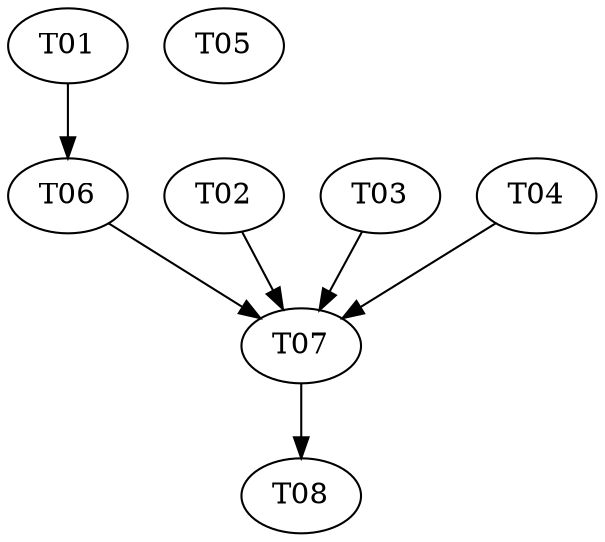

# Note-Specific Behaviour in the Chat — Implementation Plan

> **For agentic workers:** REQUIRED: Use superpowers:subagent-driven-development or
> superpowers:executing-plans to implement this plan. Steps use checkbox (`- [ ]`)
> syntax for tracking.

**Goal:** The chat knows which note you are reading — what you say resolves against
that note first, and a `Current note questions` preset appears when that note still
owes answers.

**Architecture:** One channel, not two. Every outgoing message carries the note it was
composed against; the panel announces that note to the interviewer only when its
picture is out of date (first message, then on each change). The preset's prose can
therefore say "the note I am looking at" with no interpolation. All decisions land in
pure modules (`note-context.ts`, `presets.ts`, `open-questions.ts`); the `ItemView` and
the React components do plumbing only.

**Tech Stack:** TypeScript, React 19, Obsidian plugin API, Vitest, esbuild.

**Design doc:** `docs/superpowers/specs/2026-08-13-current-note-behaviour-design.md`

**Planned by:** claude-opus-5

**One refinement on the spec:** the spec put "the new preset file loads and is
non-empty" in `tests/prompts.test.ts`. It lives in `tests/chat-presets.test.ts` here
instead, so T04 and T05 share no file and can run in the same wave. Nothing about the
behaviour changes.

**Knowledge files** are the repo's existing shared set at
`docs/superpowers/plans/knowledge/` — `run-tests.md`, `typecheck-build.md`,
`commit.md`, `regen-oracle.md`. This plan adds none.

---

## Dependency Graph

| Task | Depends On | Files Created/Modified |
|------|-----------|------------------------|
| T01 | — | `src/open-questions.ts`, `src/mindmap/heat.ts`, `src/mindmap/layout.ts`, `tests/open-questions.test.ts`, `tests/mindmap-heat.test.ts` |
| T02 | — | `src/chat/note-context.ts`, `tests/chat-note-context.test.ts` |
| T03 | — | `src/chat/queue.ts`, `tests/chat-queue.test.ts` |
| T04 | — | `src/chat/presets.ts`, `assets/prompts/presets/current-note-questions.md`, `tests/chat-presets.test.ts` |
| T05 | — | `assets/prompts/system.md`, `tests/prompts.test.ts` |
| T06 | T01 | `src/main.ts` |
| T07 | T02, T03, T04, T06 | `src/chat/ChatView.tsx`, `src/chat/components.tsx` |
| T08 | T07 | `docs/superpowers/manual-test-checklist.md`, `docs/superpowers/plans/progress/2026-08-11-graph-buddy-plugin-checkpoint.md` |

**Wave Schedule:**
- Wave 1: T01, T02, T03, T04, T05 — no dependencies, no shared files
- Wave 2: T06 — needs the counter's new home from T01
- Wave 3: T07 — the shell, needs every module beneath it
- Wave 4: T08 — documents what T07 made real

## Task Index

| ID | Name | File | Description |
|----|------|------|-------------|
| T01 | Open-questions module | `tasks/T01-open-questions-module.md` | Move `countOpenQuestions` out of the mindmap to `src/open-questions.ts` |
| T02 | Note announcement | `tasks/T02-note-context.md` | Pure decision: what to tell the interviewer, and when |
| T03 | A message carries its note | `tasks/T03-outgoing-note.md` | `Outgoing.note`, surviving the queue, a cancel and a resend |
| T04 | The preset | `tasks/T04-current-note-preset.md` | `visiblePresets` plus the preset's prose |
| T05 | The system-prompt rule | `tasks/T05-system-prompt-rule.md` | Teach the interviewer what an open-note line means |
| T06 | Active-note resolver | `tasks/T06-active-note-resolver.md` | `plugin.activeNoteIn(graphDir)` |
| T07 | Chat wiring | `tasks/T07-chat-wiring.md` | Stamp, stitch, render, and keep the row live |
| T08 | Docs and checklist | `tasks/T08-docs-and-checklist.md` | Manual checks and the status doc |

## Execution Handoff

**Plan complete and saved to
`docs/superpowers/plans/2026-08-13-current-note-behaviour/plan.md`.**

1. **Subagent-Driven (this session)** — dispatch a fresh subagent per task, review between tasks
2. **Parallel Session (separate)** — open a new session with executing-plans, batch execution
