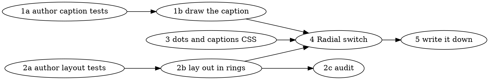

# Radial mindmap Implementation Plan

> **For agentic workers:** REQUIRED: Use superpowers:subagent-driven-development or superpowers:executing-plans to implement this plan. Steps use checkbox (`- [ ]`) syntax for tracking.

**Goal:** Give the map a Radial switch that draws the graph as rings around the hub — Obsidian-style dots with horizontal captions — so a project stays readable well past the twenty notes where the left-to-right tree runs out of screen.

**Architecture:** The existing `d3-flextree` layout is reused with its axes reinterpreted: `x` becomes an angle in radians and depth becomes a ring radius. A node reserves its *worst-case* linear breadth (captions never rotate, so one at the top of the circle lies flat across its ring), converted to an angular size by dividing by that ring's radius. When the packed tree wants more than a full turn, angles shrink and radii grow by the same factor — every node keeps exactly the arc length it reserved and the circle closes instead of wrapping over itself. All of that lives in a new pure module, `src/mindmap/radial.ts`; the view shell only paints what it returns.

**Tech Stack:** TypeScript, `d3-flextree` 2.1.2 and `d3-hierarchy` 3.1.2 (both already direct dependencies — **no new packages**), `d3-selection`/`d3-zoom` for the shell, Vitest.

---

## Settled decisions

Resolved before the plan; not open for re-litigation during execution.

- **Radial tidy tree, not force-directed.** The parent spine is what this app is about. A force layout would discard it and resettle on every vault change, which this view takes 300ms-debounced.
- **Captions are horizontal, never rotated.** This is the whole reason breadth reservation is worst-case rather than uniform.
- **A small graph stays a fan.** Angles are only ever scaled *down*, never stretched to fill the circle. Three notes forced 120° apart would read as a bug.
- **Heat maps onto the circle's two areas:** the dot's fill is the note's own open questions, a ring outside it is what a collapse is hiding. This replaces the box's divider, which has no meaning on a dot.
- **The no-overlap guarantee is per-ring, not global.** A caption on ring 1 can still reach into ring 2. Obsidian has the same property. Do not add machinery for it.
- **Cartesian mode stays.** The switch chooses between two drawings; neither replaces the other.

## File structure

| File | Responsibility |
|---|---|
| `src/mindmap/radial.ts` **(new)** | Pure. Tree → `{angle, radius, x, y, labelAnchor}` per node, plus the two path builders. Owns the ring gap, the breadth reservation rule and the crowding scale-out. No DOM, no Obsidian. |
| `src/mindmap/geometry.ts` | Gains `radialCaption()` and the two dot radii. Keeps owning "how wide does a label draw". |
| `src/mindmap/MindmapView.tsx` | Shell only. Grows a `radial` flag, a second header toggle, and a `paintRadial` sibling to the existing painter. Zoom, fit and node interaction get written once and shared. |
| `styles.css` | `cb-mm-dot`, `cb-mm-dot-hidden`, `cb-mm-caption`. Reuses the existing `cb-mm-heat-*` palette unchanged. |
| `tests/mindmap-radial.test.ts` **(new)** | The layout invariants. |
| `tests/mindmap-geometry.test.ts` | Gains a `radialCaption` block. |

`MindmapView.tsx` is already 435 lines and this adds to it. The mitigation is the shared-seam refactor in Task 4 — both painters return `Bounds`, and zoom, fit and interaction are written once — not a new file. Painting is the shell's job, and splitting it out would create a module whose only API is a d3 selection.

## Common actions

- **Run one test file:** `npx vitest run tests/<file>.test.ts`, from the repo root.
- **Run the whole suite:** `npx vitest run` — about a second, and it covers the docs as well as the code.
- **Typecheck + build:** `npm run build`.
- **Deploy to the vault:** `npm run build && deploy.bat`, then toggle the plugin off and on in Obsidian (it does not hot-reload).
- **Commit trailer:** every commit ends with `Co-Authored-By: <the model that actually wrote it> <noreply@anthropic.com>`. Subjects are a present-tense sentence about behaviour from the user's side of the screen — see `.claude/knowledge/conventions.md`.
- **Commit noise:** every `git commit` in this repo prints `ERROR: Failed to parse repository information` once or twice. It is global-hook noise and harmless. Confirm a commit by its `[branch sha]` line or `git log -1`, never by that message's absence.

---

## Task 1a: Lock the caption's shape

**role:** `red`

**Files:**
- Test: `tests/mindmap-geometry.test.ts` (append a new `describe` block at the end)

- [ ] **Step 1: Write the failing tests**

The file already defines `const measure = (text: string): number => [...text].length * 7;` near the top — reuse it, do not redeclare. Add `radialCaption` to the existing import list from `../src/mindmap/geometry`, then append:

```ts
describe("radialCaption", () => {
  it("keeps a short stem whole and reports the width it will draw", () => {
    const caption = radialCaption("Doors", measure);
    expect(caption.label).toBe("Doors");
    expect(caption.width).toBe(measure("Doors"));
    expect(caption.suffix).toBeNull();
    expect(caption.suffixX).toBeNull();
  });

  it("ellipsises a stem that would overrun the radial cap", () => {
    const long = "A ferry crossing that never arrives at the far bank";
    const caption = radialCaption(long, measure);
    expect(caption.label.endsWith("…")).toBe(true);
    expect(caption.width).toBe(measure(caption.label));
    expect(caption.width).toBeLessThan(measure(long));
  });

  it("caps a caption shorter than a box, because a ring is read at a glance", () => {
    const long = "x".repeat(200);
    expect(radialCaption(long, measure).width).toBeLessThan(nodeBox(long, measure).width);
  });

  it("lays the folded-child count after the stem, at a readable remove", () => {
    const caption = radialCaption("Doors", measure, { suffix: "+4" });
    expect(caption.suffix).toBe("+4");
    expect(caption.suffixX).toBeGreaterThan(measure("Doors"));
    expect(caption.width).toBe(caption.suffixX! + measure("+4"));
  });

  it("takes the count's room out of the stem's budget rather than dropping it", () => {
    const long = "A ferry crossing that never arrives at the far bank";
    const bare = radialCaption(long, measure);
    const counted = radialCaption(long, measure, { suffix: "+12" });
    expect(counted.suffix).toBe("+12");
    expect(measure(counted.label)).toBeLessThan(measure(bare.label));
  });

  it("treats an empty suffix as no suffix", () => {
    expect(radialCaption("Doors", measure, { suffix: "" }).suffix).toBeNull();
  });

  it("does not leave a dangling space before the ellipsis", () => {
    const caption = radialCaption("Cutting room floor conversations about the ferry", measure);
    expect(caption.label).not.toMatch(/ …$/);
  });
});
```

- [ ] **Step 2: Run to verify they fail for the right reason**

```bash
npx vitest run tests/mindmap-geometry.test.ts
```

Expected: the new block fails because `radialCaption` is not exported — a `radialCaption is not a function` or `No "radialCaption" export is defined` error. If anything in the **existing** blocks went red, you broke the file; fix that before committing.

- [ ] **Step 3: Check the compiler agrees, and for the right reason only**

```bash
npx tsc --noEmit
```

Vitest strips types without checking them, and `tests/**/*.ts` is inside this project's `tsconfig.json` — so a test file can be green and still not compile. Expected here: errors about the missing `radialCaption` export and **nothing else**. `noUncheckedIndexedAccess` is on, so any `array[i]` in a test needs a `!`; if you see one of those complaints, it is yours to fix now, not the implementer's.

- [ ] **Step 4: Commit**

```bash
git add tests/mindmap-geometry.test.ts
git commit -m "test: a radial caption fits its own shorter cap

Co-Authored-By: Claude Opus 5 <noreply@anthropic.com>"
```

---

## Task 1b: Draw the caption

**role:** `green` — **depends on Task 1a**

**Scope / Negative constraints:**
- `tests/mindmap-geometry.test.ts` is **read-only**. Do not modify it. If a test looks wrong, stop and escalate rather than editing it.
- Do not touch `MindmapView.tsx`, `styles.css` or `radial.ts` in this task.

**Files:**
- Modify: `src/mindmap/geometry.ts`
- Test: `tests/mindmap-geometry.test.ts` (read-only)

- [ ] **Step 1: Read the locked tests**

Read the `radialCaption` block. Note what it pins: the reported width is the measured width of what is actually drawn, the cap is strictly tighter than `nodeBox`'s, and the suffix eats into the stem's budget rather than being dropped.

- [ ] **Step 2: Add the constants**

In `src/mindmap/geometry.ts`, beside the existing `MAX_WIDTH` declaration:

```ts
/**
 * The caption cap in radial mode. Tighter than a box's, because a ring is read
 * at a glance and a long caption there eats angle its neighbours need.
 */
const MAX_CAPTION_WIDTH = 168;

/** The dot a note draws in radial mode, and the larger one the hub gets. */
export const DOT_RADIUS = 6;
export const HUB_DOT_RADIUS = 11;
```

- [ ] **Step 3: Add the caption type and function**

Append after `childRegionPath`:

```ts
/**
 * A node's caption in radial mode: the same text rules as a box, without the
 * box. There is no divider to draw, so the fold count is simply set after the
 * stem at the same remove the box puts either side of its rule.
 */
export interface Caption {
  /** Rendered stem, ellipsised if the full one would overrun. */
  label: string;
  /** The count of children folded away, or null. */
  suffix: string | null;
  /** Total drawn width, stem plus the gap and the count. */
  width: number;
  /** Where the count starts, measured from the caption's own start. */
  suffixX: number | null;
}

export function radialCaption(
  label: string,
  measure: Measure,
  options: { suffix?: string | null } = {},
): Caption {
  const suffix = options.suffix === undefined || options.suffix === "" ? null : options.suffix;
  const suffixWidth = suffix === null ? 0 : DIVIDER_GAP + measure(suffix);
  const budget = MAX_CAPTION_WIDTH - suffixWidth;
  const shown = measure(label) <= budget ? label : ellipsise(label, budget, measure);
  const labelWidth = measure(shown);
  return {
    label: shown,
    suffix,
    width: labelWidth + suffixWidth,
    suffixX: suffix === null ? null : labelWidth + DIVIDER_GAP,
  };
}
```

`DIVIDER_GAP` and `ellipsise` are already private in this file — reuse them, do not copy them.

- [ ] **Step 4: Run to verify they pass**

```bash
npx vitest run tests/mindmap-geometry.test.ts
```

Expected: every test in the file passes, old and new.

- [ ] **Step 5: Typecheck**

```bash
npx tsc --noEmit
```

Expected: no output. Vitest does not typecheck, so this is a separate gate.

- [ ] **Step 6: Commit**

```bash
git add src/mindmap/geometry.ts
git commit -m "feat: a note's caption knows how wide it draws on a ring

Co-Authored-By: Claude Opus 5 <noreply@anthropic.com>"
```

---

## Task 2a: Lock the radial layout's promises

**role:** `red`

**Files:**
- Create: `tests/mindmap-radial.test.ts`

**Note for the author:** these tests exist for the *invariants*, not for one implementation's numbers. Never pin a literal angle or radius — every expectation below is either computed from the layout's own output or compared between two layouts. If something is genuinely open, assert the invariant and escalate; do not invent a golden value.

- [ ] **Step 1: Write the failing tests**

```ts
import { describe, it, expect } from "vitest";
import { radialLayout, radialLinkPath, crossLinkPath, Reach, RadialNode } from "../src/mindmap/radial";
import type { MindmapNode } from "../src/mindmap/layout";

const note = (stem: string, children: MindmapNode[] = []): MindmapNode => ({
  path: `${stem}.md`,
  stem,
  kind: null,
  status: null,
  problemKinds: [],
  children,
  collapsedChildren: 0,
  openQuestions: 0,
  hiddenOpenQuestions: 0,
});

/** Every node the same size, so crowding is the only variable under test. */
const evenReach = (caption: number) => (): Reach => ({ dot: 6, caption });

const brood = (count: number, prefix = "n"): MindmapNode[] =>
  Array.from({ length: count }, (_, i) => note(`${prefix}${i}`));

/** The test's own model of a caption's height. The layout promises breadth. */
const CAPTION_HALF_HEIGHT = 7;

/**
 * The rectangle a caption occupies on screen, worked out from the layout's
 * output and the reach this test handed in — never from the module's internals.
 */
const captionRect = (node: RadialNode, reach: Reach, gap: number) => {
  const near =
    node.labelAnchor === "start"
      ? node.x + reach.dot + gap
      : node.x - reach.dot - gap - reach.caption;
  return {
    left: near,
    right: near + reach.caption,
    top: node.y - CAPTION_HALF_HEIGHT,
    bottom: node.y + CAPTION_HALF_HEIGHT,
  };
};

type Rect = ReturnType<typeof captionRect>;

const overlaps = (a: Rect, b: Rect): boolean =>
  a.left < b.right && b.left < a.right && a.top < b.bottom && b.top < a.bottom;

describe("radialLayout", () => {
  it("puts the hub at the centre, because everything else hangs off it", () => {
    const { nodes } = radialLayout(note("Hub", brood(4)), evenReach(60));
    const hub = nodes.find((n) => n.depth === 0)!;
    // Close-to rather than exactly: a zero radius times a cosine lands on -0,
    // which `toBe` counts as a different number from 0 and a reader does not.
    expect(hub.x).toBeCloseTo(0, 9);
    expect(hub.y).toBeCloseTo(0, 9);
    expect(hub.radius).toBe(0);
  });

  it("seats a whole generation on one ring", () => {
    const { nodes } = radialLayout(note("Hub", brood(5)), evenReach(60));
    const radii = new Set(nodes.filter((n) => n.depth === 1).map((n) => n.radius));
    expect(radii.size).toBe(1);
  });

  it("puts each generation further out than the one before it", () => {
    const deep = note("Hub", [note("a", [note("b", [note("c")])])]);
    const { nodes } = radialLayout(deep, evenReach(60));
    const byDepth = [1, 2, 3].map((d) => nodes.find((n) => n.depth === d)!.radius);
    expect(byDepth[1]!).toBeGreaterThan(byDepth[0]!);
    expect(byDepth[2]!).toBeGreaterThan(byDepth[1]!);
  });

  it("never lets two captions on the same ring collide, however crowded", () => {
    const reach: Reach = { dot: 6, caption: 90 };
    const { nodes } = radialLayout(note("Hub", brood(40)), () => reach);
    const ring = nodes.filter((n) => n.depth === 1);
    for (let i = 0; i < ring.length; i++) {
      for (let j = i + 1; j < ring.length; j++) {
        expect(overlaps(captionRect(ring[i]!, reach, 7), captionRect(ring[j]!, reach, 7))).toBe(false);
      }
    }
  });

  it("closes the circle instead of wrapping the far side over the near one", () => {
    const { nodes } = radialLayout(note("Hub", brood(60)), evenReach(120));
    const angles = nodes.map((n) => n.angle);
    expect(Math.max(...angles) - Math.min(...angles)).toBeLessThanOrEqual(Math.PI * 2 + 1e-9);
  });

  it("grows the circle rather than squeezing the notes when a ring fills up", () => {
    const roomy = radialLayout(note("Hub", brood(4)), evenReach(90));
    const packed = radialLayout(note("Hub", brood(60)), evenReach(90));
    const ringRadius = (layout: typeof roomy): number =>
      layout.nodes.find((n) => n.depth === 1)!.radius;
    expect(ringRadius(packed)).toBeGreaterThan(ringRadius(roomy));
  });

  it("leaves a small graph as a fan rather than stretching it round the circle", () => {
    const { nodes } = radialLayout(note("Hub", brood(3)), evenReach(60));
    const angles = nodes.map((n) => n.angle);
    expect(Math.max(...angles) - Math.min(...angles)).toBeLessThan(Math.PI);
  });

  it("hangs every caption on the outward side of its dot", () => {
    const { nodes } = radialLayout(note("Hub", brood(12)), evenReach(60));
    const placed = nodes.filter((n) => n.depth > 0);
    expect(placed.filter((n) => n.x < 0).every((n) => n.labelAnchor === "end")).toBe(true);
    expect(placed.filter((n) => n.x > 0).every((n) => n.labelAnchor === "start")).toBe(true);
  });

  it("reports one link per parent edge, always pointing one ring outward", () => {
    const tree = note("Hub", [note("a", [note("b")]), note("c")]);
    const { nodes, links } = radialLayout(tree, evenReach(60));
    expect(links).toHaveLength(nodes.length - 1);
    expect(links.every((l) => l.target.depth === l.source.depth + 1)).toBe(true);
  });

  it("returns bounds that enclose every caption it laid out", () => {
    const reach: Reach = { dot: 6, caption: 90 };
    const { nodes, bounds } = radialLayout(note("Hub", brood(18)), () => reach);
    for (const node of nodes) {
      const rect = captionRect(node, reach, 7);
      expect(bounds.minX).toBeLessThanOrEqual(rect.left);
      expect(bounds.maxX).toBeGreaterThanOrEqual(rect.right);
      expect(bounds.minY).toBeLessThanOrEqual(node.y - reach.dot);
      expect(bounds.maxY).toBeGreaterThanOrEqual(node.y + reach.dot);
    }
  });

  it("draws a lone hub without dividing by a radius it does not have", () => {
    const { nodes, links, bounds } = radialLayout(note("Hub"), evenReach(60));
    expect(nodes).toHaveLength(1);
    expect(links).toHaveLength(0);
    expect(Number.isFinite(bounds.maxX)).toBe(true);
    expect(Number.isFinite(bounds.minY)).toBe(true);
  });
});

/** Pulls the numbers back out of a path, so a curve can be checked by its ends. */
const coords = (path: string): number[] =>
  (path.match(/-?\d+(\.\d+)?(e[+-]?\d+)?/g) ?? []).map(Number);

describe("radialLinkPath", () => {
  it("leaves the parent and arrives at the child", () => {
    const { links } = radialLayout(note("Hub", [note("a", [note("b")])]), evenReach(60));
    const link = links.find((l) => l.source.depth === 1)!;
    const numbers = coords(radialLinkPath(link.source, link.target));
    expect(numbers[0]!).toBeCloseTo(link.source.x, 9);
    expect(numbers[1]!).toBeCloseTo(link.source.y, 9);
    expect(numbers[numbers.length - 2]!).toBeCloseTo(link.target.x, 9);
    expect(numbers[numbers.length - 1]!).toBeCloseTo(link.target.y, 9);
  });

  it("bends through the space between the two rings, not through the hub", () => {
    const { links } = radialLayout(note("Hub", [note("a", [note("b")])]), evenReach(60));
    const link = links.find((l) => l.source.depth === 1)!;
    const numbers = coords(radialLinkPath(link.source, link.target));
    const control = Math.hypot(numbers[2]!, numbers[3]!);
    expect(control).toBeGreaterThan(Math.min(link.source.radius, link.target.radius));
    expect(control).toBeLessThan(Math.max(link.source.radius, link.target.radius));
  });
});

describe("crossLinkPath", () => {
  it("bows toward the hub, so a chord clears the ring it starts on", () => {
    const { nodes } = radialLayout(note("Hub", brood(8)), evenReach(60));
    const ring = nodes.filter((n) => n.depth === 1);
    const [from, to] = [ring[0]!, ring[4]!];
    const numbers = coords(crossLinkPath(from, to));
    const control = Math.hypot(numbers[2]!, numbers[3]!);
    const straight = Math.hypot((from.x + to.x) / 2, (from.y + to.y) / 2);
    expect(control).toBeLessThanOrEqual(straight + 1e-9);
    expect(numbers[0]!).toBeCloseTo(from.x, 9);
    expect(numbers[1]!).toBeCloseTo(from.y, 9);
    expect(numbers[numbers.length - 2]!).toBeCloseTo(to.x, 9);
    expect(numbers[numbers.length - 1]!).toBeCloseTo(to.y, 9);
  });
});
```

- [ ] **Step 2: Run to verify they fail for the right reason**

```bash
npx vitest run tests/mindmap-radial.test.ts
```

Expected: the whole file fails to resolve `../src/mindmap/radial` — the module does not exist yet. That is the right reason.

- [ ] **Step 3: Check the compiler agrees, and for the right reason only**

```bash
npx tsc --noEmit
```

Vitest strips types without checking them, and `tests/**/*.ts` is inside this project's `tsconfig.json` — so a test file can be green and still not compile. Expected here: `Cannot find module '../src/mindmap/radial'` and **nothing else**. `noUncheckedIndexedAccess` is on, so every `array[i]` needs a `!` — the tests above are written that way; if you have added any of your own, check them now rather than leaving it for the implementer.

- [ ] **Step 4: Commit**

```bash
git add tests/mindmap-radial.test.ts
git commit -m "test: the radial map never lets two notes on a ring collide

Co-Authored-By: Claude Opus 5 <noreply@anthropic.com>"
```

---

## Task 2b: Lay the graph out in rings

**role:** `green` — **depends on Task 2a**

**Scope / Negative constraints:**
- `tests/mindmap-radial.test.ts` is **read-only**. Do not modify it. Escalate a wrong test; never edit it.
- Do not touch `geometry.ts`, `MindmapView.tsx` or `styles.css` in this task.
- `radial.ts` must import **no** Obsidian, DOM or React symbol. Only `d3-hierarchy`, `d3-flextree`, and types from the two sibling modules.

**Files:**
- Create: `src/mindmap/radial.ts`
- Test: `tests/mindmap-radial.test.ts` (read-only)

- [ ] **Step 1: Read the locked tests**

Read the file in full. Four of them carry the whole crowding rule between them: *never lets two captions collide*, *closes the circle*, *grows the circle rather than squeezing*, and *leaves a small graph as a fan*.

- [ ] **Step 2: Write the module**

Create `src/mindmap/radial.ts`:

```ts
/**
 * The map as rings around its hub.
 *
 * Nothing here is new geometry — it is the same `d3-flextree` pass the flat map
 * runs, with its axes read differently: x is an angle in radians and depth is a
 * radius. The one rule belonging to this shape alone is how much of a ring a
 * node reserves. Captions never rotate, so one at the top of the circle lies
 * flat across its ring and takes its full width in breadth; reserving that
 * worst case everywhere costs a little air at the sides of a sparse graph and
 * buys a map that never overlaps itself.
 */

import { hierarchy } from "d3-hierarchy";
import { flextree } from "d3-flextree";
import type { MindmapNode } from "./layout";
import type { Bounds } from "./geometry";

/** How far apart two rings sit before a crowded graph pushes them out. */
const RING_GAP = 170;
/** Breathing room either side of what a node reserves on its ring. */
const BREADTH_GAP = 14;
/** The space between a dot and the caption beside it. */
export const CAPTION_GAP = 7;
const TAU = Math.PI * 2;

/** What a node takes up, measured by the shell in the face it really draws in. */
export interface Reach {
  /** The dot's radius. */
  dot: number;
  /** The caption's drawn width, or 0 when the node draws none. */
  caption: number;
}

export type ReachOf = (node: MindmapNode) => Reach;

export interface RadialNode {
  path: string;
  data: MindmapNode;
  depth: number;
  /** Radians. Zero points straight up and the angle grows clockwise. */
  angle: number;
  radius: number;
  /** Cartesian, with the hub at the origin. */
  x: number;
  y: number;
  /** Which side of the dot the caption hangs off. */
  labelAnchor: "start" | "end";
}

export interface RadialLink {
  source: RadialNode;
  target: RadialNode;
}

export interface RadialLayout {
  nodes: RadialNode[];
  links: RadialLink[];
  bounds: Bounds;
}

export function radialLayout(root: MindmapNode, reachOf: ReachOf): RadialLayout {
  // The hub sits at the origin, so its own ring would be a division by zero; it
  // borrows the first ring's radius purely to have a size to be packed with.
  const ringOf = (depth: number): number => Math.max(1, depth) * RING_GAP;
  const angularSize = (depth: number, node: MindmapNode): number => {
    const reach = reachOf(node);
    const breadth =
      reach.dot * 2 + (reach.caption > 0 ? CAPTION_GAP + reach.caption : 0) + BREADTH_GAP;
    return breadth / ringOf(depth);
  };

  const laid = flextree<MindmapNode>().nodeSize((n) => [angularSize(n.depth, n.data), 1])(
    hierarchy(root, (d) => d.children),
  );

  // flextree packs siblings as tightly as their sizes allow, which on a busy
  // ring can want more than a full turn. Shrinking every angle and growing every
  // radius by the same factor leaves each node exactly the arc it reserved and
  // closes the circle, instead of letting the far side wrap over the near one.
  // It only ever shrinks: a three-note graph stays a fan rather than being
  // stretched into a ring with three notes and a great deal of nothing.
  let left = Infinity;
  let right = -Infinity;
  laid.each((n) => {
    const half = angularSize(n.depth, n.data) / 2;
    left = Math.min(left, n.x - half);
    right = Math.max(right, n.x + half);
  });
  const span = right - left;
  const scale = span > TAU ? TAU / span : 1;
  const middle = (left + right) / 2;

  const nodes: RadialNode[] = [];
  const byPath = new Map<string, RadialNode>();
  laid.each((n) => {
    const angle = (n.x - middle) * scale;
    const radius = n.depth === 0 ? 0 : ringOf(n.depth) / scale;
    const x = radius * Math.sin(angle);
    const node: RadialNode = {
      path: n.data.path,
      data: n.data,
      depth: n.depth,
      angle,
      radius,
      x,
      y: -radius * Math.cos(angle),
      labelAnchor: x < 0 ? "end" : "start",
    };
    nodes.push(node);
    byPath.set(node.path, node);
  });

  const links: RadialLink[] = [];
  laid.each((n) => {
    if (n.parent === null) return;
    const source = byPath.get(n.parent.data.path);
    const target = byPath.get(n.data.path);
    if (source !== undefined && target !== undefined) links.push({ source, target });
  });

  return { nodes, links, bounds: boundsOf(nodes, reachOf) };
}

/**
 * The box the drawing occupies. A caption hangs off one side of its dot only,
 * so a node reaches further that way than the other. Its height is left out — a
 * caption stands a few pixels taller than a dot, which the fit margin already
 * covers, and a constant for that slop would be one nobody could name.
 */
function boundsOf(nodes: RadialNode[], reachOf: ReachOf): Bounds {
  const bounds: Bounds = { minX: 0, minY: 0, maxX: 0, maxY: 0 };
  for (const node of nodes) {
    const reach = reachOf(node.data);
    const tail = reach.caption > 0 ? reach.dot + CAPTION_GAP + reach.caption : reach.dot;
    const rightward = node.labelAnchor === "start" ? tail : reach.dot;
    const leftward = node.labelAnchor === "start" ? reach.dot : tail;
    bounds.minX = Math.min(bounds.minX, node.x - leftward);
    bounds.maxX = Math.max(bounds.maxX, node.x + rightward);
    bounds.minY = Math.min(bounds.minY, node.y - reach.dot);
    bounds.maxY = Math.max(bounds.maxY, node.y + reach.dot);
  }
  return bounds;
}

const at = (angle: number, radius: number): string =>
  `${radius * Math.sin(angle)},${-radius * Math.cos(angle)}`;

/**
 * A parent edge: a cubic whose controls sit on each end's own bearing, halfway
 * between the two rings. It leaves the parent radially and arrives at the child
 * radially, so a branch reads as a branch rather than as a chord.
 */
export function radialLinkPath(source: RadialNode, target: RadialNode): string {
  const middle = (source.radius + target.radius) / 2;
  return `M${at(source.angle, source.radius)}C${at(source.angle, middle)} ${at(target.angle, middle)} ${at(target.angle, target.radius)}`;
}

/** How far in a cross-link's chord is pulled toward the hub. */
const CHORD_PULL = 0.4;

/**
 * A cross-link cuts across the circle rather than following it. Pulling the
 * curve most of the way in toward the hub keeps it off the ring it starts and
 * ends on — which is the ring it would otherwise be mistaken for.
 */
export function crossLinkPath(from: RadialNode, to: RadialNode): string {
  const cx = ((from.x + to.x) / 2) * CHORD_PULL;
  const cy = ((from.y + to.y) / 2) * CHORD_PULL;
  return `M${from.x},${from.y}Q${cx},${cy} ${to.x},${to.y}`;
}
```

- [ ] **Step 3: Run to verify the tests pass**

```bash
npx vitest run tests/mindmap-radial.test.ts
```

Expected: every test passes.

- [ ] **Step 4: Typecheck**

```bash
npx tsc --noEmit
```

Expected: no output. The shim at `src/mindmap/flextree.d.ts` extends `HierarchyNode`, which already declares `depth`, `parent` and `each` — a failure here means an import is wrong, not that the shim needs extending.

- [ ] **Step 5: Commit**

```bash
git add src/mindmap/radial.ts
git commit -m "feat: the map can be laid out as rings around its hub

Co-Authored-By: Claude Opus 5 <noreply@anthropic.com>"
```

---

## Task 2c: Audit the radial layout

**role:** `audit` — **depends on Task 2b**

**Files:** none modified. This task produces a report.

- [ ] **Step 1: Read both sides**

Read `tests/mindmap-radial.test.ts` and `src/mindmap/radial.ts` with the settled decisions at the top of this plan in hand.

- [ ] **Step 2: Probe these specifically**

- **Does the no-collision test actually bite?** Temporarily set `BREADTH_GAP` to `-60` and re-run. If *never lets two captions collide* stays green, the test is not testing what it claims. Revert either way.
- **Does the scale-out preserve arc length?** On a crowded layout, check by hand that the angular gap between two adjacent same-ring nodes, times their radius, is at least their reserved breadth. If the scaling is applied to only one of the two axes, this is where it shows.
- **Deep and lopsided trees.** A hub with one child that has forty grandchildren: ring 2 crowds while ring 1 sits nearly empty. The scale-out is global, so both rings move out together — that is intended per the settled decisions. Confirm it *behaves* that way and does not produce overlap.
- **`labelAnchor` at the poles.** A node at exactly angle 0 or π has `x === 0`. Which anchor does it get, and does *hangs every caption on the outward side* cover that case, or does it silently skip it because it filters on `x < 0` / `x > 0`?
- **`crossLinkPath` between two nodes on opposite sides.** The midpoint sits near the origin, so the control point collapses onto the hub. Is the resulting curve degenerate on screen?
- **The `+N` suffix's contribution to breadth.** `Reach.caption` is the *whole* caption width including the count. Confirm the view in Task 4 passes `caption.width`, not `measure(label)` — otherwise a folded node reserves less than it draws.

- [ ] **Step 3: Report**

Write findings as a list. Anything needing a new test becomes a new `red` task appended to this plan, **with the test code written out** — not a note saying one is needed. If nothing is found, say so plainly; do not invent findings.

---

## Task 3: Dress the dots and captions

**Files:**
- Modify: `styles.css` — append after the `.cb-mm-hub:hover text` / `:focus-visible` rule, so the block sits below the hub group rather than splitting it

No test. Per `CLAUDE.md` the views are manual-test-only by design, and the decisions that *can* be tested already live in `radial.ts` and `geometry.ts`.

- [ ] **Step 1: Add the rules**

```css
/* Radial mode. The dot's fill is the note's own heat and the ring outside it is
   the heat of whatever a collapse is hiding — the two areas the box splits at
   its divider, in the only shape a circle has for them. */
.cb-mm-dot {
  fill: var(--cb-heat-fill, var(--cb-rail));
  stroke: var(--cb-heat-line, var(--background-modifier-border-hover));
  stroke-width: 1.5;
  transition: fill 120ms ease, stroke 120ms ease;
}

.cb-mm-dot-hidden {
  fill: none;
  stroke: var(--cb-heat-line, var(--background-modifier-border-hover));
  stroke-width: 2.5;
}

.cb-mm-node:hover .cb-mm-dot,
.cb-mm-node:focus-visible .cb-mm-dot {
  stroke: var(--cb-live);
}

/* The same red the box mode uses. Two reds for one "this note is broken"
   signal would make the map's meaning depend on which shape you were in. */
.cb-mm-dot.cb-mm-problem {
  stroke: var(--cb-broken);
  stroke-dasharray: 3 2;
}

/* The hub's dot answers to Heat like every other, so its accent colour is the
   fallback rather than an override — otherwise the one note that carries the
   charter would be the one note whose questions the map does not colour. */
.cb-mm-hub-dot {
  fill: var(--cb-heat-fill, var(--cb-live));
  stroke: var(--cb-heat-line, transparent);
}

/* `text.` is load-bearing, not decoration — see the note below the block. */
text.cb-mm-caption {
  fill: var(--cb-quiet);
  font-size: var(--font-ui-small);
  dominant-baseline: middle;
  pointer-events: none;
}

.cb-mm-node:hover .cb-mm-caption,
.cb-mm-node:focus-visible .cb-mm-caption {
  fill: var(--cb-ink);
}

.cb-mm-hub .cb-mm-caption {
  fill: var(--cb-ink);
  font-size: var(--font-ui-medium);
  font-weight: 600;
}
```

The caption's selector is `text.cb-mm-caption`, not a bare class, and that matters. `.cb-mm-node text` is **(0,1,1)** — one class plus one type — so a bare `.cb-mm-caption` at (0,1,0) would lose to it on `fill`, `font-size` and `dominant-baseline`, no matter where it sat in the file. The caption would then render in `--cb-ink`, which is what the hover rule sets, making the hover rule dead code and the muted-to-normal progression invisible. Matching (0,1,1) and coming later in source is what wins the tie. Do not delete or edit `.cb-mm-node text` itself; other rules depend on it.

The same trap is live elsewhere in the file: `.cb-mm-fold` (0,1,0) has never actually beaten `.cb-mm-node text`, so a folded branch's count renders in `--cb-ink` at `--font-ui-small` rather than the `--cb-quiet` / `--font-ui-smaller` its own comment promises. That is a pre-existing defect, tracked separately — do not fix it here.

- [ ] **Step 2: Check the palette hooks resolve**

```bash
grep -n "cb-heat-fill" styles.css | head -3
```

Expected: `--cb-heat-fill` and `--cb-heat-line` are defined by the existing `.cb-mm-heat-*` classes for both themes. The new rules read them with a fallback, so a map with Heat off draws in the border colours.

- [ ] **Step 3: Commit**

```bash
git add styles.css
git commit -m "feat: the radial map's dots take the vault's colours

Co-Authored-By: Claude Opus 5 <noreply@anthropic.com>"
```

---

## Task 4: Put a Radial switch in the header

**Depends on Tasks 1b, 2b, 3.**

**Files:**
- Modify: `src/mindmap/MindmapView.tsx`

No test. Manual-test-only shell, by design.

- [ ] **Step 1: Widen the imports and add the flag**

At the top of `src/mindmap/MindmapView.tsx`, replace the geometry import line and add two more:

```ts
import type { Selection } from "d3-selection";
import { Box, Bounds, Caption, Measure, childRegionPath, edgeOpacity, fitTransform, inspectorLine, nodeBox, radialCaption, DOT_RADIUS, HUB_DOT_RADIUS } from "./geometry";
import { CAPTION_GAP, crossLinkPath, radialLayout, radialLinkPath } from "./radial";
```

Beside `private heatmap = false;`:

```ts
  private radial = false;
```

- [ ] **Step 2: Persist it**

In `getState()`:

```ts
    return { graphDir: this.graphDir, collapse: this.collapse.toJSON(), heatmap: this.heatmap, radial: this.radial };
```

In `setState()`, add `radial?: boolean;` to the destructured shape and, beside the heatmap line:

```ts
    this.radial = s.radial === true;
```

- [ ] **Step 3: Replace the hand-rolled Heat toggle with a shared one**

In `redraw()`, delete the block that builds `heatToggle` / `heatInput` (from `const heatToggle = header.createEl("label", ...` through its `addEventListener` closing lines), keeping the comment above it, and put in its place:

```ts
    // Radial is a way of reading the map and heat is another, so both switches
    // ride in the header beside the project picker rather than in settings.
    // Changing shape drops the stored transform: the old pan and zoom belong to
    // a different drawing and would open the new one somewhere off in the white.
    this.headerToggle(header, "Radial", this.radial, (on) => {
      this.radial = on;
      this.lastTransform = null;
    });
    this.headerToggle(header, "Heat", this.heatmap, (on) => {
      this.heatmap = on;
    });
```

Add the helper as a private method, above `measurers`:

```ts
  private headerToggle(host: HTMLElement, label: string, on: boolean, set: (value: boolean) => void): void {
    const toggle = host.createEl("label", { cls: "cb-mm-heat-toggle" });
    const input = toggle.createEl("input", { type: "checkbox" });
    input.checked = on;
    toggle.createSpan({ text: label });
    input.addEventListener("change", () => {
      set(input.checked);
      this.app.workspace.requestSaveLayout();
      this.redraw();
    });
  }
```

- [ ] **Step 4: Pull the node interaction out of the painter**

Both shapes wire clicks and keys identically, so it gets written once. Add above `drawTree`:

```ts
  /**
   * What a node does when it is clicked, typed at or pointed to. Identical in
   * both shapes — a click folds a branch and opens a leaf, alt-click always
   * opens, Enter opens and Space folds — so it is wired in one place.
   */
  private wireNode(
    g: Selection<SVGGElement, unknown, null, undefined>,
    node: MindmapNode,
    setActive: (node: MindmapNode | null) => void,
  ): void {
    const foldable = node.children.length > 0 || node.collapsedChildren > 0;
    const fold = (): void => {
      this.collapse.toggle(this.graphDir!, node.path);
      this.app.workspace.requestSaveLayout();
      this.redraw();
    };
    g.on("click", (event: MouseEvent) => {
      if (event.altKey || !foldable) return this.openNote(node.path);
      fold();
    });
    g.on("keydown", (event: KeyboardEvent) => {
      if (event.key === "Enter") {
        event.preventDefault();
        this.openNote(node.path);
      } else if (event.key === " " && foldable) {
        event.preventDefault();
        fold();
      }
    });
    g.on("mouseenter", () => setActive(node));
    g.on("focus", () => setActive(node));
    g.on("mouseleave", () => setActive(null));
    g.on("blur", () => setActive(null));
  }
```

In the existing `root.each((n) => { ... })` node loop, delete from `const foldable = node.children.length > 0 ...` through the final `g.on("blur", ...)` line and replace the lot with:

```ts
      this.wireNode(g, node, setActive);
```

- [ ] **Step 5: Split `drawTree` into a chooser and two painters**

`drawTree` keeps: the empty-graph guard, `host` / `svg` / `canvas`, `hubPath`, `measure`, the `crossByPath` map, `lit` / `setActive`, then the zoom wiring and `applyFit`. Everything between — the `boxes` cache, the flextree layout, the parent edges, the cross-link mesh and the node loop — moves into a new private method:

```ts
  private paintCartesian(
    canvas: Selection<SVGGElement, unknown, null, undefined>,
    data: MindmapData,
    hubPath: string,
    measure: { node: Measure; hub: Measure },
    setActive: (node: MindmapNode | null) => void,
    crossByPath: Map<string, SVGPathElement[]>,
  ): Bounds {
```

Its body is the existing code unchanged, plus — at the end, replacing the walk that used to live inside `applyFit` — the bounds it now returns:

```ts
    const bounds: Bounds = { minX: Infinity, minY: Infinity, maxX: -Infinity, maxY: -Infinity };
    root.each((n) => {
      const box = boxOf(n.data);
      bounds.minX = Math.min(bounds.minX, n.y);
      bounds.maxX = Math.max(bounds.maxX, n.y + box.width);
      bounds.minY = Math.min(bounds.minY, n.x - box.height / 2);
      bounds.maxY = Math.max(bounds.maxY, n.x + box.height / 2);
    });
    return bounds;
  }
```

In `drawTree`, where that code used to be:

```ts
    const bounds = this.radial
      ? this.paintRadial(canvas, data, hubPath, measure, setActive, crossByPath)
      : this.paintCartesian(canvas, data, hubPath, measure, setActive, crossByPath);
```

and `applyFit` becomes:

```ts
    const applyFit = (): void => {
      if (!host.isConnected) return;
      const fit = fitTransform(bounds, { width: host.clientWidth, height: host.clientHeight });
      svg.call(zoomBehavior.transform, zoomIdentity.translate(fit.x, fit.y).scale(fit.k));
    };
```

- [ ] **Step 6: Write the radial painter**

Add beside `paintCartesian`:

```ts
  /**
   * The map as rings. Every note is a dot with its name beside it, horizontal
   * whatever its bearing — a rotated caption reads well on a poster and badly
   * in a sidebar you glance at. `radialLayout` has already reserved the room
   * each caption needs, so nothing here has to avoid anything.
   */
  private paintRadial(
    canvas: Selection<SVGGElement, unknown, null, undefined>,
    data: MindmapData,
    hubPath: string,
    measure: { node: Measure; hub: Measure },
    setActive: (node: MindmapNode | null) => void,
    crossByPath: Map<string, SVGPathElement[]>,
  ): Bounds {
    const captions = new Map<string, Caption>();
    const captionOf = (node: MindmapNode): Caption => {
      const cached = captions.get(node.path);
      if (cached !== undefined) return cached;
      const isHub = node.path === hubPath;
      const caption = radialCaption(node.stem, isHub ? measure.hub : measure.node, {
        suffix: node.collapsedChildren > 0 ? `+${node.collapsedChildren}` : null,
      });
      captions.set(node.path, caption);
      return caption;
    };
    const dotOf = (node: MindmapNode): number =>
      node.path === hubPath ? HUB_DOT_RADIUS : DOT_RADIUS;

    // The whole caption, count included — reserving only the stem would leave a
    // folded node drawing wider than the ring gave it.
    const layout = radialLayout(data.root!, (node) => ({
      dot: dotOf(node),
      caption: captionOf(node).width,
    }));
    const byPath = new Map(layout.nodes.map((n) => [n.path, n]));

    for (const link of layout.links) {
      canvas
        .append("path")
        .attr("class", "cb-mm-edge")
        .attr("opacity", edgeOpacity(link.source.depth))
        .attr("d", radialLinkPath(link.source, link.target));
    }

    for (const cross of data.crossLinks) {
      const from = byPath.get(cross.from);
      const to = byPath.get(cross.to);
      if (from === undefined || to === undefined) continue;
      const path = canvas
        .append("path")
        .attr("class", "cb-mm-crosslink")
        .attr("d", crossLinkPath(from, to))
        .node();
      if (path === null) continue;
      for (const end of [cross.from, cross.to]) {
        const list = crossByPath.get(end) ?? [];
        list.push(path);
        crossByPath.set(end, list);
      }
    }

    for (const placed of layout.nodes) {
      const node = placed.data;
      const isHub = node.path === hubPath;
      const caption = captionOf(node);
      const dot = dotOf(node);
      const facts = inspectorLine(node);
      const g = canvas
        .append("g")
        .attr("class", isHub ? "cb-mm-node cb-mm-hub" : "cb-mm-node")
        .attr("transform", `translate(${placed.x},${placed.y})`)
        .attr("tabindex", 0)
        .attr("role", "button")
        .attr("aria-label", facts ?? node.stem);

      const ownHeat = this.heatmap ? ` ${heatClass(node.openQuestions)}` : "";
      const problem = node.problemKinds.length > 0;
      g.append("circle")
        .attr(
          "class",
          `${isHub ? "cb-mm-dot cb-mm-hub-dot" : "cb-mm-dot"}${problem ? " cb-mm-problem" : ""}${ownHeat}`,
        )
        .attr("r", dot);
      // What a collapse hides becomes a ring outside the dot: the same two areas
      // the box splits at its divider, in the shape a circle has for them.
      if (node.collapsedChildren > 0 && this.heatmap) {
        g.append("circle")
          .attr("class", `cb-mm-dot-hidden ${heatClass(node.hiddenOpenQuestions)}`)
          .attr("r", dot + 3);
      }

      const outward = placed.labelAnchor === "start" ? 1 : -1;
      const start = outward * (dot + CAPTION_GAP);
      g.append("text")
        .attr("class", "cb-mm-caption")
        .attr("text-anchor", placed.labelAnchor)
        .attr("x", start)
        .attr("y", 0)
        .text(caption.label);
      if (caption.suffix !== null && caption.suffixX !== null) {
        // The count sits past the stem on the outward side, so it never lands
        // between the dot and the name it belongs to.
        const offset =
          placed.labelAnchor === "start" ? caption.suffixX : caption.suffixX - caption.width;
        g.append("text")
          .attr("class", "cb-mm-caption cb-mm-fold")
          .attr("text-anchor", "start")
          .attr("x", start + offset)
          .attr("y", 0)
          .text(caption.suffix);
      }

      this.wireNode(g, node, setActive);
    }

    return layout.bounds;
  }
```

- [ ] **Step 7: Typecheck and build**

```bash
npm run build
```

Expected: the typecheck passes and `main.js` is written. `canvas` in `drawTree` is `svg.append("g")`, whose type is `Selection<SVGGElement, unknown, null, undefined>` — if the painter signatures do not line up, that is what they should say.

- [ ] **Step 8: Run the whole suite**

```bash
npx vitest run
```

Expected: all green. Nothing in this task is directly covered, but Steps 4–5 touch the Cartesian path; a mistake there surfaces as a build error, which is why Step 7 comes first.

- [ ] **Step 9: See it in the vault**

```bash
npm run build && deploy.bat
```

Toggle the plugin off and on in Obsidian, open the map, then check: the Radial switch sits beside Heat; flipping it redraws as rings centred on the hub; captions sit outside their dots and read left-to-right on both sides of the circle; a project of forty notes has no two captions on top of each other.

- [ ] **Step 10: Commit**

```bash
git add src/mindmap/MindmapView.tsx
git commit -m "feat: a Radial switch draws the map as rings around the hub

Co-Authored-By: Claude Opus 5 <noreply@anthropic.com>"
```

---

## Task 5: Write it down

**Depends on Task 4.**

**Files:**
- Modify: `docs/superpowers/manual-test-checklist.md` — a new `### Radial` block at the end of `## 2 — Dev vault: mindmap`, after the `### Heat` block
- Modify: `docs/superpowers/plans/progress/2026-08-11-graph-buddy-plugin-checkpoint.md` — a bullet in `## After the plan`

- [ ] **Step 1: Add the checklist block**

Insert after the last `### Heat` item:

```markdown
### Radial

- [ ] The header carries a **Radial** switch beside Heat, off when the map first
      opens. Off, the map is the left-to-right tree it has always been.
- [ ] Turn Radial on → the hub sits in the middle, its children on a ring around
      it, their children on a ring outside that.
- [ ] Every caption reads left to right, whatever side of the circle it is on.
      None of them is upside down or on its side.
- [ ] Captions on the left half of the circle end at their dot; captions on the
      right half start at theirs. No caption crosses its own dot.
- [ ] On a project of forty-odd notes, no two captions on the same ring overlap,
      and the rings sit further apart than on a small project — that is the map
      growing to fit rather than squeezing.
- [ ] A project of three notes is a fan, not three notes spread round a full
      circle with a great gap in it.
- [ ] Click a branch → it folds and the ring closes up around the gap. Click a
      leaf → the note opens. Alt-click a branch → the note opens.
- [ ] Tab to a dot → Enter opens it, Space folds it, same as the flat map.
- [ ] Turn Heat on with Radial on → the dots take colour by their own questions,
      and a folded dot grows a coloured ring for what it is hiding.
- [ ] A note with a validation problem keeps a red dashed ring in radial mode.
- [ ] Hover a dot → its cross-links light up as chords across the circle, not as
      arcs lying along a ring.
- [ ] Flip Radial, close the map tab, reopen it → the switch is where you left
      it, and the map opens fitted rather than on somebody else's pan.
- [ ] Flip between Radial and flat a few times → each redraw fits the whole
      graph; neither shape inherits the other's zoom.
```

- [ ] **Step 2: Add the checkpoint bullet**

Append to the `## After the plan` list, matching the surrounding bullets' shape — bold lead, prose, real commit hashes from `git log --oneline -8`:

```markdown
- **The map reads as rings** — a Radial switch beside Heat redraws the graph with
  the hub at the centre and each generation on its own ring, which is what makes
  a project of more than twenty notes legible in a sidebar. Notes become dots
  with horizontal captions; the box's divider has no meaning on a circle, so a
  collapse's hidden heat becomes a ring outside the dot instead. The layout is
  the same `d3-flextree` pass the flat map runs, read with x as an angle and
  depth as a radius — no new dependency. Its one rule of its own is that a
  caption reserves its full width in breadth wherever it sits, since captions
  never rotate; when the packed tree wants more than a full turn, angles shrink
  and radii grow together so every node keeps the arc it reserved
  (`<hash>`, `<hash>`, `<hash>`).
```

- [ ] **Step 3: Run the suite — the docs are tested**

```bash
npx vitest run
```

Expected: green, `tests/docs-questions.test.ts` included. That test walks every `.md` under `docs/`; if it goes red, check you have not left a strikethrough inside an Open questions section or an unpaired entry under a Closed questions heading.

- [ ] **Step 4: Commit**

```bash
git add docs/superpowers/manual-test-checklist.md docs/superpowers/plans/progress/2026-08-11-graph-buddy-plugin-checkpoint.md
git commit -m "docs: the checklist and the ledger cover the radial map

Co-Authored-By: Claude Opus 5 <noreply@anthropic.com>"
```

---

## Dependency graph

| Task | Role | Depends on | Files created / modified |
|---|---|---|---|
| 1a | red | — | `tests/mindmap-geometry.test.ts` |
| 1b | green | 1a | `src/mindmap/geometry.ts` |
| 2a | red | — | `tests/mindmap-radial.test.ts` *(new)* |
| 2b | green | 2a | `src/mindmap/radial.ts` *(new)* |
| 2c | audit | 2b | — (report only) |
| 3 | — | — | `styles.css` |
| 4 | — | 1b, 2b, 3 | `src/mindmap/MindmapView.tsx` |
| 5 | — | 4 | `docs/superpowers/manual-test-checklist.md`, `docs/…-checkpoint.md` |

No two tasks without a dependency edge touch the same file.



### Wave schedule

| Wave | Tasks | Notes |
|---|---|---|
| 1 | 1a, 2a, 3 | Fully parallel — two test files and a stylesheet, no shared files. |
| 2 | 1b, 2b | Parallel. Each implementer must be a **fresh agent** that did not write the tests it is passing. |
| 3 | 2c | The audit. Its findings become new `red` tasks appended to this plan. |
| 4 | 4 | Single task; touches the view alone. |
| 5 | 5 | Docs, once the behaviour they describe exists. |

**Adversarial separation requires a subagent-capable executor.** The red/green split only means something if each role runs as its own fresh agent. Run this with superpowers:subagent-driven-development, or with executing-plans dispatching one subagent per role task. Executed inline by a single agent, the separation is not enforceable and the guarantee should not be claimed.
