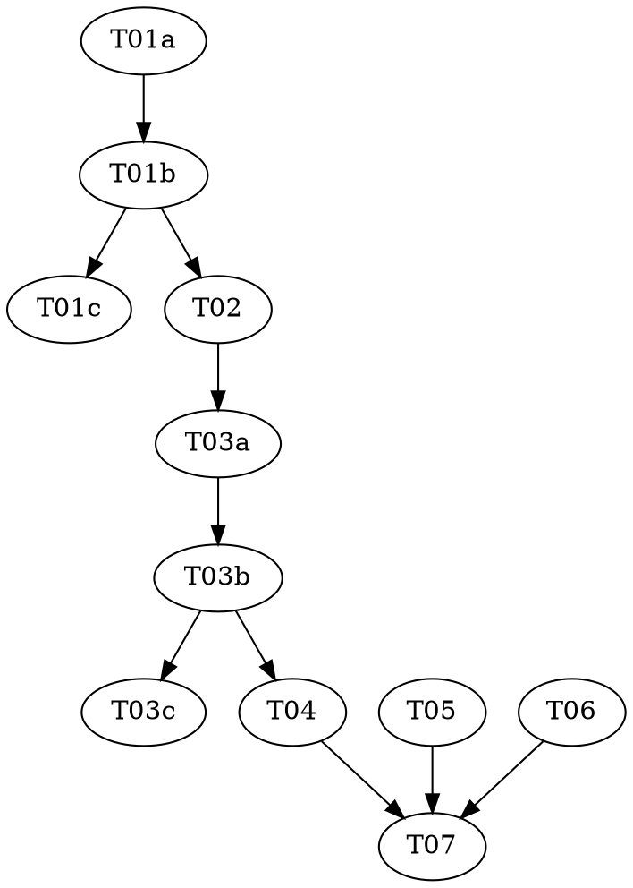

# Branch Colour Implementation Plan

> **For agentic workers:** REQUIRED: Use superpowers:subagent-driven-development or superpowers:executing-plans to implement this plan. Steps use checkbox (`- [ ]`) syntax for tracking.

**Goal:** A `color:` in a note's frontmatter paints that note's dot and every dot below it, and the plugin learns one word — **branch** — for a folder together with the note that speaks for it.

**Architecture:** A new pure module (`src/graph/color.ts`) validates the field. `Note` carries the validated colour. The mindmap's existing tree walk in `layout.ts` resolves inheritance into `MindmapNode.color`. The painters set one CSS custom property on each node group, and `styles.css` does the rest — Heat keeps winning because it is the earlier fallback in a `var()` chain, so no painter asks which mode is on.

**Tech Stack:** TypeScript, vitest, d3-selection, CSS custom properties (`color-mix`).

**Design doc:** `docs/superpowers/specs/2026-09-11-branch-colour-design.md`

**Planned by:** claude-opus-5

---

## Adversarial separation

Two behaviours here are worth pinning to intent rather than to one implementation's choices: what counts as a legal colour (T01) and how a colour reaches down a subtree (T03). Each is a **triad** — a `red` task that writes the tests, a `green` task that makes them pass without touching the test file, and an `audit` task that attacks both.

**This requires a subagent-capable executor.** Dispatch each role task as a fresh agent. One agent running the three in sequence does not give you the separation and should not claim it.

## Dependency Graph

| Task | Role | Depends On | Files Created/Modified |
|------|------|-----------|------------------------|
| T01a | red | — | `tests/color.test.ts` (authored here) |
| T01b | green | T01a | `src/graph/color.ts` (`tests/color.test.ts` is READ-ONLY) |
| T01c | audit | T01b | — (audit only) |
| T02 | — | T01b | `src/graph/notes.ts`, `tests/notes.test.ts` |
| T03a | red | T02 | `tests/mindmap-layout.test.ts` (authored here) |
| T03b | green | T03a | `src/mindmap/layout.ts`, `tests/mindmap-radial.test.ts` (`tests/mindmap-layout.test.ts` is READ-ONLY) |
| T03c | audit | T03b | — (audit only) |
| T04 | — | T03b | `src/mindmap/MindmapView.tsx`, `styles.css` |
| T05 | — | — | `assets/prompts/system.md`, `src/graph/hierarchy.ts`, `CLAUDE.md` |
| T06 | — | — | `assets/agents/kg-scout.md` |
| T07 | — | T04, T05, T06 | — (verification only) |

**Wave Schedule:**
- Wave 1: T01a, T05, T06 (no dependencies, no shared files)
- Wave 2: T01b
- Wave 3: T01c, T02 (audit runs beside the next step; it reports, it does not block)
- Wave 4: T03a
- Wave 5: T03b
- Wave 6: T03c, T04
- Wave 7: T07

**File conflict check:** no two tasks in the same wave touch the same file. T01a owns `tests/color.test.ts`; T03a owns `tests/mindmap-layout.test.ts`; T03b is the only task that edits `tests/mindmap-radial.test.ts`, and it does so to keep a type literal compiling, not to add coverage.

## Task Index

| ID | Name | File | Description |
|----|------|------|-------------|
| T01a | Colour parser tests | `tasks/T01a-colour-parser-tests.md` | Failing tests for `parseColor` |
| T01b | Colour parser | `tasks/T01b-colour-parser.md` | `src/graph/color.ts` — hex grammar and the named-colour table |
| T01c | Colour parser audit | `tasks/T01c-colour-parser-audit.md` | Adversarial audit of T01a + T01b |
| T02 | `Note.color` | `tasks/T02-note-colour.md` | Read and validate the field at index time |
| T03a | Inheritance tests | `tasks/T03a-inheritance-tests.md` | Failing tests for colour down a subtree |
| T03b | Inheritance | `tasks/T03b-inheritance.md` | `MindmapNode.color`, resolved in the existing walk |
| T03c | Inheritance audit | `tasks/T03c-inheritance-audit.md` | Adversarial audit of T03a + T03b |
| T04 | Paint | `tasks/T04-paint.md` | Painters set `--cb-tint`; stylesheet reads it |
| T05 | The word | `tasks/T05-vocabulary.md` | Branch vocabulary + `color:` in prompt, comment and CLAUDE.md |
| T06 | Scout follows folders | `tasks/T06-scout-parent.md` | Drop the stale `parent:` instruction |
| T07 | Verify | `tasks/T07-verify.md` | Full suite, oracle parity, build, deploy |

## Shared reading

- `shared/interfaces.md` — every signature and type that crosses a task boundary. Read it before any code task.
- `shared/conventions.md` — this project's commit format, comment discipline and test taste.
- `knowledge/run-tests.md`, `knowledge/commit.md` — the repeated commands.
