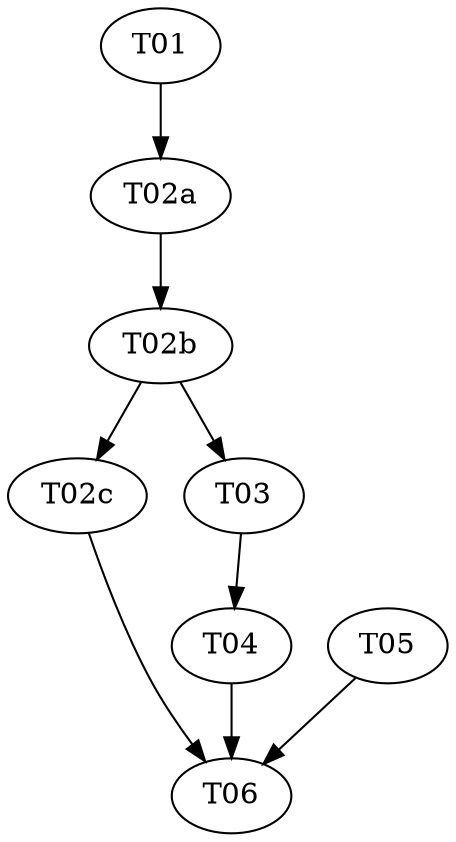

# Highlight Implementation Plan

> **For agentic workers:** REQUIRED: Use superpowers:subagent-driven-development or superpowers:executing-plans to implement this plan. Steps use checkbox (`- [ ]`) syntax for tracking.

**Goal:** Right-click any note on the map to tick **Highlight**: everything not connected to it dims, the connections inside the Highlight stay drawn, and Add / Remove / Extend grow or trim it.

**Architecture:** A new pure module, `src/mindmap/highlight.ts`, holds every rule — the state, its transitions, which menu items a note gets, and which drawn notes count as lit. `buildMindmapData` gains one field, `parentOf`, so those rules can see the whole hierarchy even where the flat map has pruned a fold. `MindmapView.tsx` keeps the state in memory, builds an Obsidian `Menu` from the module, shows the center in the header, and sets dim / held classes while painting; `styles.css` does the rest.

**Tech Stack:** TypeScript, vitest, Obsidian `Menu` API, d3-selection, CSS.

**Spec:** `docs/superpowers/specs/2026-09-16-highlight-design.md`

**Planned by:** claude-opus-5

## Global Constraints

- **Highlight** is the name of the view. Use its words everywhere — code comments, menu titles, commit messages, docs: *Highlight is on / off*, *the Highlight center*, *in the Highlight*, *dimmed*.
- Menu titles, verbatim: `Highlight` (checkbox), `Add to Highlight`, `Remove from Highlight`, `Extend Highlight`.
- Header chip text, verbatim: `Highlight: ` followed by the center's stem.
- Highlight is **never** saved: not in `getState`, not in `data.json`.
- Highlight never opens or closes a fold.
- No Obsidian or DOM import in `src/mindmap/highlight.ts`.
- Test file name: `tests/mindmap-highlight.test.ts` (the repo's `mindmap-*.test.ts` convention).
- Commit format and trailer: `shared/conventions.md`.
- All work happens on the branch `claude/highlight` (a worktree via `vf-superpowers:using-git-worktrees`). T02a's red commit is the only red commit and never reaches `main`; the branch merges only after T06 is green.

---

## Adversarial separation

The rules module (T02) is where intent matters most — which notes light, what the center refuses, what a fold stands in for. It is a **triad**: a `red` task writes the tests, a `green` task makes them pass without touching the test file, an `audit` task attacks both.

**This requires a subagent-capable executor.** Dispatch each role task as a fresh agent. One agent running the three in sequence does not give you the separation and must not claim it.

The view tasks (T03, T04) are manual-test by the project's standing rule and carry concrete code.

## Dependency Graph

| Task | Role | Depends On | Files Created/Modified |
|------|------|-----------|------------------------|
| T01 | — | — | `src/mindmap/layout.ts`, `tests/mindmap-layout.test.ts` |
| T02a | red | T01 | `tests/mindmap-highlight.test.ts` (authored here) |
| T02b | green | T02a | `src/mindmap/highlight.ts` (`tests/mindmap-highlight.test.ts` is READ-ONLY) |
| T02c | audit | T02b | — (audit only) |
| T03 | — | T02b | `src/mindmap/MindmapView.tsx`, `styles.css` |
| T04 | — | T03 | `src/mindmap/MindmapView.tsx`, `styles.css` |
| T05 | — | — | `docs/GLOSSARY.md`, `src/mindmap/INDEX.md`, `docs/superpowers/manual-test-checklist.md` |
| T06 | — | T02c, T04, T05 | — (verification only) |

**Wave Schedule:**
- Wave 1: T01, T05 (no dependencies, no shared files)
- Wave 2: T02a
- Wave 3: T02b
- Wave 4: T02c, T03 (the audit reports; it does not block the view work. Gap findings become new red tasks that must land before T06)
- Wave 5: T04
- Wave 6: T06

**File conflict check:** T03 and T04 both edit `MindmapView.tsx` and `styles.css`, so T04 depends on T03. T01 is the only task touching `layout.ts` and `tests/mindmap-layout.test.ts`. T05 touches only docs no other task edits.

## Task Index

| ID | Name | File | Description |
|----|------|------|-------------|
| T01 | `parentOf` on the map data | `tasks/T01-parent-of.md` | Expose the full hierarchy `buildMindmapData` already computes |
| T02a | Highlight rules tests | `tasks/T02a-highlight-tests.md` | Failing tests for `highlight.ts` |
| T02b | Highlight rules | `tasks/T02b-highlight.md` | `src/mindmap/highlight.ts` |
| T02c | Highlight rules audit | `tasks/T02c-highlight-audit.md` | Adversarial audit of T02a + T02b |
| T03 | Menu, state and header | `tasks/T03-menu-and-header.md` | Context menu, in-memory state, prune, header chip |
| T04 | Dimming | `tasks/T04-dimming.md` | Dim / held classes in both painters, styles |
| T05 | Words and checklist | `tasks/T05-docs.md` | Glossary entry, module INDEX, manual checklist |
| T06 | Verify | `tasks/T06-verify.md` | Full suite, oracle parity, build, deploy, hand-off |

## Shared reading

- `shared/interfaces.md` — every signature that crosses a task boundary. Read it before any code task.
- `shared/conventions.md` — commit format, comment discipline, test taste for this plan.
- `../knowledge/run-tests.md`, `../knowledge/typecheck-build.md`, `../knowledge/commit.md` — the repeated commands.
